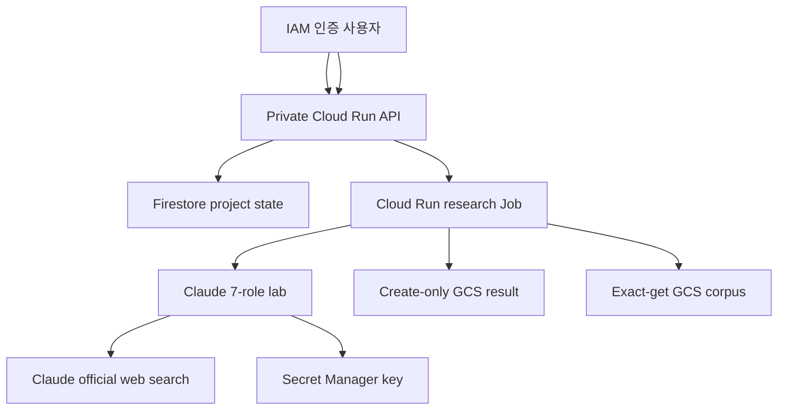

# GCP 주 애플리케이션 배포

이 디렉터리는 비공개 사용자 API, 비동기 연구 worker, Firestore 상태, GCS 결과,
검토된 private GCS 코퍼스와 Secret Manager Claude 키를 배포한다. API는 연구 요청을
202로 접수하고 Cloud Run Job을 실행하므로 7개 역할의 모델 호출을 HTTP 요청 안에서
기다리지 않는다.

## 배포 구성



- API 서비스 계정: Firestore 상태 읽기·쓰기, 정확한 결과 객체 읽기, worker 실행
- worker 서비스 계정: Firestore 상태 읽기·쓰기, 결과 객체 생성, Claude secret 읽기
- worker의 코퍼스 권한은 정확한 객체 읽기(`storage.objects.get`)뿐이며 list, 생성,
  수정과 삭제 권한이 없다.
- Claude 키는 API 컨테이너와 Terraform state에 들어가지 않는다.
- API에는 `allUsers` 권한을 부여하지 않는다. 배포를 실행한 gcloud 계정만 기본
  invoker로 등록한다.
- worker는 task 1개, 재시도 0, 1시간 제한으로 실행한다. 중복 실행은 project 상태
  claim에서 차단한다.
- 전체 `ResearchLabRun`은 GCS create-only 객체로 저장하고 Firestore에는 checksum,
  크기, 상태와 사람 검토 이력만 저장한다.

## 사전 조건

- 결제가 연결된 GCP 프로젝트
- `gcloud` 인증과 해당 프로젝트의 리소스·IAM 생성 권한
- Terraform 1.7 이상
- `uv`
- 로컬 Git checkout 또는 Cloud Shell에 업로드한 이 저장소

Cloud Shell이 아니면 다음 인증이 필요할 수 있다.

```bash
gcloud auth login
gcloud auth application-default login
```

## 한 번에 배포

저장소 루트에서 실행한다.

```bash
./deploy/gcp-app/deploy.sh YOUR_GCP_PROJECT_ID
```

기본 리전은 서울 `asia-northeast3`다. 다른 리전을 쓰려면 두 번째 인자로 전달한다.

```bash
./deploy/gcp-app/deploy.sh YOUR_GCP_PROJECT_ID us-central1
```

Secret에 활성 버전이 없을 때 스크립트가 Claude API 키를 숨김 입력으로 한 번 묻는다.
키는 `gcloud secrets versions add --data-file=-`의 표준입력으로 전달되며 파일,
Terraform 변수나 state에 저장되지 않는다. 이미 활성 버전이 있으면 기존 버전을
재사용한다.

`data/`에 공개 연구자료가 있으면 정규화 결과와 수집 보고서를 `artifacts/`에 만들고,
업로드 전 public-only 코퍼스 승인 여부를 묻는다. 승인을 자동화한 별도 검토 절차가
있을 때만 다음 값을 명시할 수 있다.

```bash
DEFENSE_RESEARCH_APPROVE_CORPUS=1 \
DEFENSE_RESEARCH_CORPUS_REVIEWER="reviewer@example.com" \
./deploy/gcp-app/deploy.sh YOUR_GCP_PROJECT_ID
```

이 값은 코퍼스 검토 결정을 표현할 뿐 Claude 키를 대체하지 않는다. `data/`가 없거나
승인하지 않아도 배포는 공식 웹 검색만 사용하는 상태로 완료된다.

스크립트는 다음을 수행한다.

1. `data/`를 읽기 전용으로 정규화하고 전후 원본 checksum 비교
2. 운영자 승인 시 content-addressed index·manifest 생성
3. 필요한 GCP API, Artifact Registry, Secret과 private corpus bucket bootstrap
4. 승인된 index·manifest를 generation precondition 0으로 create-only 업로드
5. Claude 키의 Secret Manager 버전 확인 또는 최초 등록
6. `.gcloudignore`가 제외한 원본 data·cache 없이 Cloud Build 실행
7. 생성 이미지를 SHA-256 digest로 고정
8. 기존 `(default)` Firestore가 있으면 위치를 보존하고 Terraform state로 import
9. Cloud Run API·worker, Firestore, GCS와 최소 역할 적용

## API 사용

배포 결과의 `api_url`을 설정하고 IAM identity token으로 호출한다.

```bash
API_URL="$(terraform -chdir=deploy/gcp-app output -raw api_url)"
TOKEN="$(gcloud auth print-identity-token)"
```

### 연구 요청

```bash
curl -sS -X POST "${API_URL}/v1/research-projects" \
  -H "Authorization: Bearer ${TOKEN}" \
  -H "Content-Type: application/json" \
  -d '{
    "question": "공개자료로 국방 AI 정책의 집행 성과를 어떻게 검증할 수 있는가?",
    "objective": "검토 가능한 연구설계와 최소 PoC 범위를 제안한다.",
    "scope": ["국방 인공지능", "정책 집행"],
    "constraints": ["공개자료만 사용"],
    "deliverables": ["연구보고서", "PoC 제안"]
  }'
```

응답은 `project_id`, `queued` 상태와 Cloud Run operation 식별자를 포함한다.

### 상태와 결과

```bash
PROJECT_ID="응답의 project_id"

curl -sS \
  -H "Authorization: Bearer ${TOKEN}" \
  "${API_URL}/v1/research-projects/${PROJECT_ID}"

curl -sS \
  -H "Authorization: Bearer ${TOKEN}" \
  "${API_URL}/v1/research-projects/${PROJECT_ID}/result"
```

상태는 `queued → running → awaiting_human_review`로 이동한다. 결과가 준비되기 전
`/result`는 409를 반환한다. worker 실패 시 상태는 `failed`이며 provider 원문 대신
정제된 오류 종류만 저장한다.

### 사람 검토

```bash
curl -sS -X POST \
  -H "Authorization: Bearer ${TOKEN}" \
  -H "Content-Type: application/json" \
  "${API_URL}/v1/research-projects/${PROJECT_ID}/review" \
  -d '{
    "decision": "approve",
    "reviewer": "reviewer@example.com",
    "comment": "근거 공백을 확인하고 승인함"
  }'
```

허용 결정은 `approve`, `approve_with_edits`, `hold`, `reject`다.
`approve_with_edits`는 `requested_edits`가 필요하다. 수정 항목은 검토 이력으로만
저장되며 모델 결과나 소스 코드를 자동 변경하지 않는다. `hold` 상태에서는 나중에 다시
검토할 수 있다.

## 현재 운영 범위

배포 worker는 실제 Claude 7개 역할, 기본 공개 데이터 분석, 승인된 내부 코퍼스 검색과
공식 외부 출처 검색을 연결한다. 웹 검색은 같은 `ANTHROPIC_API_KEY`를 사용하며 별도
검색 자격증명이 필요 없다. Terraform allow-list 밖의 도메인은 검색할 수 없고 검색
결과와 교차검증된 citation만 `ResearchToolEvidence`가 된다.

코퍼스 manifest에는 index의 SHA-256, 바이트 크기, 발간물 수, 검토자와 검토시각이
들어간다. worker는 manifest와 index를 정확한 객체명으로만 내려받아 세 값을 다시
검증한다. 내부 코퍼스 오류는 해당 도구의 근거 공백으로 격리되며 외부 검색이나 다른
역할의 성공 결과를 지우지 않는다.

개발 연구자의 코드 제안도 주 worker에서 자동 실행·반영·배포되지 않는다. 격리 pytest는
별도 `deploy/gcp-sandbox/` 구성을 명시적으로 연결해야 한다.
