# defense-research-agent 아키텍처

## 1. 현재 범위

현재 구현은 기본 오프라인 경로와 명시적으로 조립하는 선택적 운영 경로를 제공한다.

기본 오프라인 경로:

1. 읽기 전용 `data/` 수집 및 `ResearchPublication` 정규화
2. `artifacts/normalized/publications.jsonl`을 사용하는 인메모리 내부 연구자료 검색
3. fixture 외부 이슈 Provider, Fake 모델, 로컬 평가·랭킹·승인 흐름

선택적 운영 경로:

1. Anthropic 구조화 출력과 공식 출처 검색 adapter
2. GCS 내부 코퍼스·실행 산출물, Firestore 상태·검토 이력
3. 비공개 Cloud Run API와 비동기 Cloud Run Job

기본 테스트와 CLI 예시는 외부 데이터베이스, LLM 또는 네트워크 API 없이 실행된다.
운영 adapter는 자격증명과 배포 설정을 명시적으로 제공했을 때만 조립한다. 두 경로
모두 `data/`를 읽기 전용으로 취급하며 파생 결과는 `artifacts/` 또는 전용 GCS 객체에
기록한다. 벡터 DB와 임베딩 검색은 아직 구현하지 않았다.

## 2. 검색 계층 구조

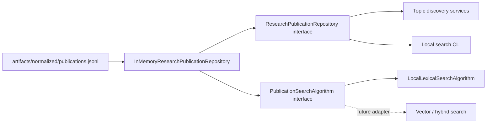

- `ResearchPublicationRepository`는 저장 방식과 검색 알고리즘에서 독립적인 애플리케이션
  인터페이스다.
- `InMemoryResearchPublicationRepository`는 JSONL을 Pydantic 모델로 검증해 메모리에
  적재하고 필터, ID 조회, 최신 자료, 분포 집계를 담당한다.
- `PublicationSearchAlgorithm`은 순위 계산 경계다. 저장소가 publication ID 제한 집합을
  전달하므로 필터링과 랭킹을 분리할 수 있다.
- `LocalLexicalSearchAlgorithm`은 제목, 초록, 키워드, 본문을 대상으로 동작하는
  무의존성 기본 구현이다.

## 3. 기본 검색 방식

질의와 문서 텍스트를 Unicode NFC 및 소문자로 정규화한 뒤 한글·영문·숫자 토큰을
추출한다. 각 질의어를 문서 필드에서 부분 문자열로 찾기 때문에 `인공지능`과 같은
한글 키워드는 별도 형태소 분석기 없이도 조사 또는 합성어가 붙은 텍스트와 일치할 수
있다.

순위 점수는 결정적 Python 코드로 계산한다.

- 필드 가중치: 제목 4.0, 키워드 3.5, 초록 3.0, 본문 1.0
- 용어 빈도: `1 + log(tf)`
- 역문서 빈도: `1 + log((N + 1) / (df + 1))`
- 동점: `publication_id` 오름차순

점수는 후보 간 순위를 위한 비정규화 lexical score이며 0~100 평가 점수와 의미가
다르다. 결과에는 점수, 실제로 일치한 필드와 질의어가 포함된다.

## 4. 필터와 날짜 정밀도

검색 전 자료 유형, 저자, 날짜 필터를 적용한다.

- 명시적 `publication_date`가 있으면 정확한 날짜로 비교한다.
- 현재 정규화 자료 371건은 모두 `publication_date`가 없다.
- 이 경우 `_ingestion.filename_year`를 연도 정밀도 근거로 사용한다.
- 연도만 있는 자료는 날짜 범위의 연도가 포함될 때 선택하며 특정 월·일을 추측하지
  않는다.
- 날짜와 파일명 연도 모두 없는 자료는 날짜 필터와 분포 집계에서 제외하고
  `unknown_date_count`로 보고한다.

## 5. 알려진 한계

1. 형태소 분석, 동의어, 띄어쓰기 교정, 의미 유사도를 지원하지 않는다.
2. 부분 문자열 검색은 짧거나 흔한 질의어에서 재현율과 정밀도의 균형이 낮을 수 있다.
3. 현재 산출물은 초록과 키워드가 모두 비어 있어 실제 검색은 제목과 본문에 의존한다.
4. 파일명 기반 제목은 잘렸을 수 있고 저자는 대표저자 한 명만 포함할 수 있다.
5. 저추출·제어문자 손상 문서에 대한 품질 게이트는 아직 검색 계층 앞에 연결되지 않았다.
6. 전체 본문을 메모리에 정규화하므로 코퍼스가 크게 증가하면 시작 시간과 메모리 사용량이
   선형으로 증가한다.
7. `find_similar`는 현재 제목·초록을 lexical query로 변환하며 의미적 유사도가 아니다.

## 6. 벡터 및 하이브리드 검색 확장 지점

벡터 검색을 추가할 때 repository 호출부는 유지하고 `PublicationSearchAlgorithm`의
새 구현을 주입한다.

권장 순서:

1. 페이지 근거를 보존하는 `PublicationChunk` 생성과 품질 게이트
2. `VectorSearchAlgorithm` 어댑터 구현
3. 오프라인 fake embedding으로 인터페이스·결정성 테스트
4. lexical/vector 점수를 별도 보존하는 `HybridSearchAlgorithm`
5. 모델명, 차원, 청킹 버전, 입력 checksum을 인덱스 메타데이터에 기록
6. 실제 외부 모델 연결은 선택적 통합 테스트로 격리

벡터 결과도 publication ID, chunk/page 근거, 원점수와 결합 규칙을 반환해야 한다.
점수 결합, 정렬, 임계값 분기는 계속 결정적 Python 코드에서 수행한다.

## 7. 외부 이슈 검색 경계

기본 오프라인 외부 이슈 계층은 네트워크를 사용하지 않는 fixture 구현이다. 운영
조립에는 고정 도메인 allow-list와 provider citation을 교차 검증하는 선택적 Anthropic
공식 출처 검색 adapter가 추가로 구현돼 있다.

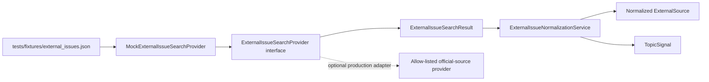

`ExternalIssueSearchProvider.search_recent_issues()`는 다음 교체 가능한 계약을 유지한다.

```python
search_recent_issues(
    query,
    start_date,
    end_date,
    domains,
    limit,
) -> list[ExternalSource]
```

호출자가 실패 상태까지 보존해야 할 때는 같은 인자의
`search_recent_issues_with_status()`를 사용한다. 상태는 `success`, `partial`,
`failure`, `timeout`이며 항목별 검증 실패도 정제된 오류 모델로 반환한다. 부분 성공은
유효한 출처를 버리지 않는다.

### 외부 출처 정규화

`ExternalIssueNormalizationService`는 다음 결정적 규칙을 적용한다.

- URL host/scheme 소문자화, fragment 및 추적 query parameter 제거
- 날짜의 ISO·점·슬래시·ISO datetime 형식 정규화
- 알려진 기관명 alias와 Unicode NFC·공백 정규화
- canonical URL 중복과 제목 유사도 0.92 이상 중복 제거
- 신뢰도 tier, 출처 유형, 최신 날짜, source ID 순으로 정렬
- 공식 정책문서·국방부 보도자료·의회/감사자료를 뉴스보다 우선
- 뉴스와 공식 원문 관계를 `reports_on` 또는 `summarizes` edge로 보존

신뢰도 tier는 자동 사실 판정이 아니라 출처 우선순위를 위한 provenance 분류다.
모든 `ExternalSource`는 기본적으로 `content_trust=untrusted`, `reviewed=false`다.

### 외부 콘텐츠 안전 경계

- title과 snippet의 명령문은 실행하거나 시스템 지시로 해석하지 않는다.
- 외부 텍스트는 Pydantic 검증 후에도 신뢰할 수 없는 평문이다.
- `TopicSignal` 변환은 문자열 복사와 결정적 필드 매핑만 수행한다.
- URL은 네트워크로 열지 않으며 fixture Provider에는 HTTP 클라이언트가 없다.
- UI 또는 프롬프트에 넣는 후속 계층은 외부 텍스트를 이스케이프하고 데이터 구획으로
  전달해야 한다.
- 사람 검토 전에는 `reviewed=true`로 바꾸지 않는다.

### Provider 설정과 교체

현재 Mock 실행에 필요한 환경변수:

```text
DEFENSE_RESEARCH_EXTERNAL_ISSUE_PROVIDER=mock
DEFENSE_RESEARCH_EXTERNAL_ISSUE_FIXTURE=tests/fixtures/external_issues.json
```

Provider-neutral 구현에서 향후 별도 web provider를 추가할 때 사용할 예약 계약:

```text
DEFENSE_RESEARCH_EXTERNAL_SEARCH_BASE_URL=
DEFENSE_RESEARCH_EXTERNAL_SEARCH_API_KEY=
DEFENSE_RESEARCH_EXTERNAL_SEARCH_TIMEOUT_SECONDS=10
```

현재 Anthropic 운영 adapter도 이 예약 URL·API key를 읽지 않고 `ANTHROPIC_API_KEY`와
별도 설정을 사용한다. 다른 Provider를 구현할 때는
`ExternalIssueSearchProvider`를 구현하고 애플리케이션 조립 지점에서 주입한다.
자격증명은 런타임 환경에서만 읽으며 fixture, 코드, 로그, 오류 메시지에 기록하지 않는다.
네트워크 계약 테스트는 기본 오프라인 테스트와 분리해야 한다.

## 8. 연구주제 생성과 LangGraph

연구주제 생성은 내부 검색 결과와 정규화된 외부 `TopicSignal`을 하나의 검증 경계에서
연결한다.

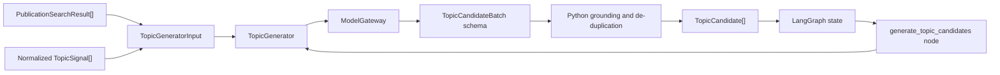

### ModelGateway

`ModelGateway.generate_structured(task_type, messages, output_schema, metadata)`가 실제 모델과
애플리케이션 사이의 유일한 생성 경계다. 기본 테스트와 그래프 실행은 응답을 순서대로
반환하는 `FakeModelGateway`만 사용한다. Fake 응답도 요청된 Pydantic 스키마를 통과하지
못하면 실패한다.

실제 모델 어댑터를 추가할 때도 다음 규칙을 유지한다.

- 자유 형식 응답을 상태에 기록하지 않는다.
- `output_schema` 검증 전 결과를 사용하지 않는다.
- provider 고유 응답과 재시도는 gateway 안에 격리한다.
- 모델명, prompt version과 실행 metadata를 감사 가능한 형태로 보존한다.
- API 자격증명은 런타임 환경에서만 읽고 기본 테스트에 요구하지 않는다.

### 결정적 생성 규칙

모델 출력은 `TopicCandidateDraft` 스키마를 통과한 후 Python에서 다시 검증된다.

- 입력에 외부 signal이 있으면 허용된 외부 `signal_id`를 최소 하나 포함
- 내부 검색 결과가 있으면 허용된 `publication_id`를 최소 하나 포함
- 입력에 없는 근거 ID 차단
- 외부 이슈 제목을 그대로 반복하는 후보 차단
- 사용자 제외 분야가 후보 핵심 텍스트에 포함되면 차단
- 제목과 연구질문이 모두 유사한 후보 제거
- 요청된 후보 수만큼 결정적으로 절단
- 제목, 연구질문, 근거 ID로 안정적인 candidate ID 생성
- 추천 산출물을 국방논단, KIDA Brief, 국방정책연구, 연구보고서로 제한

외부 title과 summary는 `user` 메시지 안의
`untrusted_external_signals` 데이터 구획에만 들어간다. 시스템 메시지는 외부 문구를
포함하지 않으며 해당 문구의 명령을 따르지 말라고 명시한다.

### LangGraph 상태와 노드

`TopicGenerationState`는 다음 입력과 출력을 가진다.

- `normalized_signals`
- `internal_search_results`
- `existing_publication_types`
- `user_interest_domains`
- `excluded_domains`
- `candidate_count`
- `topic_candidates`

현재 그래프는 `START → generate_topic_candidates → END`의 최소 수직 흐름이다.
`TopicGenerator`와 `ModelGateway`는 그래프 전역에서 생성하지 않고 조립 시 주입한다.
따라서 단위 테스트와 E2E 그래프 테스트 모두 네트워크 없이 같은 상태 전이를 재현한다.

## 9. 독립 평가와 부분 실패

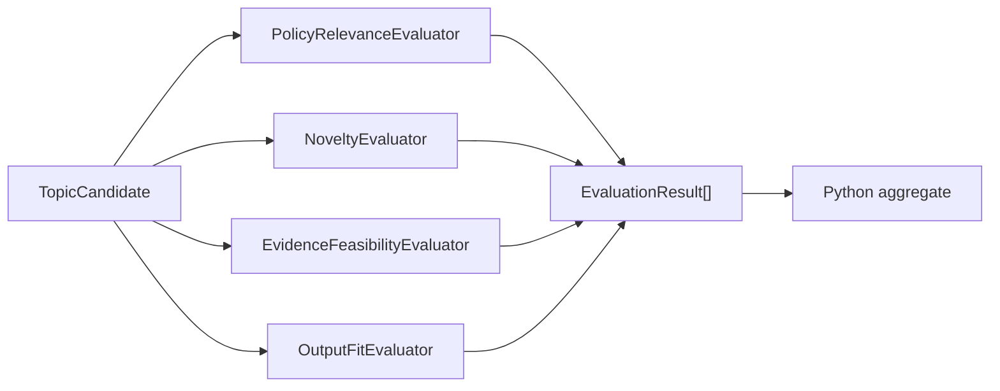

각 평가 입력은 후보, 연결된 신호, 관련·유사 내부 발간물의 독립 스냅샷이다. 다른
평가기의 점수는 입력 스키마에 존재하지 않는다. `EvaluationRunner`는
`ThreadPoolExecutor`로 후보/평가기 작업을 병렬 실행하고 설정된 상한까지만 재시도한다.
한 작업의 실패는 `EvaluationFailure`로 남으며 다른 결과와 후보는 보존한다.

일곱 canonical 기준은 `policy_relevance`, `timeliness`, `novelty`,
`public_evidence_sufficiency`, `policy_impact`, `feasibility`, `output_fit`이다.
모델 결과는 Pydantic 검증 뒤에도 Python에서 다음 게이트를 통과한다.

- 입력에 없는 근거 ID 거부
- 평가기 책임 밖 기준 거부
- 근거 없는 60점 초과 결과 상한 적용
- 기존 발간물 제목 직접 중복 시 신규성 20점 상한
- 평가기별 시도 횟수와 실패 원인 보존

## 10. 결정적 랭킹과 다양성

`configs/scoring.json`을 `RankingConfig`로 검증한 뒤 일곱 기준 가중합과 이름 있는
감점을 순수 Python 함수로 계산한다. 결과 `RankedTopic`은 기준별 점수, 원점수,
일반 감점, 감점 후 점수, 다양성 감점, 최종 점수, 후보 속성과 설명을 모두 보존한다.

다양성은 이미 선택된 후보와 같은 주 정책 분야, 국가, 산출물, 단기/구조적 연구 시계가
반복될수록 점수를 낮추는 greedy selection이다. 조정이 꺼지면 감점 후 점수와
`candidate_id` 동점 규칙만 사용한다. 자세한 공식은
[`EVALUATION_CRITERIA.md`](./EVALUATION_CRITERIA.md)에 있다.

## 11. 인간 검토 중단·재개

전체 그래프의 정상 경로는 다음과 같다.

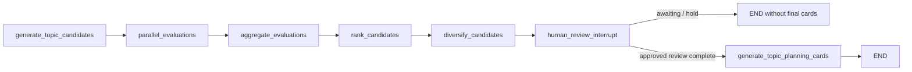

그래프 첫 실행은 `ranked_candidates`를 저장하고 `awaiting_review`에서 끝난다. 이전
state와 같은 `run_id`에 `ReviewSubmission`을 넣어 다시 호출하면 시작 router가 생성·
평가를 반복하지 않고 검토 노드로 복귀한다. 로컬 CLI 재개는 같은 의미를
`ranked_candidates.json`과 append-only `review_history.jsonl`로 제공한다.
로컬 JSONL append는 프로세스 간 파일 잠금과 `fsync`를 사용하며 sequence, event ID와
시간 순서를 다시 검증한다. 운영 Firestore 상태 전이와 검토 append는 transaction
안에서 현재 상태를 읽고 갱신해 동시 쓰기가 이력을 조용히 덮어쓰지 않게 한다.

미검토·보류 후보는 최종 카드 생성을 차단한다. 모든 결정이 완료돼 승인 또는
수정승인 후보가 있을 때만 기획 카드를 만들고, 거절 후보는 포함하지 않는다.

## 12. 오프라인 평가 하네스

`PilotEvaluationHarness`는 정규화·수집·검색·생성·평가·랭킹 산출물에서 직접 계산할
수 있는 지표만 산출한다. 전문가 골든셋이 필요한 지표는 이유와 함께
`unavailable`이다. 실패 사례 목록은 비어 있지 않은 경우 보고서에 그대로 노출한다.

시점 분할은 `publication_date`를 우선하고 없으면 `_ingestion.filename_year`를 사용한다.
기준 연도 이하만 입력, 이후만 미래 평가 대상으로 두며 입력 집합의 미래 연도 건수를
누출로 계산한다. 현재는 미래 실제 발간 주제와 생성 후보의 의미 일치 골든셋이 없어
그 비교는 `unavailable`이다.

## 13. 7개 역할 연구실 오케스트레이션

상위 `ResearchLabService`는 하나의 연구 요청을 연구실 단위로 조정한다.

1. `MainResearcherAgent`가 문헌, 최신 이슈, 방법론·데이터와 개발·PoC 역할에
   독립 과업을 배정한다.
2. 네 `StructuredResearchAgent`를 `ThreadPoolExecutor`로 병렬 실행한다.
3. 근거 감사자와 비판·레드팀 연구자가 성공한 전문 연구 결과의 같은 스냅샷을
   독립적으로 검토한다.
4. 메인 연구자가 성공, 부분 실패, 상충 의견과 근거 공백을 종합한다.
5. `ResearchLabRun.status`는 사람 검토 전 상태로 끝난다.

역할마다 `ResearchRoleSpec`으로 책임, `ModelRoute`와 `ToolCapability` 허용 목록을
분리한다. `ModelRoute`는 실제 SDK 객체가 아니라 provider와 model ID의 논리 설정이다.
따라서 기본 Fake gateway를 Claude gateway로 교체해도 연구 계획, 병렬 실행, 실패 보존,
검토와 승인 경계는 유지된다.

개발·PoC 연구자의 `code_sandbox`는 원본과 분리된 로컬 정적 검사와 GCP Cloud Run Job
pytest runner 계약을 제공하지만 배포 권한은 없다. 방법론 연구자의
`data_analysis_sandbox`는 등록된 공개 데이터셋과 고정 통계 연산만 실행한다. 상세
역할표와 GCP 배포 목표는 [`RESEARCH_LAB.md`](./RESEARCH_LAB.md)에 있다.

## 14. 역할별 검색 도구와 증거 주입

`ResearchToolRuntime`은 모델이 임의 명령이나 URL을 실행하는 구조가 아니다. 메인
연구자가 만든 `ResearchTask.requested_tools`를 해당 역할의 `allowed_tools`와 비교한
뒤, 애플리케이션에 미리 등록된 adapter만 실행한다.

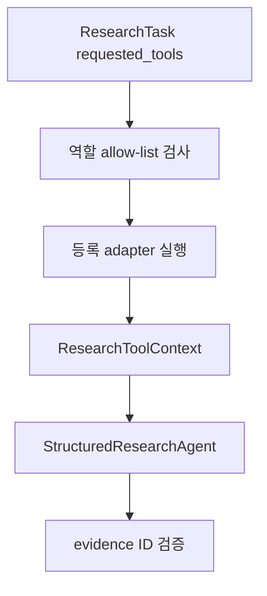

`InternalCorpusSearchAdapter`는 기존 `ResearchPublicationRepository`의 결정적 검색을
발간물 evidence로 변환한다. `ExternalIssueSearchAdapter`는
`ExternalIssueSearchProvider` 결과를 기존 정규화 서비스로 처리하고 모든 외부 내용을
신뢰하지 않는 evidence로 표시한다.

Provider timeout·부분 실패·검증 실패는 성공 결과와 함께 `ResearchToolFailure`로
보존된다. 에이전트 출력의 인용 ID는 자신의 `ResearchToolContext` 또는 검토 대상으로
전달된 동료 결과의 인용 ID에 포함돼 있어야 한다. 역할 권한 밖 도구 요청과 출처에 없는
인용은 결정적 Python 검증으로 차단한다.

## 15. 개발·PoC 코드 샌드박스

개발 연구자의 `code_sandbox`는 모델 출력 전 검색 도구와 달리, 구조화된
`ResearchAgentResult.proposed_artifacts`를 받은 뒤 실행되는 후처리 도구다.

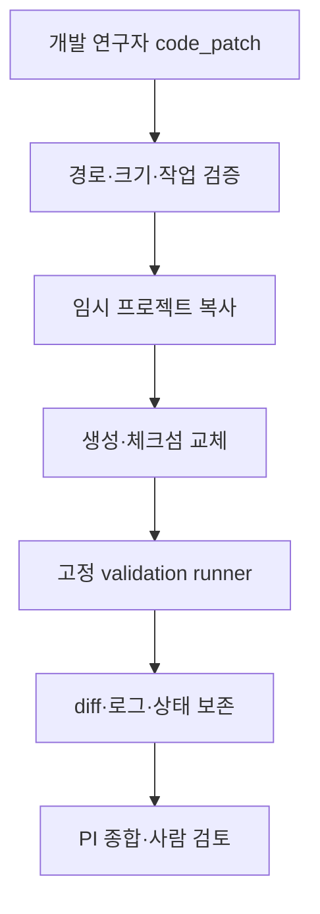

`CodeFileChange`는 생성과 교체만 표현한다. 교체에는 `expected_sha256`이 필수이며,
모델이 본 파일과 실제 파일이 달라진 경우 패치를 차단한다. 기본 허용 대상은 별도 PoC
패키지와 그 단위 테스트다. validation은 enum과 상대 경로만 받으며 자유 셸 명령은
애플리케이션 어디에서도 실행하지 않는다.

로컬 `StaticSandboxValidationRunner`는 `compile()`로 구문만 검사하고 생성 코드를
실행하지 않는다. pytest는 `SandboxValidationUnavailableError`로 차단된다. 실제 테스트
실행은 `GcpCloudRunJobValidationRunner`를 주입했을 때만 별도 Cloud Run Job으로
위임한다.

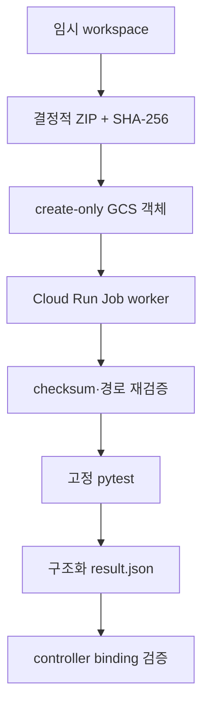

worker는 전용 `/26` Direct VPC에 `ALL_TRAFFIC`으로 연결되고 Private Google Access
443 외 egress는 차단된다. 실행 identity는 전용 버킷 객체의 get/create만 허용하며
list, overwrite, delete 권한은 없다. 요청 ID·checksum·validation·대상이 일치하지 않는
결과는 격리 backend 실패로 처리한다. 어떤 경우에도 임시 검증 성공이 원본 반영,
사람 승인 또는 배포를 의미하지 않는다.

## 16. 제한된 공개 데이터 분석

데이터 분석은 모델이 생성한 Python이나 SQL을 실행하는 일반 목적 sandbox가 아니다.
`ResearchTask.data_analysis_requests`는 dataset ID, 고정 연산 enum, 허용 열과 단순
필터만 표현한다. `DataAnalysisDatasetRegistry`는 배포자가 검토한 `public_only`
데이터셋을 애플리케이션 시작 시 등록하며, planner에는 실제 행을 제외한 catalog만
전달한다.

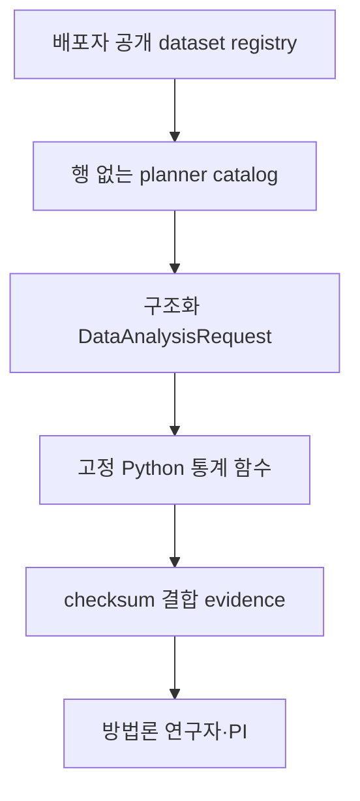

허용 연산은 행 수, 수치 기술통계, 그룹 건수·평균과 Pearson 상관계수다. 열이 없거나
수치 열에 문자열이 있거나 상관계수의 분산이 0이면 stable failure code로 거부한다.
동일 태스크의 다른 성공 결과는 유지한다. 모든 결과는 데이터 SHA-256, source 및
filtered row count, caveat와 source evidence ID를 기록하고 원본 변경·배포 플래그는
항상 false다.

패키지 resource의 소형 데이터는 wheel·오프라인 경로 검증용 fixture다. 실제 GCP
운영에서는 검토한 공개 데이터 레지스트리를 같은 스키마로 주입하되 모델이 경로나
네트워크 위치를 선택하게 해서는 안 된다.

## 17. Claude 구조화 출력과 역할 라우팅

`AnthropicModelGateway`는 provider-neutral `ModelGateway`를 공식 Anthropic SDK에
연결한다. 한 gateway 인스턴스는 하나의 역할 route에 고정되며 호출자가 임의 model ID를
선택할 수 없다.

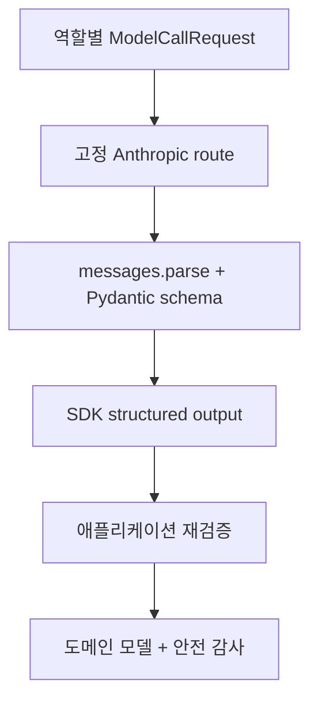

시스템 프롬프트는 provider의 top-level `system`으로 분리하고 사용자 입력만
`messages` 배열에 넣는다. `output_schema`는 호출별 Pydantic 클래스이며 SDK 파싱 뒤
`model_validate()`로 다시 검증한다. 기본 route는 역할별 비용·처리량·추론 요구에 따라
Opus, Sonnet과 Haiku alias를 배정하고 모든 모델 ID는 환경변수로 교체할 수 있다.

런타임 설정의 유일한 필수값은 `ANTHROPIC_API_KEY`다. SDK client는 7개 gateway가
공유하지만 route는 각 역할에 고정된다. 감사 레코드에는 task type, model ID, schema,
지연, token 수, request ID와 allow-list 실행 식별자만 포함한다. Secret 값, 전체
프롬프트, provider 응답 원문과 provider 예외 메시지는 포함하지 않는다.

refusal은 별도 실패로, token 한도와 스키마 불일치는 출력 실패로 정제한다. SDK의 제한된
재시도 밖의 provider 실패도 원문 없이 예외 종류만 노출한다. 외부 검색, 코드 검증과
데이터 분석은 SDK tool calling에 맡기지 않고 기존 Python allow-list adapter를
계속 사용한다.

## 18. GCP 사용자 API와 비동기 worker

주 애플리케이션은 짧은 private API 요청과 긴 연구 실행을 분리한다. API는 Firestore에
요청을 먼저 생성한 뒤 `run.jobsExecutorWithOverrides` 권한으로 project ID 하나만
Cloud Run Job에 전달한다. Claude key, 프롬프트와 사용자 요청 전체를 override에 넣지
않는다.

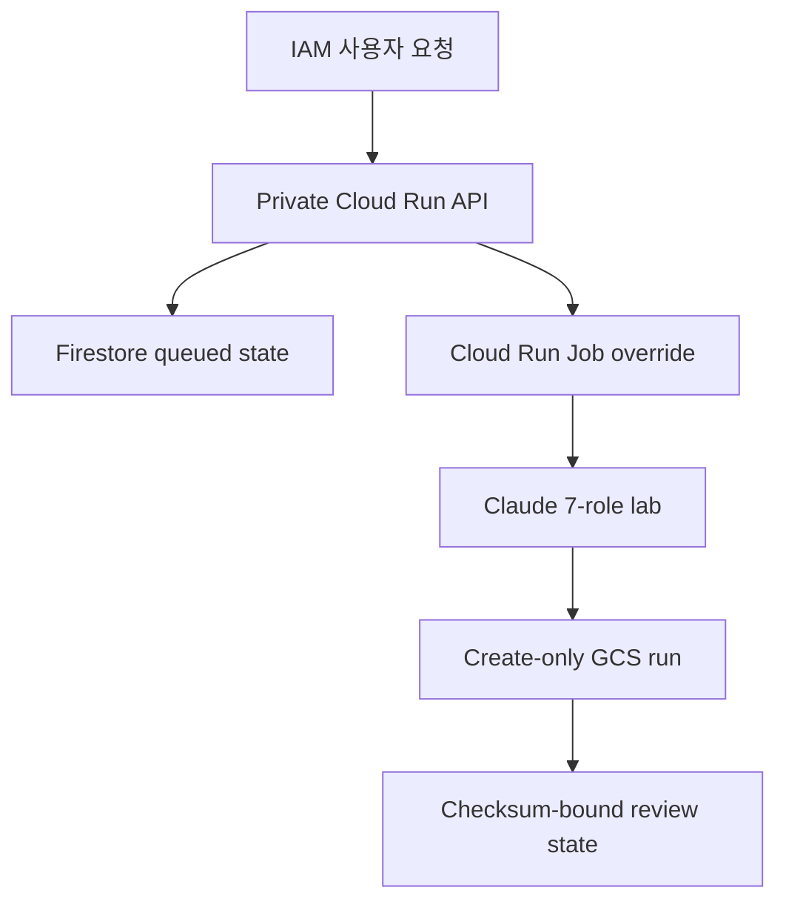

`ResearchProjectRecord`의 상태는 `queued`, `running`, `awaiting_human_review`,
`approved`, `held`, `rejected`, `failed`만 허용한다. worker는 앞의 세 상태와 실패만
만들 수 있다. 승인 계열 상태는 별도 사람 API가 append한 `ResearchLabReviewEvent`가
없으면 Pydantic 검증을 통과하지 못한다.

Firestore의 dispatch, claim, complete, fail, review 전이는 모두 transaction에서
선행 상태를 확인한다. 검토 이력은 연속 sequence, 고유 event ID, 단조 증가 timestamp와
마지막 결정-현재 상태의 일치를 검증한다.

전체 `ResearchLabRun`은 Firestore 문서 크기에 의존하지 않도록 GCS에 저장한다. worker는
generation 0 조건으로 새 객체만 만들고 API는 Firestore의 object name, SHA-256, byte
크기와 result 내부 project ID를 모두 확인한 뒤 반환한다. API 서비스 계정은 정확한
객체 get 권한만 가지며 list·update·delete 권한이 없다.

Secret Manager key의 값은 Terraform이 관리하지 않는다. 배포 스크립트가 표준입력으로
버전을 만든 뒤 worker Job의 숫자 secret version에 연결한다. API identity에는 secret
accessor를 주지 않는다. worker image도 Artifact Registry digest로 고정한다.

P020 production 조립은 공개 데이터 분석, 승인된 GCS 내부 코퍼스와 Claude 공식 출처
검색 adapter를 등록한다. 내부 코퍼스는 content-addressed manifest의 크기, SHA-256과
발간물 수를 모두 확인하고 GCS list 없이 exact get만 사용한다. 외부 출처는 고정
도메인 allow-list의 실제 검색 결과와 일치하는 Claude citation만 근거로 변환한다.
adapter가 실패하면 `ResearchToolRuntime`이 해당 실패를 근거 공백으로 보존하고 PI는
이를 종합한다. 임의 URL이나 검토되지 않은 로컬 corpus로 조용히 대체하지 않는다.
