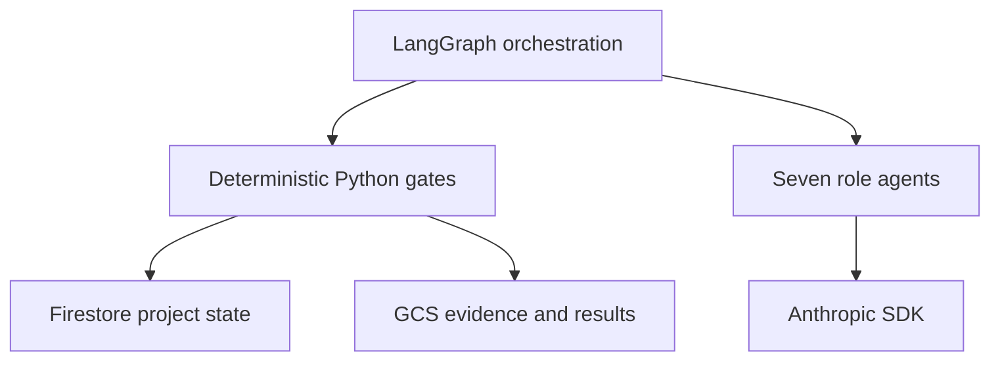

# AutoGen과 LangGraph 선택 기록

## 결정

이 프로젝트의 주 오케스트레이터는 **LangGraph를 유지한다**. AutoGen으로 교체하지
않으며, Claude 호출과 서버 측 공식 출처 검색은 Anthropic SDK 경계를 그대로 사용한다.

현재 LangGraph는 연구주제 생성·평가·랭킹·사람 검토 그래프에 적용돼 있다. 7개 역할
`ResearchLabService`는 결정적 Python 실행기와 `ThreadPoolExecutor`를 사용한다. 즉,
전체 연구실이 이미 LangGraph로 이관된 상태는 아니다.

## 요구사항별 비교

| 요구사항 | LangGraph | AutoGen | 이 프로젝트의 판단 |
|---|---|---|---|
| 명시적 연구 단계·조건 분기 | typed state와 graph edge가 중심 | GraphFlow로 가능하지만 experimental | LangGraph |
| 장기 실행·실패 후 재개 | persistence/checkpointer와 node-boundary 재실행 | team state 저장·복원 가능 | LangGraph |
| 장시간 사람 승인 대기 | interrupt와 영속 state에 적합 | 실행 중 `UserProxyAgent`는 저장·재개 불안정 경고 | LangGraph |
| 자유로운 에이전트 대화·handoff | 구현 가능하지만 저수준 | group chat, selector, swarm이 편리 | 탐색형 실험은 AutoGen |
| 결정적 Python 게이트 혼합 | graph node로 직접 표현 | custom agent/GraphFlow 필요 | LangGraph |
| Claude 연결 | `ChatAnthropic` 또는 SDK 직접 사용 | Anthropic client가 experimental | 기존 Anthropic SDK 유지 |
| GCP 자체 배포 | 라이브러리만 사용해 Cloud Run에 포함 가능 | 라이브러리만 사용해 Cloud Run에 포함 가능 | 동률 |

AutoGen은 에이전트가 대화를 통해 다음 화자를 고르고 자유롭게 핸드오프하는 실험에
적합하다. 본 시스템은 도구 허용 목록, 근거 ID 검증, 독립 감사, 사람 승인처럼 실행
순서를 코드가 보장해야 하므로 graph 기반 제어가 우선이다.

## 적용 구조

- LangGraph: 단계, fan-out/fan-in, 조건 분기와 향후 중단·재개
- Anthropic SDK: Pydantic 구조화 출력과 Claude 서버 측 웹 검색
- 애플리케이션 서비스: 도구 allow-list, 근거 교차검증, 점수와 승인 전이
- Firestore: 사용자 프로젝트 상태와 사람 검토 이력
- GCS: 승인된 코퍼스와 checksum이 결합된 결과

LangSmith Cloud는 필수 구성요소가 아니다. 오픈소스 LangGraph 라이브러리를 현재
Cloud Run 이미지 안에서 사용하고 GCP에 자체 배포한다.

## 다음 이관 순서

1. 현재 `ResearchLabService` 동작을 기준 회귀 테스트로 고정한다.
2. `plan`, `specialists`, `reviews`, `synthesis`를 typed LangGraph node로 분리한다.
3. 각 node는 현재 Pydantic 결과와 도구 경계를 그대로 호출하게 한다.
4. PoC에서는 Firestore의 명시적 단계 상태로 재실행을 제한한다.
5. 임의 node부터 정확히 재개해야 할 운영 요구가 생기면 공식 Postgres checkpointer와
   GCP Cloud SQL을 별도 의사결정으로 도입한다.

현재 P020에서는 오케스트레이터를 바꾸지 않는다. 검토된 내부 코퍼스와 공식 웹 검색을
기존 `ResearchToolRuntime` 뒤에 추가해 프레임워크 선택과 데이터 신뢰 경계를 분리한다.

## 공식 참고자료

- [LangGraph overview](https://docs.langchain.com/oss/python/langgraph/overview)
- [LangGraph workflows and agents](https://docs.langchain.com/oss/python/langgraph/workflows-agents)
- [LangGraph memory and production checkpointer](https://docs.langchain.com/oss/python/langgraph/add-memory)
- [AutoGen teams](https://microsoft.github.io/autogen/stable/user-guide/agentchat-user-guide/tutorial/teams.html)
- [AutoGen GraphFlow](https://microsoft.github.io/autogen/stable/user-guide/agentchat-user-guide/graph-flow.html)
- [AutoGen human in the loop](https://microsoft.github.io/autogen/stable/user-guide/agentchat-user-guide/tutorial/human-in-the-loop.html)
- [AutoGen model clients](https://microsoft.github.io/autogen/stable/user-guide/core-user-guide/components/model-clients.html)
