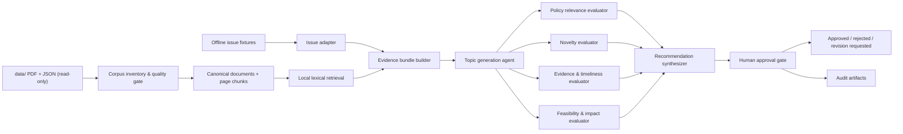
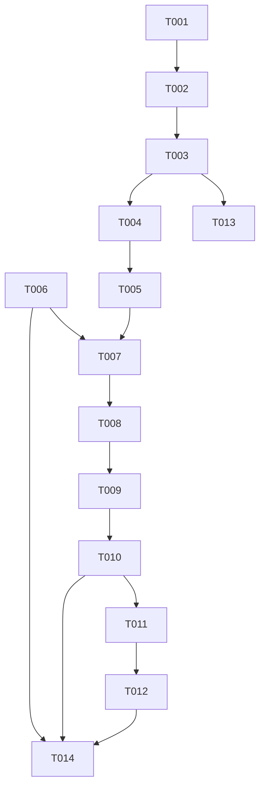
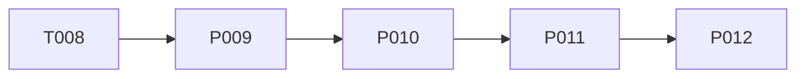

# Defense Research Platform Implementation Plan

이 문서는 **지금부터 수행할 개발 작업**을 우선순위와 완료 조건으로 정의한다. 장기 제품
방향은 [ROADMAP.md](./ROADMAP.md), 현재 기술 설계는
[ARCHITECTURE.md](./ARCHITECTURE.md), 평가 방법은 [EVALUATION.md](./EVALUATION.md),
결정 근거는 [DECISIONS.md](./DECISIONS.md)를 참조한다.

현재 우선순위는 agent 역할을 더 늘리는 것이 아니라 **Data / Retrieval 기반을 강화하는
것**이다. Topic Discovery와 Research Lab의 현재 동작은 회귀 baseline으로 유지한다.

## Current Priority

```text
P0 현재 시스템 검증
P1 Document Intelligence
P2 Retrieval
P3 Research Copilot
P4 Learning Companion
P5 Model Runtime
P6 Product UI
P7 Advanced Intelligence
```

| 우선순위 | 목표 | 시작 조건 | 완료 신호 |
|---|---|---|---|
| P0 | 현재 E2E와 운영 경계 검증 | 즉시 | 재현 가능한 baseline과 known failure 목록 |
| P1 | 신뢰할 수 있는 페이지 근거 | P0 baseline | 품질 gate를 통과한 page/section chunk |
| P2 | 측정 가능한 검색 개선 | P1 chunk | lexical 대비 benchmark가 있는 hybrid retrieval |
| P3 | citation-grounded 연구 지원 | P2 retrieval | 근거·인용·abstention 평가 통과 |
| P4 | 공통 기반 위의 학습 지원 | P2, P3 공통 기반 | 수준별 설명·학습 경로·knowledge check 평가 |
| P5 | local/API/BYOK runtime 확장 | 평가 harness | provider별 품질·비용·privacy 비교 |
| P6 | 연구자용 제품 경험 | 핵심 API 안정화 | 검토 가능한 Search/Learn/Research/Topics UX |
| P7 | graph·timeline·report 고도화 | 검증된 use case | 선행 기능 대비 incremental value 입증 |

## 현재 baseline

다음 기능은 이미 구현돼 있으며 신규 작업에서 보존해야 한다.

- `ResearchPublicationRepository`, `PublicationSearchAlgorithm`과 lexical search
- external issue provider abstraction과 정규화·안전 경계
- Topic Discovery 생성, 네 독립 평가기와 결정적 ranking
- 사람 승인 중단·재개와 append-only review history
- 7개 역할 Research Lab orchestration과 역할별 tool allow-list
- `ModelGateway`, `FakeModelGateway`, Claude structured output adapter
- 제한된 데이터 분석과 격리 코드 검증 계약
- 선택적 GCP API/worker/Firestore/GCS/Secret Manager 구성

현재 `PublicationChunk` 도메인 모델은 존재하지만 extraction·chunking·index pipeline에
연결되지 않았다. Vector, hybrid, reranker, RAG, Learning Companion과 Product UI는 아직
구현되지 않았다.

## P0 — 현재 end-to-end 시스템 검증

목적은 새 기능을 추가하기 전에 현재 시스템의 실제 기준선을 고정하는 것이다.

### P0.1 오프라인 실행 baseline

- [ ] `ingest`가 현재 corpus 수량과 실패 보고를 재현하는지 확인
- [ ] local lexical search의 고정 질의 결과 snapshot 확인
- [ ] offline pilot을 credentials와 네트워크 없이 실행
- [ ] research lab demo를 credentials와 네트워크 없이 실행
- [ ] human review의 네 결정과 같은 run 재개 확인
- [ ] pilot evaluation 산출물과 `unavailable` 지표 확인
- [ ] known failure와 실제 미검증 항목을 `PILOT_RESULT.md`에 갱신

### P0.2 품질 baseline

- [ ] `uv run pytest` 결과 기록
- [ ] `uv run mypy` strict 결과 기록
- [ ] `uv run ruff check .` 결과 기록
- [ ] `uv run ruff format --check .` 결과 기록
- [ ] package import와 health check 확인
- [ ] 기본 suite가 외부 API credentials를 요구하지 않는지 확인
- [ ] 현재 `data/` 불변 해시 또는 동등 검사 기록

### P0.3 선택적 운영 경로

- [ ] 자격증명이 있는 경우 Anthropic runtime path의 최소 structured-output smoke test
- [ ] GCP Terraform validate와 배포 스크립트 dry/static contract 확인
- [ ] 실제 staging Cloud Run API/worker smoke test 계획 수립
- [ ] role별 latency, token, 검색 호출과 비용 관측 항목 정의
- [ ] 실패 시 provider 원문·secret이 로그에 남지 않는지 표본 확인

Anthropic·GCP 검증을 실행하지 못하면 완료로 표시하지 않고 `not_run`과 이유를 기록한다.

## P1 — Document Intelligence

목적은 원본 PDF를 변경하지 않고 metadata, page text, quality와 chunk provenance를
재현 가능하게 만드는 것이다.

### P1 현재 구현 상태

코드 기준 상태다. 이전 로드맵 문서에서 옮겨 왔고 교차 검토로 확인했다.

- [x] 정규화된 publication ID와 source checksum
- [x] page/chunk provenance domain contract
- [x] 같은 입력에서 같은 ID/checksum을 만드는 deterministic page chunker
- [ ] JSON page adapter와 parser abstraction
- [ ] PDF 본문 직접 extraction adapter
- [ ] 저추출·제어문자·중복·orphan quality gate
- [ ] page/chunk artifact writer와 provenance audit

현재 chunker는 ingestion이나 retrieval에 연결되지 않았다. 따라서 page citation, embedding,
vector search와 RAG가 구현됐다고 간주하지 않는다.

### P1.1 `PublicationChunk` domain model 정비

현재 모델 필드는 `chunk_id`, `publication_id`, `section`, `page`, `sequence`, `text`,
`token_count`, `metadata`다. 다음 요구를 현재 domain convention에 맞게 검토한다.

- [x] `page_start` / `page_end` 또는 단일 `page` 표현 결정
- [ ] `section_title`과 현재 `section`의 호환 전략 결정
- [x] chunk text checksum 추가
- [x] `parser_version`, `chunking_version`을 typed field 또는 검증된 metadata로 보존
- [x] 동일 publication/version에서 안정적인 `chunk_id` 생성 규칙 정의
- [x] 기존 모델 사용처와 serialization 호환성 검토
- [x] 정상·blank text·페이지 경계·version 누락 테스트

완료 조건: chunk 하나만으로 publication, page range, parser/chunking version과 텍스트
checksum을 역추적할 수 있다. **성립한다.** `PublicationChunk.provenance`가
parser name/version/source checksum을, `chunking_version`과 `checksum`이 나머지를 담는다.

parser version 역추적 — 완료:

- [x] `PublicationPage`에 `ExtractionProvenance` 부여
- [x] `PublicationChunk`로 provenance 전파
- [x] provenance 변경을 chunk 경계로 처리 (P1.4 페이지 단위 OCR fallback이 한 문서 안에
      서로 다른 추출기 산출물을 섞을 수 있다)
- [x] 기존 chunker 사용처와 테스트 갱신

`chunk_id`는 v2로 올라갔고 parser name/version/source checksum을 identity에 포함한다.
parser version만 바뀌면 `provenance`와 `chunk_id`만 바뀌고 text, checksum, page span,
page range, chunk index, chunking version은 유지된다.

페이지 단위 인용 — 완료:

- [x] `PublicationPageSpan(page_number, start_offset, end_offset)` 추가
- [x] chunk text의 임의 offset에서 정확히 하나의 원본 페이지를 역추적
- [x] 빈틈·중첩 없음, chunk text 전체 길이 포함, 연속 페이지 번호, `page_start`/`page_end`
      일치를 Pydantic validator로 강제
- [x] 페이지 사이 구분자는 앞 페이지 구간에 귀속. 구분자 문자열로 역분할하지 않으므로
      본문에 빈 줄이 있어도 성립한다

인용 단위는 페이지 범위가 아니라 단일 페이지다.

남은 항목: `section_title`과 기존 `section`의 호환 전략. 현재 `section_title`은 계약에
유지하되 파서가 채우지 않으므로 항상 `None`이고, 따라서 `chunking.py`의 `changes_section`
경계는 실제 corpus에서 발화하지 않는다. `data/metadata/*.json`의 `page_texts`는
`{page, text, char_count}`뿐이라 section 정보가 원본에 없다. P1.3 파서가 heading을
추출하는 것이 전제다.

### P1.2 Parser abstraction

- [x] parser input/output과 stable error taxonomy 정의
- [x] parser capability에 text, pages, tables, OCR 필요 신호를 표현
- [x] provider-specific 라이브러리를 adapter 내부에 격리
- [x] parser version과 source checksum을 결과에 기록
- [x] fake parser로 정상·실패·부분 추출 테스트

계약은 `search/parsers/base.py`, 구현 adapter 는 `json_page_parser.py` 와
`pdfium_pdf_parser.py` 다. 교차 검토가 5개 항목 전부 met 으로 판정했다. 체크 표기가
누락돼 있던 것을 통합 담당이 코드 기준으로 갱신했다.

### P1.3 PDF extraction

- [x] 현재 `PdfPublicationReader`의 header/checksum 검증을 유지
- [x] 페이지별 본문 추출 adapter 추가 — 기존 metadata JSON의 `page_texts` 전용
- [x] `pypdfium2` 기반 PDF 본문 직접 추출 adapter 추가
- [x] 기존 JSON `page_texts`와 신규 PDF 추출 결과의 선택 정책 정의
- [x] 암호화·손상·빈 페이지·비정상 Unicode 실패/보존 정책 구현
- [x] 네 publication type의 대표 fixture로 actual PDF page mapping 검증
- [x] actual PDF page에서 chunk page span으로 citation retrace 통합 테스트

입력, 출력, 공개 계약과 의존성:

- `PdfiumPdfParser.parse(source_path: Path, source_checksum: Checksum) -> ParseResult`는
  읽기 전용 PDF 경로와 호출자가 계산한 SHA-256을 받아 정렬된 `PublicationPage`,
  `ParserFailure`, `ExtractionProvenance`, `requires_ocr`을 반환한다. 기존 `DocumentParser`,
  `ParseResult`와 오류 taxonomy의 공개 시그니처는 변경하지 않았다.
- adapter 공개 식별자는 `name = "pypdfium2-pdf"`, `version = "1.0.0"`이다. version은
  adapter 동작 버전이며 추출 텍스트나 페이지 포함 여부가 달라질 수 있는 변경에서 반드시
  올린다. capability는 `text`, `page_text`, `ocr_signal`이며 지원하지 않는 `tables`는
  선언하지 않는다.
- `select_page_text_result(*, pdf_result: ParseResult | None,
  json_result: ParseResult | None) -> PageTextSelection`을 parser 배럴에서 공개한다.
  `PageTextSelection.result`가 선택 결과이고 양쪽 원본 결과, `selected_source`,
  `sources_match`, `used_fallback`을 함께 보존한다.
- 기존 의존성 `pypdfium2>=5.12,<6`만 사용한다. provider import는
  `search/parsers/pdfium_pdf_parser.py` 안에만 있고 `base.py`에는 PDF 라이브러리가 없다.
  `pyproject.toml`과 `uv.lock`은 변경하지 않았다.

PDF 추출 결정:

- PDF 바이트를 한 번 읽어 실제 checksum을 계산한다. 불일치하면 PDF를 열지 않고 실제
  checksum provenance와 `CHECKSUM_MISMATCH`를 반환한다. 읽기 실패 때만 전달된 checksum을
  provenance에 유지하고 `UNREADABLE_SOURCE`를 반환한다. `%PDF-` header 불일치는
  `CORRUPT_STRUCTURE`다.
- PDFium의 password/security load error는 `ENCRYPTED`, 그 밖의 load error는
  `CORRUPT_STRUCTURE`다. 페이지 load/text-page/strict decode 실패는 그 페이지의
  `DECODE_ERROR`로 남기고 다른 페이지를 계속 추출한다. 공백뿐인 페이지는 `EMPTY_PAGE`로
  제외하고, 결과 페이지가 하나도 없으면 기존 failure에 `EMPTY_DOCUMENT`를 추가한다.
- `get_text_bounded(errors="strict")` 결과를 줄바꿈과 C0/C1 문자를 포함해 그대로 보존한다.
  따라서 관측된 `\r\n`과 U+0001을 parser에서 정규화하지 않는다. 서로게이트가 깨진 UTF-16은
  조용히 삭제하지 않고 페이지 `DECODE_ERROR`다. Python Unicode DB에서 `Cn`인 미정의
  코드포인트는 유효한 Unicode scalar이고 Unicode 버전에 따라 향후 배정될 수 있으므로
  손상 근거로 삼지 않고 byte-equivalent UTF-8로 보존한다. U+0001 치환은 ADR-010대로 품질
  게이트 측정 단계 책임이다.
- `section_title`은 항상 `None`이고 제목을 추측하지 않는다. 페이지 번호는 PDFium의
  zero-based index에 1을 더해 실제 원본 PDF 페이지와 일치시킨다.
- PDFium에는 파일 경로 대신 이미 읽고 닫은 `bytes`를 전달한다. document, page,
  text-page는 성공·빈 페이지·페이지 decode 실패 경로 모두 `finally`에서 명시적으로 닫고,
  close 호출 수를 테스트한다.

`requires_ocr`과 선택 정책:

- PDF의 `requires_ocr=True` 근거는 **추출 텍스트가 공백이고 단일 image object가 page
  면적의 80% 이상을 덮는 페이지가 하나 이상 존재**하는 경우다. 이는 텍스트 레이어 없는
  전면 스캔을 가리키는 결정적 보수 기준이다. 단순 빈 페이지, 작은 로고, checksum/구조
  오류에는 OCR 필요를 추측하지 않고 `False`다. OCR 실행은 P1.4 범위로 남긴다.
- 선택은 문서 단위 **PDF 우선**이다. PDF 결과에 유효 페이지가 하나라도 있으면 부분 실패가
  있어도 PDF 전체 결과를 사용하고 JSON 페이지를 섞지 않는다. PDF를 실행하지 않았거나
  PDF 결과가 0페이지일 때만 유효한 JSON 결과로 fallback한다. 양쪽 모두 0페이지이면 기본
  PDF failure를 숨기지 않도록 PDF를 선택한다.
- 양쪽에 페이지가 있으면 정렬된 `(page_number, text)` 전체를 exact 비교한다. 불일치해도
  PDF를 선택하되 `sources_match=False`로 명시하며, 계약에 없는 failure code를 만들지 않는다.
  두 parser provenance를 한 문서 결과에 섞지 않아 재추출과 감사 경계를 유지한다.

변경 파일은 `search/parsers/pdfium_pdf_parser.py`, `page_text_selection.py`, parser 배럴,
대응 unit/integration test와 `tests/fixtures/pdf_pages/`의 dependency-free 생성기 및 PDF다.
fixture는 실제 corpus와 외부 API·모델·시간을 사용하지 않는다. 정상 다중 페이지, 빈 페이지
부분 성공, 모든 페이지 무본문, 손상/header, 암호화, checksum, 페이지 decode 부분 실패,
비정상 Unicode, OCR signal, 결정성, 원본 hash 불변, 자원 close와 네 publication type page
mapping을 실행한다. integration test는 PDF 추출 페이지를 `DeterministicPageChunker`에 넣어
page span을 역추적한다.

이 변경은 retrieval/ranking metric, 점수 계산과 승인 상태를 바꾸지 않는다. 예상 영향은
PDF 원문 기반 page text가 이후 품질 게이트와 인용 경로의 입력이 되는 것이며, ADR-010에 따라
parser version 변경 시 corpus 품질 임계값을 재측정해야 한다. 자동 승인이나 상태 전이는
추가하지 않아 human approval boundary는 유지된다.

완료 검증(2026-08-10):

- deterministic offline unit/failure/boundary/integration suite를 포함해 `uv run pytest`
  397개 통과
- `uv run mypy` strict 156개 source file 통과
- `uv run ruff check .` 통과, `uv run ruff format --check .` 177개 file 통과
- package import와 `defense-research-agent health` 통과
- 기본 suite와 분리한 읽기 전용 corpus smoke check에서 206-page 연구보고서의 page 1 제목,
  page 2 `EMPTY_PAGE`, 마지막 page 206 locator와 원문 `\r\n` 보존을 확인
- `data/` 744개 파일의 사전·사후 SHA-256 manifest가 byte-identical이며 집계 checksum은
  `b41040a3f9e06ecd3f841eed78959eb16a85ec32b4523b00c689214c5220120d`
- 새 파일에 secret과 실제 `.env`가 없고, 기존 human approval boundary를 변경하지 않음을
  확인했다. retrieval 변경이 아니므로 retrieval 전용 benchmark 항목은 적용 대상이 아니다.

### P1.4 OCR fallback boundary

- [x] OCR 필요 조건과 허용 문서 상태 정의
- [x] OCR provider interface와 fake 구현 설계
- [x] 페이지 단위 OCR 실행과 timeout·부분 실패 표현
- [x] 기본 추출 대비 품질 개선 시에만 OCR 결과 채택
- [x] OCR 원문, confidence, provider/version과 checksum 보존
- [x] OCR을 기본 오프라인 suite에서 실제 호출하지 않도록 격리

구현 기록(2026-08-11):

- 입력은 기존 `ParseResult`, checksum이 검증된 `Sequence[OcrPageInput]`과 선택적
  `PublicationQualityStatus`이고, 출력은 최종 페이지, 원본 parser failure, 페이지별 시도·거부
  근거와 OCR 원문을 함께 갖는 `OcrFallbackResult`다. 변경 범위는 신규 `search/ocr/`, 대응
  unit test와 이 P1.4 기록뿐이다. 표준 라이브러리와 기존 Pydantic만 사용하며 실제 OCR 엔진,
  외부 프로세스·네트워크·자격증명 의존성은 없다.
- parser 경로는 문서의 `requires_ocr=True`와 페이지 단위 `EMPTY_PAGE` failure가 모두 있을
  때만 그 빈 페이지를 시도한다. 현재 parser 계약은 scan 신호를 낸 빈 페이지를 개별 표시하지
  않으므로 신호가 있는 문서의 모든 `EMPTY_PAGE`가 후보이며, 빈 페이지 오탐은 채택 게이트에서
  막는다. 별도로 기존 remediation artifact가 OCR을 명시한 `low_text`, `corrupt_text`,
  `orphan_pdf`만 문서 허용 상태로 사용하고 이때 알려졌거나 렌더링된 모든 페이지를 비교한다.
  `ready`, `warning`, `manual_review`, `duplicate`는 독립적인 OCR 근거로 쓰지 않는다.
- 채택 정책 `ocr-fallback-v1`은 provider confidence 0.5 이상, 유효 비공백 문자 1개 이상,
  출력 가능 문자 비율 0.95 이상을 먼저 요구한다. 기본 페이지에 유효 문자가 없으면 이를 통과한
  OCR을 개선으로 보고, 그 외에는 정확한 정수 비율 비교로 출력 가능 문자 비율이 더 높거나,
  비율이 같으면서 유효 문자 수가 엄격히 많을 때만 채택한다. 동률과 악화는 거부한다. 0.95는
  기존 quality gate의 `min_printable_ratio`와 맞췄으며, 비교·점수·분기는 LLM이 아닌 결정적
  Python 코드가 수행한다.
- 모든 시도는 OCR 원문, confidence, provider name/version과 렌더링 입력 SHA-256을
  `OcrPageResult`에 보존한다. timeout과 provider failure도 페이지 결과이며, 미채택 성공까지
  `OcrPageDecision`에 기본/OCR 측정값, stable decision code와 사유를 남긴다. 채택 페이지의
  provenance는 OCR provider name/version과 원본 문서 checksum을 사용하고, 렌더링된 페이지
  checksum은 OCR 결과에 별도로 남긴다. 따라서 원본 페이지와 섞일 때 기존 chunker의 provenance
  경계가 실제로 두 chunk를 만든다.
- `FakeOcrProvider`는 생성 시 복사한 checksum별 fixture를 재생한다. 같은 입력 바이트와 같은
  fixture에서 직렬화 결과가 byte-identical하며 clock, randomness, process, network, model,
  credential, locale, filesystem을 사용하지 않는다. pixel 인식, OCR 정확도·레이아웃·언어 지원,
  실제 latency/cancellation, 실제 provider confidence 또는 렌더러 적합성은 보장하지 않는다.
- unit/failure/boundary test 37개가 필요 조건의 참·거짓, 개선 채택, 악화·동률·낮은 confidence·
  낮은 출력 가능 비율 거부와 증거 보존, timeout 뒤 다음 페이지 성공, 누락 입력, provider lineage,
  혼합 provenance chunk 경계와 전체 결과의 byte 동일성을 실제 분기로 검증한다. 전체 offline
  suite 467개와 mypy strict, ruff lint/format이 통과했다.
- 평가 지표는 페이지별 `decision` 분포와 baseline/OCR `printable_ratio`, `usable_character_count`,
  provider confidence다. 예상 영향은 빈·손상 페이지의 복구 후보를 늘리되 품질 비지배 OCR이나
  동률의 자동 대체를 0건으로 유지하는 것이다. 이 레인은 retrieval ranking/index를 변경하지
  않아 retrieval 전용 benchmark와 latency/index-size 항목은 적용 대상이 아니다. 후보 승인
  상태와 human approval 전이는 전혀 변경하지 않았다.
- 실제 엔진 연결 전에는 PDF page renderer와 해상도·색상·회전 및 renderer version/checksum
  lineage, OCR 엔진/provider와 언어·레이아웃 설정, timeout·취소·retry·동시성·resource limit,
  provider별 confidence 보정, 실제 38개 저추출 corpus의 page ground truth와 채택 임계값 평가,
  결과 artifact 저장·재실행 정책을 사람이 결정해야 한다.

### P1.5 Metadata normalization

- [x] 제목, 부제, authors, organization, 발행일/정밀도, 권·호, DOI, 초록과 키워드 추출
- [x] 원본 표기, normalized value, confidence와 evidence page 보존
- [x] 파일명 연도·processed date·published date를 분리
- [x] 긴 파일명·불완전 자모에서는 표지 근거를 우선
- [x] 추측 대신 `null`과 실패 사유를 반환

구현 기록(2026-08-09):

- 입력은 `ResearchPublication`, 페이지 근거가 있는 `Sequence[PublicationPage]`, 선택적
  `source_path`이며, 출력은 기존 계약의 `ExtractedPublicationMetadata`다. 변경 범위는
  `search/metadata.py`, 대응 unit test와 이 P1.5 기록뿐이고 새 의존성은 없다.
- `RuleBasedPublicationMetadataExtractor`는 `cover_page > body > filename >
  processing_metadata` 순으로 필드별 후보를 선택한다. 강한 후보가 있으면 약한 후보를
  병합하지 않고 버리며, 같은 강도의 값이 충돌하면 `null`과 실패 사유를 반환한다.
- 정규화 규칙 `nfc-whitespace-v1`은 NFC 조합, 제어·format 문자의 공백 치환, 연속 공백
  축약만 수행한다. 불완전 한글 자모를 추측해 완성하지 않으며 extractor provenance version에
  규칙 버전을 포함한다. `SEASON`의 date 운반값은 봄·여름·가을·겨울을 각각
  3월·6월·9월·12월 1일로 고정하되 정확한 월·일로 해석하지 않고 precision과 원문
  `issue_label`을 함께 보존한다.
- 결정적 offline unit test는 실제 자료에서 관찰된 국방논단 제어문자 표지, 국방정책연구
  계절호와 `*`/`**` 저자 각주, 연구보고서 월 표기, Brief 저자 표기, 긴·잘린 파일명,
  동일 강도 충돌, 미확정 필드와 byte-equivalent 재실행을 포함한다. 기본 suite는 실제
  `data/`나 네트워크를 읽지 않는다.
- 교차 검토 보완(2026-08-09)으로 extractor version을 `1.0.1`로 올렸다. 연구보고서 표지의
  `연구보고서 <분류><번호>`, 발행일과 ISBN은 제목이 아닌 구조 헤더로 제외하고, 헤더 뒤
  제목 블록을 파일명에서 확인한 첫 저자 또는 보수적인 저자 목록 형식 전까지만 채택한다.
  일련번호 전용 도메인 필드는 현 계약에 추가하지 않았으며 원본 `PublicationPage.text`에
  보존한다. 국방정책연구 제목은 줄별 `†`/`‡`와 독립·저자 결합형 숫자 각주를 제거하되
  `MetadataEvidence.raw_text`에는 원문 표기를 유지한다. 지배 연구보고서 레이아웃 두 변형과
  숫자 각주 두 변형을 deterministic unit fixture로 추가했다.
- 두 번째 교차 검토 보완(2026-08-09)으로 extractor version을 `1.0.2`로 올렸다. 실제
  연구보고서의 지배적 요약 헤딩인 `요 약`을 `요약`과 동일하게 인식하고, 여러 줄
  `Key words` 블록은 국방정책연구 권·호 러닝 헤더 전에 종료한다. 실제 corpus에서
  관찰된 두 텍스트 형태를 재현하는 경계 unit test로 추출값과 evidence 범위를 고정했다.
- 세 번째 교차 검토 보완(2026-08-10): 입력은 실제 corpus에서 관찰된 Brief 표지
  상용구·중복 제목, `- … -` 보고서 부제와 `source_path` 없는 단일 저자 보고서 표지다.
  출력 계약과 선택적 `source_path` API는 유지하고 `search/metadata.py`, unit test와 이
  기록만 변경하며 새 의존성은 없다. Brief 표지는 상용구 뒤부터 저자 전까지의 제목을
  채택하되 연속 중복 줄을 접고, 줄 전체를 감싼 대시는 명시적 부제로 분리한다. 보고서의
  단일 저자는 보고서 식별 근거, 선행 제목과 후행 메타데이터만 있는 구조에서만 인정한다.
  세 재현 test와 단일 단어 보고서 제목 음성 경계 test를 추가했다. 읽기 전용 corpus
  진단에서는 372건을 `source_path` 유무 양쪽으로 모두 처리했고, Brief 지배 레이아웃
  135/135건에서 상용구를 제거했으며 대시 부제 표지 13/13건에서 부제를 분리했다.
- 네 번째 교차 검토 보완(2026-08-10): 표지에 발행일이 없는 Brief와 본문에
  발행일이 아닌 과거 사건 날짜가 있는 입력을 경계 조건으로 삼는다. 발행일은 표지에서
  명시적으로 확인된 날짜만 채택하고 본문 날짜와 파일명 연도는 승격하지 않는다. 출력의
  `PublicationDates`에는 미확정 사유를 추가해 값과 실패 사유를 상호 배타적으로 만든다.
  이는 JSON에 nullable `failure_reason`을 추가하는 계약 변경이며 extractor version은
  `1.0.4`로 올렸다. 새 의존성은 없다. 실제 지적된 Brief 전체 페이지를 읽기 전용으로
  재실행해 파일명 연도만 별도 보존되고 발행일은 `null`과 본문 날짜 배제 사유로 반환됨을
  확인했다. 동일 강도 표지 날짜 충돌과 날짜 모델의 정상·실패 경계도 deterministic unit
  test로 고정했다.
- 사람 재확인을 반영한 최종 보완(2026-08-10): 입력은 유형별 간기를 포함한
  `PublicationPage`와 파일명 연도이고, 출력은 수용된 기존 `PublicationDates`다.
  국방논단은 같은 page 1의 `발행처/발행인/편집인` 연속 블록으로 구조가
  확인된 `제N호(YY-MM) YYYY년 M월 D일` 머리줄을 DAY로 확정한다.
  PDF 텍스트 추출 순서로 머리줄과 간기 블록이 떨어진 변형도 같은 표지
  내의 구조 근거로 처리한다. 국방정책연구는 page 1 머리줄의
  `YYYY년 계절(V-I)`만 SEASON으로 확정하고 운반월을 3/6/9/12월 1일로
  유지하며 원문 계절호를 `issue_label`에 보존한다. BODY의 `게재 확정`은
  심사 통과일이므로 후보에서 제외한다. 연구보고서는 기존 날짜-only 간기
  경로를 유지하고 Brief는 발행일을 항상 미확정한다. 유형별 경로가
  아닌 산문·부제 기간·타 발간물 언급의 날짜는 명시적 사유와 `null`로
  반환한다. 범용 발행 마커 후보와 사후 `issue_label is None` 보완 가드는
  제거했다. extractor version은 `1.1.0`이며 `domain/`, 의존성, 배럴 파일은
  변경하지 않았다.
- 기본 test는 실제 corpus를 읽지 않는다. deterministic fixture는 실제 page 텍스트
  모양을 따라 국방논단의 제어문자 간기 블록, 순서가 뒤섞인 표지,
  국방정책연구의 계절호 머리줄과 BODY `게재 확정` 줄을 함께 포함한다.
  연구보고서의 표지 MONTH와 원장 서명 인접 BODY MONTH, Brief의 산문
  날짜와 대시 부제 기간을 각각 양성·음성 지배 경로로 검증한다.
  완료 조건은 유형별 정밀도·근거 source, `filename_year`, `failure_reason`,
  `게재 확정` 배제와 deterministic 재실행을 포함한 대응 unit suite 통과다.
- 읽기 전용 corpus 372건 재측정 결과 확정률은 국방논단
  100/100(100.0%, 전부 DAY/COVER_PAGE), 국방정책연구 61/61(100.0%, 전부
  SEASON/COVER_PAGE), 연구보고서 35/38(92.1%, MONTH 35건·COVER_PAGE 34건·BODY
  1건), Brief 0/173(0.0%), 전체 196/372(52.7%)였다. 모든 미확정건에
  `failure_reason`이 있고, 국방정책연구 61건 모두 `issue_label`을 보존했다.
  지적된 `2022_김기범_…`, `2021_박대광_…` 사례도 `published_at=null`을
  유지했다. 산문 날짜나 파일명 연도를 발행일로 승격하지 않는다.
- 읽기 전용 corpus smoke 진단에서 문서 JSON 372/372개가 예외 없이 처리됐다. 이는 실행
  안정성 지표이지 metadata 정확도 지표가 아니다. 정답셋이 없으므로 precision/recall은
  기록하지 않으며, 기대 영향은 구조화 필드의 근거 추적성과 누락·충돌 가시성 향상이다.
- extractor는 publication 승인 상태를 바꾸지 않는다. 모호한 값, 파일명/발행 연도 충돌과
  도메인상 맞는 저자·기관 판정은 계속 사람 검수 대상이다.

### P1.6 Quality gate

- [x] `ready`, `warning`, `low_text`, `corrupt_text`, `duplicate`, `orphan_pdf`, `manual_review` 계산
- [x] empty text, control character, printable/Korean ratio와 page density 측정
- [ ] 품질 미달 문서를 기본 인덱스에서 제외
- [x] threshold와 제외 사유를 versioned 설정으로 기록
- [x] 재추출/OCR 대기열과 failure report 생성
- [x] `DATA_QUALITY_REPORT.md`의 알려진 위험을 회귀 fixture로 반영

구현 기록 (2026-08-09):

- 입력은 `ResearchPublication`, 원문을 보존한 `PublicationPage` 목록, 이미 채택한 본문
  checksum→publication ID 매핑이다. 출력은 Pydantic `QualityMeasurements`와
  `PublicationQualityVerdict`다. 측정과 판정을 분리했으며 저장된 measurements와 원문 본문
  checksum만으로 다른 threshold version을 재적용할 수 있다.
- 구현 파일은 `src/defense_research_agent/evaluation/quality.py`, 회귀 테스트는
  `tests/unit/evaluation/test_quality_gate_contract.py`다. 신규 의존성은 없다. 임계값과
  `CONTROL_CHARACTER_SUBSTITUTIONS`는 변경하지 않았다.
- 판정 우선순위는 `orphan_pdf`(ingestion 계보상 PDF는 있으나 연결된 문서 JSON 없음) →
  `duplicate`(원문 결합 text checksum의 기존 owner가 다른 publication) → `low_text` →
  `corrupt_text` → `manual_review` → `warning` → `ready`다. 페이지가 0개라는 사실만으로는
  DQ-01 orphan을 증명하지 않으므로 이 경우는 `low_text` 재추출 대상으로 분류한다.
  `manual_review`는 한글 비율 미달, 또는 표지에서 얻은 제목이 없는 상태에서 파일명이 240
  UTF-8 bytes 이상이거나 불완전 한글 자모로 끝나는 DQ-04 신호에 적용한다. ingestion이
  `title_source=filename`으로 표시한 제목은 표지 근거로 간주하지 않는다.
- 기본 인덱스 hand-off용 `select_default_index_publications`는 verdict가 없으면 실패하고
  `ready`/`warning`만 반환한다. 그러나 현재 실제 index manifest 작성 경로는 quality verdict를
  입력받지 않으며 `services/`는 이 레인의 수정 금지 범위다. 따라서
  publication JSONL을 직렬화하기 전에 이 함수를 호출하는 index payload builder를 추가하고,
  이미 만들어진 payload를 받는 `services/corpus_index.py`도 누락/non-indexable verdict를
  거부하도록 배선하기 전까지 위 세 번째 체크박스는 완료로 표시하지 않는다.
- `quality-artifacts-v1` 형식으로 `artifacts/quality/reextract_ocr_queue.jsonl`과
  `artifacts/quality/failure_report.json`을 publication ID 순서로 원자적 기록한다. Queue의 각
  줄은 schema/threshold version, publication ID, status, reason, measurements와 요청 action을
  담는다. Report는 threshold 전체 snapshot, 7개 status 수량, indexable/excluded/queue 수량과
  non-ready finding을 담는다. 실행 시각을 넣지 않아 같은 입력은 byte-equivalent하다.
- DQ-01 중복·orphan 계보, DQ-02 1,000자 미만, DQ-03 U+0001 3.3%/비치환 control
  3.3%/손상 control 41.7%, DQ-04 250-byte·불완전 자모 파일명, DQ-07 완전한 NFD 파일명을
  실제 측정 대역의 오프라인 fixture로 고정했다. 모든 운영 본문에 나타나는 `\n`과 함께
  `\t`/`\r`도 layout control 면제 분기를 직접 통과시켜 control/printable 판정 회귀를 막는다.
  파일명 잘림 판정은 원본명을 보존한 채 NFC로 비교하므로, NFD가 중성 자모로 끝나는 완전한
  음절은 정상이고 NFC 후에도 독립 자모가 남는 실제 잘림만 review 신호가 된다.
- NFC 복합키로 고유화한 370개 PDF-JSON 연결을 실제 파일명·페이지로 읽기 전용 재감사한
  결과는 `ready` 269, `warning` 28, `low_text` 37, `corrupt_text` 1, `duplicate` 1,
  `manual_review` 34다. DQ-04 위험 37개 중 앞선 상태가 없는 34개가 수동 검토로 이동한다.
  여기에 DQ-01의 JSON 없는 실제 PDF 1개를 ingestion 계보로 입력하면 `orphan_pdf` 1개가
  추가되어 총 371개 중 indexable 297개, non-indexable 74개다. aggregate catalog인
  `pdf_index.json`은 publication도 orphan PDF도 아니며 이 수량에서 제외했다. 정식 수량
  검증은 parser/index 배선 후 integration으로 고정하며, `manual_review`는 자동 승인·색인하지
  않아 사람 판단 경계를 유지한다.

### P1.7 Page-aware / section-aware chunking

- [x] 페이지 근거가 사라지지 않는 chunking algorithm 정의
- [x] section boundary 우선, 최대 길이와 overlap 규칙 정의
- [x] 표·각주·참고문헌 처리 정책 명시
- [x] 동일 입력·version에서 byte-equivalent chunk 순서 보장
- [x] `artifacts/corpus/chunks.jsonl`과 manifest 생성
- [x] actual PDF page로 citation retrace integration test

구현 계획(2026-08-11):

- 입력은 `ResearchPublication`과 page number가 엄격히 증가하는 `PublicationPage` 목록의
  문서 sequence다. 출력은 `PublicationChunk` 목록, UTF-8 `chunks.jsonl`, 그리고 chunk
  파일의 SHA-256·byte 크기를 결합한 UTF-8 manifest다. 문서는 `publication_id`, chunk는
  `chunk_index` 순으로 정렬하고 JSON key 정렬과 LF 종단을 고정한다. 생성 시각은 기록하지
  않는다.
- 변경 파일은 `search/chunking.py`, chunking unit test, PDF citation retrace integration
  test, 이 P1.7 절과 재생성 진입점 `scripts/build_corpus_chunks.py`다. Pydantic은 기존
  의존성만 사용하며 추가 외부 의존성은 없다.
- page는 분할하지 않는 원자 단위로 유지한다. section title 변경, page gap, parser
  provenance 변경, 최대 문자 수 초과를 경계로 쓰고 빈 page는 제외하면서 경계로 쓴다.
  단일 page가 최대 길이보다 길면 page 근거 보존을 우선해 그대로 한 chunk로 허용한다.
- 페이지 단위 OCR fallback은 현행처럼 별도 chunk로 유지한다. 문단 중간의 extractor 변경으로
  근거 단위가 쪼개질 수 있지만, 서로 다른 extractor 산출물을 한 chunk에 섞으면 단일 provenance를
  정확히 기록할 수 없으므로 문단 연속성보다 provenance 정확성을 우선한다.
- overlap은 `none`, 크기 `0`으로 고정한다. 문장/문자 overlap은 원문 page를 분할해야 하고,
  page overlap은 중복 chunk와 중복 citation을 만들며 최대 길이 의미도 흐린다. 현재
  `PublicationPageSpan`의 chunk 내부 무공백·무중첩·전체 길이 partition과 page 원자성을
  보존하는 쪽을 택한다.
- 현재 parser 출력에는 표·각주·참고문헌 구조 표식이 없다. 따라서 추출된 표 표현과 각주를
  분리하지 않고 page text 안에서 byte-for-byte 보존하며, 참고문헌처럼 보이는 page도 별도
  휴리스틱 없이 인접 본문과 같은 규칙으로 chunking한다. 오탐 가능한 제목/번호/기호 정규식은
  만들지 않는다. 이 pass-through 정책과 일반 본문 양쪽을 합성 fixture로 검증한다.
- `section_title`은 계약에 따른 합성 fixture에서 경계를 검증한다. 현재
  `data/metadata/*.json`의 `page_texts`는 `{page, text, char_count}`뿐이고 PDF/JSON parser도
  section을 채우지 않으므로 실 corpus에서는 이 경계가 발화하지 않는다. heading 추출은 parser
  책임이며 P1.7 범위 밖이다.
- blank page, section 변경, page gap, parser provenance 변경, 최대 문자 수 조건은 서로 우선순위를
  주장하지 않고 독립적으로 관측한다. 같은 전이에 여러 조건이 맞아도 pending chunk는 한 번만
  방출하고, 각 predicate 발화 수는 manifest에 별도로 집계한다. parser가 chunker 전달 전에
  제외한 빈 page 수도 manifest에 기록한다.
- 완료 조건은 다섯 경계 회귀, page span partition, overlap/구조 pass-through 정책,
  invalid/duplicate 입력 failure path, artifact byte 재현성, 생성 PDF의 실제 추출 text offset을
  source page로 역추적하는 integration test와 전체 pytest/mypy/ruff 통과다. 시간·network·외부
  모델은 사용하지 않고 파일 시스템 출력은 `tmp_path`와 `artifacts/`로 격리한다.
- retrieval ranking 자체는 바꾸지 않아 현재 Recall/MRR baseline에는 직접 영향이 없다. 다만
  page를 중복하지 않는 정책은 향후 retrieval에서 중복 hit를 만들지 않으며, chunking version과
  설정은 manifest에 남겨 이후 평가 비교가 가능하게 한다. 후보 승인 상태나 human approval
  경계는 변경하지 않는다.

완료 기록(2026-08-11):

- 기존 `PublicationChunk`와 `PublicationPageSpan`, `PublicationChunker.chunk()` 계약은 변경하지
  않았다. `DeterministicPageChunker`에 read-only `max_characters`, `chunking_version`, `settings`
  property를 추가하고, `ChunkingDocument`, `ChunkingSettings`,
  `ChunkBoundaryFiringCounts`, `ParserProvenanceDistribution`, `ChunkArtifactManifest`와
  `write_chunk_artifacts(documents, output_directory, *, chunker=None)`를 공개했다. 최상위 barrel은
  통합 경계를 지키기 위해 변경하지 않았다.
- chunk 동작은 바뀌지 않아 `page-window-v1`과 `publication-chunk:v2` identity를 유지했다.
  manifest version은 `publication-chunks-manifest-v2`이고 파일명은
  `chunks.manifest.json`이다. manifest는 `chunking_version`, input document/page 수, chunk 수,
  parser가 제외한 빈 page 수, 경계별 발화 수, parser name/version별 document/page/chunk 분포,
  전체 chunking settings, chunk 파일명, SHA-256과 byte 크기를 담는다. 관측 불가능했던
  `boundary_precedence` 설정은 제거했다.
- JSONL은 `publication_id`/`chunk_index` 순서, UTF-8, key sort, compact separator와 LF를
  고정했다. manifest도 같은 canonical JSON 규칙을 사용하고 생성 시각을 넣지 않는다.
  표준 `ensure_outside_read_only_data` guard로 `data/` 아래 출력을 파일 생성 전에 거부하며,
  `data/artifacts/corpus` 중첩 우회도 회귀 테스트로 고정했다. duplicate publication ID와 잘못된
  parser 탈락 수치도 기록 전에 거부한다.
- `scripts/build_corpus_chunks.py`는 손수 만든 publication을 폐기하고 정식 `IngestionService`의
  canonical publication ID와 `_ingestion` 계보를 사용한다. 계보의 선택 JSON을
  `JsonPageParser`로 읽고 production 품질 gate의 `ready`/`warning`만 선별한다. DQ-04는 연결된
  PDF의 정규화·축약된 파일시스템명 대신 selected JSON metadata가 보존한 원본 NFD filename을
  판정에 사용한다. 제외 문서는 `artifacts/corpus/quality/failure_report.json`에 상태·사유와 함께
  남기고, 예상 밖 parser failure는 fail closed하며 실행 전후 전체 `data/` tree hash를 비교한다.
  같은 입력으로 두 번 실행한 chunk, manifest, failure report가 각각 byte-equivalent함을 확인했다.
- 생성 artifact는 정식 ingestion publication 371건을 판정한 뒤 `ready` 269건과 `warning` 28건,
  합계 297건(5,294 parser 생존 page, 제외된 빈 page 123건)만 입력으로 사용해 2,018 chunk를
  기록했다. `manual_review` 34건을 포함한 74건은 색인에서 제외했다. parser 분포는
  `json-page-texts` `1.0.0` 297 documents / 5,294 pages / 2,018 chunks다. 경계 발화는 blank page
  0, section title 변경 0, page gap 103, parser provenance 변경 0, max characters 1,633회다.
  `chunks.jsonl` SHA-256은
  `6cf445f99ca2a656a34b769cdf5749e9ef48840650936b4d47b5850106a5309c`이고 manifest SHA-256은
  `8436ce88aa33d9af91a7bd3974d529bce32413da03b6ebd95becd321a2dd2ba8`이다.
- 운영 판정 분포는 `ready` 269, `warning` 28, `low_text` 38, `corrupt_text` 1,
  `manual_review` 34, `orphan_pdf` 1, `duplicate` 0이다. P1.6 재감사의 `low_text` 37 / `duplicate`
  1과 다른 이유는 같은 18자 본문 두 건이 모두 먼저 `low_text`로 제외되며, duplicate owner는
  indexable verdict 뒤에만 등록하는 현재 계약 때문이다. 이 차이는 indexable 297건과 사람 승인
  경계에 영향을 주지 않는다.
- unit test는 다섯 경계 각각의 발화와 독립 집계, parser 탈락 page 감사 수치, span partition,
  no-overlap, 구조처럼 보이는 text와
  일반 text의 pass-through, canonical artifact 재생성, provenance 분포, 잘못된 순서·설정·중복
  ID·`data/` 하위 출력 경로를 검증한다. 빌드 진입점 unit test는 manual-review 제외와 사유 보존,
  371건 감사 fixture의 297건 선별, parser fail-closed, duplicate owner 등록 순서, digest 불일치,
  정식 ingestion ID·계보를 실제 실행한다. integration test는 생성 PDF를 `PdfiumPdfParser`로
  추출하고 실제 citation 문자열 offset이 정확히 하나의 `PublicationPageSpan`과 원본 page
  number로 역추적됨을 검증한다.
- 전체 offline 검증은 Python 3.12에서 `pytest` 446개, `mypy --strict` 158 files,
  `ruff check`, `ruff format --check` 182 files가 통과했다. 네트워크·외부 API·모델·시간을
  사용하지 않았고 파일 시스템 test는 fixture와 `tmp_path`로 격리했다. 새 dependency,
  secret, 실제 `.env`, 자동 승인 상태 전이는 추가하지 않았다.

## P2 — Retrieval

목적은 기존 lexical baseline을 유지하면서 vector·hybrid 검색을 평가 가능한 방식으로
추가하는 것이다.

### P2.1 `EmbeddingProvider` interface

- [x] document/query embedding 계약과 batch capability 정의
- [x] model ID, dimension, normalization, input checksum과 version metadata 정의
- [x] timeout, partial failure와 invalid dimension 오류 모델 정의
- [x] secret과 provider 원문을 결과·로그에서 제외

계약은 `search/embeddings/base.py` 다. 교차 검토가 4개 항목 전부 met 으로 판정했다.
체크 표기 누락을 통합 담당이 코드 기준으로 갱신했다.

### P2.2 `FakeEmbeddingProvider`

- [x] 외부 모델 없이 결정적인 embedding 생성
- [x] 같은 입력·설정의 byte-equivalent 결과 보장
- [x] batch, empty input, dimension과 Unicode 테스트
- [x] ranking 의미를 과장하지 않고 interface·pipeline 테스트에만 사용

구현 기록(2026-08-09):

- 입력은 원문 `Sequence[str]`/query `str`과 `dimension`, `normalized`,
  `max_batch_size`, `max_input_bytes` 설정이며, 출력은 계약의 `EmbeddingBatchResult`이다.
  빈 입력·긴 입력은 입력별 failure로 남기고 다른 입력의 vector를 보존한다. 빈 배치는
  `EMPTY_INPUT`, batch limit 초과는 전용 코드가 없어 batch-level `PROVIDER_ERROR`로 처리한다.
- SHA-256 digest가 단일 좌표·부호·정수 크기를 정하며, 정규화 설정에서는 크기만 `1.0`으로
  바꾼다. 따라서 동일 입력·설정의 JSON 직렬화와 실행 순서 독립성, 정확한 unit norm만
  보장한다. lexical/semantic 유사도, ranking 품질, 실제 embedding 분포는 보장하지 않는다.
- 텍스트 정규화는 적용하지 않는다. `input_checksum`과 vector는 공백을 포함한 정확한 원문을
  UTF-8 `surrogatepass`로 인코딩한 바이트 기준이다. `strip()`은 빈 입력 판정에만 사용한다.
- 변경 파일은 `search/embeddings/fake.py`, 같은 package의 `__init__.py`, 전용 unit test와 이
  P2.2 기록뿐이다. 표준 라이브러리만 사용하며 외부 API·모델·network·credential·시간·파일
  시스템 의존성이 없어 별도 integration test나 fake/fixture 격리가 필요하지 않다.
- unit test는 byte 동일성, 실행 순서, 설정 차이, unit norm, partial failure, 빈 입력·빈 batch,
  batch/input limit, dimension contract, 한글·결합 문자·emoji·고립 surrogate와 query/document
  경로를 실행한다.
- 평가 metric의 예상 영향은 없다. 이 test double은 검색 algorithm/index/fusion을 변경하지
  않으므로 versioned retrieval benchmark, lexical baseline, Recall/MRR, latency/resource,
  query slice와 score trace 측정 대상이 아니다. P2.6 품질 비교에 포함하면 오히려 지표를
  왜곡하므로 사용하지 않는다.
- 연구 후보 승인이나 상태 전이를 수행하지 않아 human approval boundary를 변경하지 않으며,
  `data/` 원본과 secret·`.env`를 읽거나 기록하지 않는다.

### P2.3 `VectorSearchAlgorithm`

- [x] 기존 `PublicationSearchAlgorithm`을 최대한 유지하는 adapter 설계
- [x] vector index abstraction과 content-addressed manifest 정의
- [x] publication/chunk/page provenance 반환
- [x] 동일 점수의 결정적 tie-breaker 정의
- [x] index/model/chunking version 불일치 차단

구현 계획(2026-08-12):

- 입력은 검증된 `PublicationChunk` sequence, `EmbeddingProvider`, 기대 chunking version과
  query/filter/limit이다. 출력은 content-addressed index manifest, canonical vector payload와
  publication/chunk/page span·parser provenance를 보존하는 chunk 검색 결과다.
- 변경 파일은 신규 `search/vector/`, 대응 unit/integration test와 이 P2.3 절뿐이다. 기존
  `PublicationSearchAlgorithm`, lexical baseline, domain model과 다른 retrieval lane은 수정하지
  않는다. 표준 라이브러리와 기존 Pydantic 계약만 사용하며 새 dependency는 없다.
- 완료 조건은 manifest byte 동일성, 실제 동점 정렬, model ID/version/dimension/normalization 및
  chunking version 불일치의 개별 차단, offset의 원본 page 역추적, 빈 입력과 limit/filter 경계를
  deterministic fixture로 실행하고 전체 offline 품질 명령을 통과하는 것이다.
- `FakeEmbeddingProvider`는 계약·결정성 검증에만 사용한다. 의미 유사도나 검색 품질을 제공하지
  않으므로 이 lane에서는 Recall/MRR, lexical 대비 개선, latency/resource 개선을 주장하거나
  측정하지 않는다. golden dataset 기반 품질·성능 평가는 P2.6에서 수행한다.

구현 기록(2026-08-12):

- 기존 ABC는 publication과 `SearchMatch`만 받아 page-aware chunk를 표현할 수 없어 수정하거나
  거짓 subtype으로 만들지 않았다. `VectorSearchAlgorithm.build_index(chunks)`와 provenance-rich
  `search`를 나란히 두고 query/filter/limit 인자는 유지했다. 기존 호출자는 명시적
  `PublicationChunkFactory`를 주입한 `PublicationVectorSearchAdapter`로 원래 ABC를 사용하며,
  publication별 최고 chunk를 `SearchMatch`로 투영한다. 이 경계에서는 기존 non-negative score
  계약을 지키도록 cosine을 `(cosine + 1) / 2`로 단조 변환한다. 반환 subtype에 원래
  `cosine_score`와 변환식을 함께 남기며, raw `VectorSearchMatch.score`는 `[-1, 1]` cosine을
  유지한다. 이 투영은 citation provenance를 버리므로 근거 제시 호출자는 `VectorSearchMatch`를
  보존해야 한다.
- `VectorIndex`와 결정적 exact-cosine `InMemoryVectorIndex`를 정의했다. manifest schema/version은
  부분 실패 감사 계약을 반영한 `vector-index-manifest-v2`이며 embedding model ID/version,
  dimension, `l2|none` normalization, chunking version, input/indexed chunk 수, canonical input
  chunk SHA-256, canonical `vectors.jsonl` SHA-256·byte 크기, cosine metric, tie-breaker, 누락 정책과
  누락 chunk 상세, 그리고 이 전체를 묶는 `content_address`를 기록한다. wall-clock·절대 경로가
  없어 같은 입력·설정·결정적 provider의 manifest와 vector payload가 byte 동일하며, 생성 경로는
  공용 `ensure_outside_read_only_data`로 검사한다.
- 부분 실패 정책 `skip-unembeddable-inputs-v1`은 같은 입력을 재시도해도 해결되지 않는
  `empty_input`과 `input_too_long`만 건너뛴다. 각 누락은 chunk/publication ID, chunk index와
  checksum, UTF-8 byte 크기, failure code/message로 manifest에 기록한다. batch-level failure와
  `timeout`, `rate_limited`, `provider_error`, 결과 position/checksum/dimension 불일치는 전체 build를
  중단한다. 따라서 일시적 provider 장애는 부분 index로 확정되지 않고, 입력 귀속 가능한 영구
  실패만 조용한 누락 없이 감사 가능한 부분 index가 된다.
- 점수는 Python 표준 라이브러리로 cosine을 계산한다. 정렬은 score 내림차순 뒤 publication ID,
  chunk index, chunk ID 오름차순이다. unit test가 실제 동일 점수 `1.0` 세 건과
  `FakeEmbeddingProvider`의 0점 동점이 top-k 경계에 걸리는 분기를 실행한다. 질의 전 manifest와
  현재 model ID, embedding version, dimension, normalization,
  chunking version을 각각 비교하고 하나라도 다르면 provider 호출 전에 거부한다. provider 결과의
  metadata·입력 checksum·dimension·outcome position도 다시 검증한다.
- 결과는 완전한 `PublicationChunk`를 포함해 publication/chunk ID, 원문 text/checksum, page range,
  `PublicationPageSpan`, parser/source provenance와 chunking version을 보존한다.
  `page_number_for_offset`으로 half-open chunk offset을 원본 page number에 역추적한다.
- vector unit test 26개가 canonical artifact 동일성·content-address tamper, empty index/query,
  zero/negative/excess limit, filter 적용/미적용, build/query failure, duplicate/checksum/version 오류,
  음수 cosine repository 연결, 변환 전후 순위, top-k 동점 절단, page offset과 legacy adapter를
  deterministic fixture로 실행한다. 별도 provider-index integration test는 실측 32개 배치를
  생성해 7,073B 17개와 8,712B 14개, 10,212B 1개를 기본 `FakeEmbeddingProvider`에 전달하고
  17개 색인·15개 `input_too_long` 누락 및 persisted manifest의 사유를 확인한다. 실제 `data/`나
  corpus artifact, network, credential, 외부 API·모델·시간은 사용하지 않는다.
- 변경은 신규 `search/vector/`, 대응 unit/integration test와 이 P2.3 절뿐이며 표준 라이브러리와 기존
  Pydantic만 사용한다. lexical baseline, 점수 외 Python 분기, human approval 상태 전이, secret,
  실제 `.env`, `data/` 원본을 변경하지 않았다. 품질·latency·memory/index size/build time과
  lexical 비교 및 score 하한은 golden dataset과 실제 embedding provider가 필요한 P2.6 미해결
  항목이다.
- 전체 offline 검증은 Python 3.12에서 `pytest` 539개, `mypy --strict` 178 source files,
  `ruff check`, `ruff format --check` 205 files가 통과했다. 검증 전후 `data/` 전체 파일 digest도
  동일했다.

### P2.4 `HybridSearchAlgorithm`

- [x] lexical score와 vector score를 별도 보존
- [x] Reciprocal Rank Fusion 또는 명시적 fusion 전략 선택
- [x] fusion version과 parameter를 결과에 기록
- [x] filter를 ranking 전후 어디에 적용하는지 명시
- [x] lexical-only fallback과 부분 실패 처리

구현 계획(2026-08-12):

- 입력은 주입된 publication-level lexical 검색기, chunk-level vector 검색기와
  query/`allowed_publication_ids`/limit이다. 출력은 publication별 융합 순위와 점수, 두 source의
  원점수·순위, lexical 일치 정보, 대표 vector chunk provenance, fusion/fallback trace를 담은 검증된
  `HybridSearchResult`다. hybrid는 서로 다른 build 입력 publication/chunk를 다시 조정하지 않고 이미
  구축된 두 검색기의 query 경계만 조합한다.
- fusion은 점수 척도를 섞지 않는 publication-level Reciprocal Rank Fusion을 사용한다. 기본 `k=60`,
  버전은 `rrf-publication-v1`이며 source별 후보 깊이는 기본 100이고 요청 limit보다 작지 않게 확장한다.
  vector chunk 결과는 원래 vector 순위에서 가장 먼저 나온 chunk를 publication 대표로 선택한 뒤
  publication rank를 연속으로 다시 부여한다. 대표 chunk 전체를 결과에 남겨 citation provenance를
  보존한다. 최종 정렬은 fusion score 내림차순, publication ID 오름차순이다.
- filter는 fusion 전에 두 검색 호출에 동일하게 전달한다. 따라서 허용되지 않은 publication은 각 source
  candidate/rank와 RRF 계산에 들어오지 않는다. vector index 미build 또는 vector query 실패 시 lexical
  rank만으로 같은 RRF 식을 적용하고 결과 status, stable failure code/message에 fallback을 표시한다.
  lexical 실패는 필수 baseline 실패이므로 성공 결과로 숨기지 않고 호출자에게 전파한다.
- 변경 파일은 신규 `search/hybrid/`, 전용 unit/integration test와 이 P2.4 절뿐이다. 표준 라이브러리와
  기존 Pydantic만 사용하며 새 dependency는 없다. 완료 조건은 교차 순위·양방향 단독 결과, vector
  미build/실패, pre-fusion filter, 실제 동점, 후보 절단, 원점수·순위·대표 chunk 보존과 byte 동일성을
  offline fixture로 실행하고 전체 품질 명령을 통과하는 것이다. integration fixture는 실코퍼스 중앙값에
  가까운 약 7,000-byte chunk를 사용하며 실제 `data/`와 corpus artifact는 읽지 않는다.
- `FakeEmbeddingProvider`나 고정 vector fixture는 fusion 계약과 결정성만 검증한다. 검색 품질 향상,
  lexical baseline 비교, Recall@5/10, MRR, latency와 resource 지표는 golden dataset이 준비되는 P2.6까지
  미해결로 남기고 이 lane의 완료로 주장하지 않는다. 검색 결과는 사람 승인 상태를 변경하지 않는다.

구현 기록(2026-08-12):

- 공개 검색 계약은
  `HybridSearchAlgorithm(lexical_search, vector_search, *, rrf_k=60,
  candidate_limit_per_source=100).search(query, allowed_publication_ids, limit) ->
  HybridSearchResult`다. 두 주입 경계는 `LexicalPublicationSearch`와 `ChunkVectorSearch` protocol이며
  서로 다른 build 단위를 hybrid가 재구축하지 않는다. 결과는 Pydantic model로 검증하고 점수 계산,
  상태 분기, 정렬과 절단은 전부 결정적 Python 코드가 수행한다.
- fusion은 raw score가 아닌 source rank만 사용하는 `reciprocal_rank_fusion`, 버전
  `rrf-publication-v1`, 기본 `k=60`이다. 각 source 후보 깊이는 기본 100이며 요청 limit가 더 크면 그
  값까지 확장하고 실제 값을 결과 trace에 남긴다. 최종 score는 각 존재하는 source에 대해
  `1 / (k + source_rank)`를 `math.fsum`한 값이다. 동점은 publication ID 오름차순으로 결정한 뒤
  limit를 적용한다.
- chunk-level vector 결과는 vector 전체 순서에서 publication별 첫 chunk, 즉 최고-ranked chunk 하나로
  접고 publication rank를 연속으로 다시 부여한다. 결과에는 lexical 원점수·순위·일치 필드·용어와
  raw cosine, vector publication rank, 원 chunk rank, 대표 `PublicationChunk` 전체를 모두 보존한다.
  따라서 fusion 이유와 page/parser provenance를 함께 설명할 수 있다. manifest의 input/indexed/skipped
  chunk 수도 결과에 복사해 성공한 부분 index의 coverage 누락을 숨기지 않는다.
- filter는 `pre_fusion`으로 고정했다. 정렬된 immutable ID snapshot을 두 source에 먼저 전달하므로
  허용되지 않은 publication은 source candidate/rank와 RRF에 참여하지 않는다. vector index가 없으면
  `vector_index_not_built`, query/index 실행이 예외를 내면 `vector_search_failed`를 stable failure로
  기록하고 lexical rank만으로 결과를 반환한다. vector 검색이 성공했지만 어떤 publication이 vector에
  없으면 그 match의 vector score/rank/chunk가 `null`이다. lexical 실패는 필수 baseline 실패라서
  vector-only 성공으로 가장하지 않고 예외를 전파한다.
- unit test 16개가 교차 source 순위, 양방향 단독 결과, 다중 chunk 투영, index 미build, vector query
  실패, pre-fusion filter, 실제 RRF 동점과 publication-ID tie-breaker, 후보 수보다 작은 limit 절단,
  byte 동일 결과, 빈 query/filter와 non-positive limit, lexical 실패 및 parameter 경계를 실행한다.
  integration test 1개는 7,073B chunk 4개와 8,712B chunk 1개를 생성해 실제 lexical/vector 구현을
  연결하고 1개 `input_too_long` 누락, 5개 fusion 후보의 limit 3 절단과 결과 byte 동일성을 검증한다.
  실제 `data/`, corpus artifact, network, credential, 외부 API·모델·시간은 사용하지 않는다.
- 변경은 신규 `search/hybrid/`, 대응 unit/integration test와 이 P2.4 절뿐이다. 새 dependency,
  artifact, secret, 실제 `.env`, 자동 승인 상태 전이는 추가하지 않았다. Python 3.12에서 전체 offline
  검증은 `pytest` 575개, `mypy --strict` 190 source files, `ruff check`, `ruff format --check`, package
  import와 CLI health가 통과했다.
- 이 결과는 fusion 계약과 결정성만 입증한다. `FakeEmbeddingProvider`는 의미 유사도를 제공하지 않으므로
  lexical 대비 품질 개선 여부, versioned benchmark, Recall@5/10, MRR, p50/p95 latency, memory/index
  size/build time, query slice 회귀와 대표 실패 사례는 측정하거나 완료로 주장하지 않는다. 전문가 golden
  dataset과 실제 provider가 준비된 뒤 P2.6에서 판단할 항목이다.

### P2.5 `Reranker` abstraction

- [x] 입력 candidate 수와 반환 계약 정의
- [x] deterministic fake reranker 제공
- [x] provider/model/version과 latency·cost trace 기록
- [x] reranker 실패 시 원래 hybrid 순위 보존 여부를 정책화
- [x] untrusted text와 prompt injection 경계 테스트

구현 기록(2026-08-12):

- 공개 입력은 검색 구현과 독립적인 `RerankCandidate(candidate_id, text, source_score)` 목록과
  query이며, 호출은 `Reranker.rerank(query, candidates) -> RerankExecution`이다. provider별
  `max_candidates`가 상한이다. `RerankResult`의 Pydantic validator가 출력 수를 입력 이하로
  제한하고 입력에 없는 ID, 중복 ID, 잘못된 원래/새 순위를 거부한다. 공용 실행 경계도
  provider가 선언한 입력 ID와 실제 호출 입력 스냅샷의 일치를 재검증한다.
- 결과는 provider name/version, model ID, 입력 ID, 원래/새 순위와 선택적 rerank score를
  보존한다. latency, USD cost와 선택적 input/output unit은 별도 `RerankExecution.trace`에
  기록하고 dataclass equality에서 `compare=False`로 제외했다. 결정적 비교와 직렬화 대상은
  `RerankExecution.result`이므로 실제 provider의 비결정적 측정값이 byte 비교를 깨지 않는다.
- 실패 정책은 fail-open이다. candidate 상한 초과, provider 예외, 실제 입력과 다른 응답은
  모두 `FAILED` 상태와 안정된 error code를 남기고 전달받은 전체 순서를 그대로 반환한다.
  reranking은 검색 뒤의 선택적 개선 단계이므로 upstream 결과의 가용성을 유지하되, 실패한
  부분 결과나 바뀐 순위를 성공처럼 노출하지 않기 위한 선택이다. 예외 원문은 secret이나
  비결정적 내용을 누출할 수 있어 결과에 복사하지 않는다.
- `FakeReranker`는 query와 untrusted candidate text를 읽지 않는 identity ordering이다. 외부
  model, network, credential, clock, randomness, locale, filesystem 없이 같은 입력·설정의
  `RerankResult` JSON bytes, 명시적 simulated failure, provider latency/cost 0만 보장한다.
  relevance score, 순위 또는 검색 품질 개선과 실제 provider 동작은 보장하지 않는다.
- 변경 파일은 `search/rerank/base.py`, `fake.py`, 같은 package의 `__init__.py`, 전용 unit
  test와 이 P2.5 기록뿐이다. 표준 라이브러리와 기존 Pydantic만 사용해 새 의존성은 없으며,
  다른 search 구현과 결합하지 않아 integration test는 필요하지 않다. unit test는 byte
  동일성, 초과·외부 후보 validator, candidate 상한, 빈 목록, provider 예외와 simulated
  failure, 실패 순서 불변, prompt injection 무시, trace equality 분리를 실제 분기로 실행한다.
- 이 contract-only fake는 ranking을 변경하지 않으므로 평가 metric의 예상 영향은 없다.
  golden dataset이 필요한 versioned benchmark, lexical baseline, Recall@5/10, MRR,
  p50/p95 latency, resource와 query-slice 회귀는 실행하거나 충족했다고 주장하지 않으며 P2.6에
  남긴다. 다만 향후 비교를 위한 `rerank_score`와 provider/model/version trace 계약은 보존한다.
  연구 후보 승인이나 상태 전이를 수행하지 않아 human approval boundary를 유지하고, `data/`
  원본과 secret·실제 `.env`를 읽거나 기록하지 않는다.

### P2.6 Retrieval benchmark

- [ ] 전문가 curated 30~50개 초기 golden question 작성 지원
- [ ] relevant publication/page와 relevance grade schema 구현
- [ ] lexical, BM25, vector, hybrid, reranker 비교 harness 구현
- [ ] Recall@5, Recall@10, MRR와 선택적 nDCG 계산
- [ ] p50/p95 latency, memory, index size와 build time 측정
- [ ] experiment log와 baseline comparison report 생성

상세 metric과 dataset schema는 [EVALUATION.md](./EVALUATION.md)를 따른다.

## P3 — Research Copilot

선행 조건: P1 page-aware evidence와 P2 benchmarked retrieval.

- [ ] corpus question과 project context Pydantic schema
- [ ] evidence retrieval과 source inspection service
- [ ] claim-citation pair를 가진 grounded answer schema
- [ ] citation correctness/completeness 검증
- [ ] 근거 부족·충돌 시 abstention 정책
- [ ] 문서 비교와 follow-up question context
- [ ] offline fake model E2E와 optional provider suite
- [ ] 사람 검토 없이 보고서 사실을 확정하지 않는 출력 경계

## P4 — Learning Companion

선행 조건: P2 공통 retrieval과 P3 citation 기반.

- [ ] 초급·중급·전문가 설명 level schema
- [ ] 개념·관련 개념·출처 기반 learning path
- [ ] 읽을거리 추천과 page citation
- [ ] quiz와 knowledge check의 정답 근거
- [ ] research notebook 저장·내보내기 경계
- [ ] 학습 질문에서 Topic Discovery로 전달하는 명시적 사용자 action
- [ ] 별도 corpus를 만들지 않고 공통 infrastructure 공유

## P5 — Model Runtime

- [ ] 현재 Fake/Anthropic baseline 평가
- [ ] OpenAI-compatible adapter 제안과 contract test
- [ ] local model adapter와 vLLM/Ollama endpoint 후보 평가
- [ ] `LOCAL`, `HYBRID`, `CLOUD`, `BYOK` 정책 schema
- [ ] runtime별 quality, latency, cost, memory, GPU와 privacy 비교
- [ ] BYOK secret lifecycle과 masking 테스트
- [ ] provider-specific 설정을 adapter 밖으로 누출하지 않는지 검증

구현하지 않은 provider는 지원 완료로 문서화하지 않는다.

## P6 — Product UI

- [ ] 연구자 인터뷰와 Search/Learn/Research/Topics workflow 정의
- [ ] citation/source inspection interaction 설계
- [ ] Notebook과 Reports 정보 구조 검증
- [ ] untrusted external content와 model-generated content 표시
- [ ] human review, 충돌과 append-only audit UX
- [ ] API contract와 role-based access 요구 정의
- [ ] 프론트엔드 framework는 별도 결정 기록 후 선택

## P7 — Advanced Intelligence

P1~P3의 데이터·검색·RAG가 안정되고 use case가 검증된 뒤 수행한다.

- [ ] entity/relation/event schema와 provenance 요구 정의
- [ ] knowledge graph가 lexical/hybrid baseline보다 주는 가치 평가
- [ ] event timeline과 시간 정밀도·충돌 처리
- [ ] report builder의 citation·human approval 계약
- [ ] trend analysis의 시점 누출과 source bias 평가
- [ ] 실험 결과에 따라 구현·보류·폐기 결정

## Definition of Done

모든 구현 task에 공통 적용한다.

- [ ] domain model과 interface 검토 완료
- [ ] 입력, 출력, 변경 파일과 의존성 기록
- [ ] unit test 작성
- [ ] failure-path test 작성
- [ ] 경계 조건 테스트 작성
- [ ] 필요한 경우 integration test 작성
- [ ] deterministic offline test 제공
- [ ] 외부 API·모델·시간·파일 시스템 의존성을 fake 또는 fixture로 격리
- [ ] `uv run pytest` 통과
- [ ] `uv run mypy` strict 통과
- [ ] `uv run ruff check .` 통과
- [ ] `uv run ruff format --check .` 통과
- [ ] 관련 documentation 업데이트
- [ ] `data/` 원본 미변경 확인
- [ ] secret·실제 `.env` 미커밋 확인
- [ ] 평가 metric과 예상 영향 기록
- [ ] human approval boundary 유지 확인

Retrieval 변경에는 추가로 적용한다.

- [ ] versioned benchmark 실행
- [ ] lexical baseline 비교
- [ ] Recall@5, Recall@10, MRR 기록
- [ ] p50/p95 latency 측정
- [ ] memory, index size와 build time 기록
- [ ] query slice별 회귀와 대표 실패 사례 기록
- [ ] fusion/rerank score trace 보존

## Human vs Codex

### 사람이 직접 책임질 것

- 문제 정의
- 국방 도메인 판단
- 데이터셋 선정
- evaluation dataset 생성·검수
- 아키텍처 결정
- 제품 우선순위
- 실험 결과 해석
- trade-off 수용 여부 결정

### Codex가 주로 수행할 것

- 승인된 설계의 구현
- 단위·실패·통합 테스트
- provider와 storage adapter 작성
- 안전한 리팩터링
- boilerplate와 schema 구현
- 문서 업데이트
- benchmark harness와 재현 가능한 report 구현

Codex가 제품 방향, 관련도 label이나 국방 도메인 판단을 자율적으로 확정하지 않는다.

권장 개발 루프:

```text
Human이 문제 정의
    -> Codex 구현
    -> Human 리뷰
    -> benchmark / evaluation
    -> Human 결과 해석
    -> 다음 구현 결정
```

## Backlog 운영 규칙

- 현재 상태와 완료 여부는 코드·테스트·실행 증거를 기준으로 표시한다.
- 여러 계층을 바꾸는 task는 구현 전에 입력·출력·변경 파일·완료 조건·테스트·의존성을
  이 문서에 추가한다.
- 구현 범위가 [ROADMAP.md](./ROADMAP.md)의 Epic 또는
  [DECISIONS.md](./DECISIONS.md)의 결정과 달라지면 먼저 문서를 갱신한다.
- 실험 결과와 생성 로그는 `artifacts/`에 기록하고 원본 `data/`에는 쓰지 않는다.
- 신규 agent 역할은 데이터·검색 기반의 명확한 병목을 해결할 때만 검토한다.

---

## Legacy file pilot plan and completed implementation record

아래 내용은 데이터 조사에서 P020까지 이어진 기존 상세 계획과 완료 기록이다. 현재
우선순위는 위의 P0~P7을 사용하며, 아래 티켓은 과거 설계 의도·수치·변경 파일을 추적할
때 참고한다. 기존의 유용한 맥락을 보존하기 위해 삭제하지 않았다.

<details>
<summary>기존 파일럿 구현 계획 펼치기</summary>

# defense-research-agent 파일럿 구현 계획

## 1. 목표

로컬의 한국국방연구원 공개 연구자료와 향후 연결할 최신 이슈 데이터를 근거로 국방정책 연구주제 후보를 생성·평가·추천하고, 최종 선택은 사람이 승인하는 멀티 에이전트 시스템을 단계적으로 구현한다.

이번 계획은 현재 확인한 실제 데이터 구조를 기준으로 한다. `data/`는 읽기 전용 원본으로 취급하며 모든 정규화·색인·실행 결과는 `artifacts/` 아래 파생 산출물로 만든다.

## 2. 설계 원칙

1. **원본 불변**: `data/` 아래에는 어떤 파일도 생성·수정·삭제·이동하지 않는다.
2. **근거 우선**: 후보 주제와 평가에는 문서 ID, PDF 상대 경로, 페이지 번호를 포함한다.
3. **품질 게이트**: 저추출·손상·중복 문서는 색인 전에 상태를 부여하고 기본 검색에서 제외한다.
4. **명시적 인간 승인**: 추천 결과는 자동 게시·확정하지 않는다. `approved` 전이는 사람만 수행한다.
5. **오프라인 재현성**: 첫 수직 프로토타입은 외부 API 대신 고정된 최신 이슈 fixture와 로컬 검색을 사용한다.
6. **교체 가능한 모델/검색기**: 생성 모델, 임베딩, 웹 검색 제공자를 인터페이스 뒤에 둔다. 테스트는 fake 구현으로 실행한다.
7. **비밀정보 비저장**: 키나 토큰을 코드·fixture·로그에 넣지 않는다.
8. **감사 가능성**: 입력 버전, 프롬프트 버전, 에이전트 결과, 사람의 판단과 시각을 실행 레코드에 남긴다.
9. **보수적 자동화**: 근거가 부족하거나 에이전트 평가가 충돌하면 추천 대신 `needs_review`를 반환한다.

## 3. 제안 아키텍처



첫 프로토타입에서 “에이전트”는 각각 입력/출력 JSON 스키마와 독립 평가 책임을 가진 실행 단위다. 단순히 하나의 긴 프롬프트를 여러 이름으로 나누지 않는다.

## 4. 제안 프로젝트 구조

아래는 구현 티켓에서 생성할 구조이며 현재 존재하는 파일이 아니다.

```text
defense-research-agent/
├── data/                              # 원본, 읽기 전용
├── artifacts/                         # 생성물, data와 분리
│   ├── inventory/
│   ├── corpus/
│   ├── index/
│   └── runs/
├── configs/
│   ├── quality.yaml
│   └── scoring.yaml
├── fixtures/
│   └── issues/
├── src/defense_research_agent/
│   ├── domain/
│   ├── ingestion/
│   ├── quality/
│   ├── parsing/
│   ├── retrieval/
│   ├── issues/
│   ├── agents/
│   ├── workflow/
│   └── interfaces/
├── tests/
│   ├── fixtures/
│   ├── unit/
│   ├── integration/
│   └── e2e/
└── pyproject.toml
```

`artifacts/`는 원본이 아니며 재생성 가능해야 한다. 대형 PDF나 원문 복사본을 이 경로에 중복 저장하지 않는다.

## 5. 개발 티켓

각 티켓은 단독으로 리뷰·테스트 가능한 크기로 정의했다. “변경 파일”은 해당 티켓에서 새로 만들거나 수정할 예정인 파일이다.

### T001. 읽기 전용 코퍼스 매니페스트와 연결 감사

- **목적**: 현재 파일 구조를 코드가 재현 가능하게 스캔하고 PDF-JSON 연결, 고아 파일, 논리 중복을 명시한다.
- **입력**: `data/` 경로
- **출력**:
  - `artifacts/inventory/files.jsonl`
  - `artifacts/inventory/document_links.jsonl`
  - `artifacts/inventory/findings.json`
  - 실행 요약 표준 출력
- **변경 파일**:
  - `pyproject.toml`
  - `src/defense_research_agent/domain/source_file.py`
  - `src/defense_research_agent/ingestion/inventory.py`
  - `src/defense_research_agent/interfaces/cli.py`
  - `tests/unit/ingestion/test_inventory.py`
  - `tests/integration/test_current_data_inventory.py`
- **완료 조건**:
  - PDF 371, JSON 373, `.DS_Store` 3을 재현한다.
  - 문서 JSON 372, 집계 JSON 1을 구분한다.
  - 고유 연결 370, orphan PDF 1, 3:1 중복 그룹 1을 보고한다.
  - 비교용 키는 NFC 정규화하되 원본 이름을 그대로 보존한다.
  - `data/`의 처리 전후 SHA-256 목록이 동일하다.
- **테스트**:
  - 정상 1:1 연결, orphan, 여러 JSON→하나의 PDF, 잘못된 JSON, 분해형/조합형 한글 fixture
  - 현재 데이터 수치에 대한 읽기 전용 통합 테스트
  - 동일 입력의 산출물 정렬과 ID가 결정적인지 확인
- **의존성**: 없음

### T002. 표준 문서 모델과 안정적 문서 ID

- **목적**: 원본 레코드를 변경하지 않고 후속 파이프라인이 사용할 표준 모델로 변환한다.
- **입력**: T001 `document_links.jsonl`, 문서 JSON
- **출력**: `artifacts/corpus/canonical_documents.jsonl`
- **변경 파일**:
  - `src/defense_research_agent/domain/document.py`
  - `src/defense_research_agent/ingestion/normalize.py`
  - `tests/unit/ingestion/test_normalize.py`
- **완료 조건**:
  - `document_id`, `source_type`, 원본/NFC 파일명, 저장소 상대 경로, PDF 해시, 페이지 수, 원본 메타데이터를 보존한다.
  - `metadata.path`를 식별 키로 사용하지 않는다.
  - 논리 중복은 하나의 canonical 문서와 여러 source-record 계보로 표현한다.
  - `filename_year`, `processed_at`, 아직 확인하지 못한 `published_at=null`을 구분한다.
- **테스트**:
  - 경로가 달라도 같은 PDF는 같은 ID
  - PDF 내용이 달라지면 ID 변경
  - 원본 값 손실 없는 round-trip 검사
- **의존성**: T001

### T003. 텍스트 품질 점수와 색인 게이트

- **목적**: 불완전하거나 손상된 추출 텍스트가 검색·생성 결과를 오염시키지 않게 한다.
- **입력**: T002 canonical 문서와 `page_texts`
- **출력**:
  - 품질 필드가 추가된 canonical 문서
  - `artifacts/corpus/reextract_queue.jsonl`
- **변경 파일**:
  - `configs/quality.yaml`
  - `src/defense_research_agent/quality/text_quality.py`
  - `src/defense_research_agent/quality/gates.py`
  - `tests/unit/quality/test_text_quality.py`
  - `tests/integration/test_quality_baseline.py`
- **완료 조건**:
  - `ready`, `warning`, `low_text`, `corrupt_text`, `duplicate`, `orphan_pdf`, `manual_review` 상태를 계산한다.
  - 1,000자 이하 38개와 심각한 제어문자 문서를 기본 색인에서 제외한다.
  - 임계값과 사유를 결과에 기록한다.
  - 원본 텍스트는 보존하고 정제 텍스트는 별도 필드에 둔다.
- **테스트**:
  - 빈 페이지 비율, 제어문자 비율, 쪽당 문자 수 경계값
  - `2023_이상국_인태지역주요군사력과전략동향` 특성을 축소한 fixture
  - 품질 설정 변경 시 상태 변화 테스트
- **의존성**: T002

### T004. 자료 유형별 서지·구조 파서

- **목적**: 네 유형에서 제목, 저자, 발행일, 요약/초록, DOI, 키워드와 본문 구간을 근거 위치와 함께 추출한다.
- **입력**: T003에서 `ready` 또는 `warning`인 문서
- **출력**: 구조화 필드와 필드별 `confidence`, `evidence_page`, `raw_text`
- **변경 파일**:
  - `src/defense_research_agent/parsing/base.py`
  - `src/defense_research_agent/parsing/brief.py`
  - `src/defense_research_agent/parsing/defense_forum.py`
  - `src/defense_research_agent/parsing/policy_studies.py`
  - `src/defense_research_agent/parsing/research_report.py`
  - `tests/fixtures/gold_documents/`
  - `tests/unit/parsing/`
- **완료 조건**:
  - 네 유형 각각 최소 5개 수작업 gold 표본에서 제목과 대표저자 정확도 100%
  - 복수 저자 순서, 원문 표기, 소속/이메일을 가능한 범위에서 분리
  - 날짜 정밀도(`day`, `month`, `season`, `year`)를 보존
  - `국방정책연구`의 DOI, Abstract, Keywords를 분리
  - 실패 시 추측값 대신 `null`과 사유 반환
- **테스트**:
  - 유형별 표지 변형, 계절호, 별표 저자 각주, 공백/제어문자
  - 파일명 연도와 본문 연도 충돌
  - 긴 파일명/잘린 제목에서 표지 제목 우선
- **의존성**: T003

### T005. 페이지 근거를 보존하는 청킹과 로컬 검색

**현재 상태 (2026-08-09): 부분 구현**

- [x] `PublicationPage`와 page-aware `PublicationChunk` domain model
- [x] page range·text checksum·chunking version을 보존하는 결정적 page chunker
- [ ] JSON `page_texts` 또는 PDF parser를 `PublicationPage`로 연결
- [ ] `artifacts/corpus/chunks.jsonl` 생성과 품질 게이트 연결
- [ ] chunk-level lexical index와 page citation 검색 결과

위 체크 항목은 T005 전체 완료를 의미하지 않는다. 현재 publication-level lexical 검색은
유지되며 chunk artifact와 retrieval 연결은 아직 없다.

- **목적**: 외부 임베딩 API 없이 재현 가능한 첫 검색 계층을 만든다.
- **입력**: T004 구조화 문서와 페이지 텍스트
- **출력**:
  - `artifacts/corpus/chunks.jsonl`
  - `artifacts/index/lexical/`
  - 페이지 인용이 포함된 검색 결과
- **변경 파일**:
  - `src/defense_research_agent/domain/publication.py`
  - `src/defense_research_agent/domain/search.py`
  - `src/defense_research_agent/search/chunking.py`
  - `src/defense_research_agent/search/lexical.py`
  - `tests/unit/search/`
  - `tests/integration/test_retrieval.py`
- **완료 조건**:
  - 청크마다 `publication_id`, 페이지 시작/끝, 텍스트 checksum과 chunking version을 가진다.
  - 품질 게이트 제외 문서는 기본 인덱스에 들어가지 않는다.
  - 같은 입력에서 청크와 검색 순서가 결정적이다.
  - 검색 결과가 실제 페이지 텍스트로 역추적된다.
- **테스트**:
  - 페이지 경계를 넘는 청크, 짧은 문서, 중복 문서 제외
  - 국방 AI/인력/획득 등 골든 질의의 관련 문서 회수
  - 인덱스 재생성 동일성
- **의존성**: T004

### T006. 최신 이슈 표준 모델과 오프라인 어댑터

- **목적**: 향후 웹 검색 제공자와 현재 오프라인 프로토타입이 같은 이슈 스키마를 사용하게 한다.
- **입력**: 사람이 검토해 저장한 JSON fixture
- **출력**: 정규화된 `IssueItem[]`
- **변경 파일**:
  - `src/defense_research_agent/domain/issue.py`
  - `src/defense_research_agent/issues/base.py`
  - `src/defense_research_agent/issues/fixture_provider.py`
  - `fixtures/issues/pilot.json`
  - `tests/unit/issues/test_fixture_provider.py`
- **완료 조건**:
  - `issue_id`, 제목, 요약, 발생일/게시일, 출처명, URL, 수집시각, 원문 해시, 검토 상태를 표현한다.
  - fixture는 공개정보만 포함하고 비밀정보·토큰을 포함하지 않는다.
  - 중복 URL과 동일 내용 이슈를 결정적으로 병합한다.
- **테스트**:
  - 날짜 정밀도, URL 정규화, 중복, 필수 필드 누락
  - 네트워크 호출이 발생하지 않는지 확인
- **의존성**: 없음

### T007. 이슈-코퍼스 근거 묶음 생성

- **목적**: 각 최신 이슈에 관련된 KIDA 근거와 기존 연구의 공백을 생성 에이전트 입력으로 묶는다.
- **입력**: T005 검색기, T006 `IssueItem[]`
- **출력**: `EvidenceBundle` JSON
- **변경 파일**:
  - `src/defense_research_agent/retrieval/evidence.py`
  - `src/defense_research_agent/domain/evidence.py`
  - `tests/unit/retrieval/test_evidence.py`
  - `tests/integration/test_issue_to_evidence.py`
- **완료 조건**:
  - 이슈마다 상위 근거와 반대/인접 근거를 구분한다.
  - 모든 인용은 문서 ID와 페이지를 가진다.
  - 자료 유형 하나가 결과를 독점하지 않도록 유형별 한도를 설정할 수 있다.
  - 근거 부족 시 명시적인 `insufficient_evidence`를 반환한다.
- **테스트**:
  - 인용 역추적, 유형 다양성, 중복 청크 억제
  - 관련 문서가 없는 이슈 처리
- **의존성**: T005, T006

### T008. 연구주제 후보 생성 에이전트

- **목적**: 이슈와 근거 묶음으로 검증 가능한 연구질문 후보를 생성한다.
- **입력**: `EvidenceBundle`, 후보 수, 정책 분야 제약
- **출력**: `TopicCandidate[]`
- **변경 파일**:
  - `src/defense_research_agent/agents/model_gateway.py`
  - `src/defense_research_agent/agents/topic_generator.py`
  - `src/defense_research_agent/domain/topic.py`
  - `src/defense_research_agent/agents/prompts/topic_generator.md`
  - `tests/unit/agents/test_topic_generator.py`
- **완료 조건**:
  - 후보마다 제목, 연구질문, 정책 배경, 예상 기여, 연구 범위, 방법 후보, 근거 인용, 가정을 가진다.
  - 근거에 없는 사실은 주장으로 확정하지 않고 가정/확인 필요로 표시한다.
  - 모델 출력은 스키마 검증 실패 시 제한 횟수 내 재시도 후 실패한다.
  - 테스트는 결정적 fake model을 사용하며 API 키가 필요 없다.
- **테스트**:
  - 유효/무효 모델 출력, 인용 없는 후보 거부, 프롬프트 버전 고정
  - 같은 fake 응답의 결정적 파싱
- **의존성**: T007

### T009. 독립 평가 에이전트와 점수 보정

- **목적**: 후보를 서로 다른 평가 책임으로 검토하고 단일 모델의 자기평가 편향을 줄인다.
- **입력**: `TopicCandidate`, `EvidenceBundle`, 평가 설정
- **출력**: 평가자별 `EvaluationCard`
- **변경 파일**:
  - `configs/scoring.yaml`
  - `src/defense_research_agent/agents/evaluators.py`
  - `src/defense_research_agent/domain/evaluation.py`
  - `src/defense_research_agent/agents/prompts/evaluators/`
  - `tests/unit/agents/test_evaluators.py`
- **완료 조건**:
  - 정책 관련성, 기존 KIDA 연구 대비 신규성, 시의성/근거성, 수행 가능성/정책 파급의 네 평가를 분리한다.
  - 각 점수는 근거, 불확실성, 치명적 결함을 포함한다.
  - 평가자 간 점수 차이가 임계값을 넘으면 `needs_review`가 된다.
  - 평가 입력에는 다른 평가자의 점수를 노출하지 않는다.
- **테스트**:
  - 평가자 격리, 점수 범위, 치명적 결함 규칙, 충돌 감지
  - 근거가 빈 후보의 하향 평가
- **의존성**: T008

### T010. 추천 합성기와 인간 승인 상태기계

- **목적**: 평가 결과를 설명 가능한 순위로 합성하고 사람만 최종 상태를 바꾸게 한다.
- **입력**: 후보와 평가 카드
- **출력**:
  - 순위가 있는 `RecommendationSet`
  - `ApprovalDecision`
  - append-only 실행/판단 로그
- **변경 파일**:
  - `src/defense_research_agent/workflow/recommendation.py`
  - `src/defense_research_agent/workflow/approval.py`
  - `src/defense_research_agent/domain/approval.py`
  - `tests/unit/workflow/`
- **완료 조건**:
  - 허용 상태는 `proposed`, `needs_review`, `approved`, `rejected`, `revision_requested`다.
  - 에이전트는 `approved` 상태를 만들 수 없다.
  - 가중치와 탈락 사유를 결과에 노출한다.
  - 승인자 입력, 시각, 코멘트, 대상 후보 버전을 기록한다.
- **테스트**:
  - 상태 전이 표 전체, 무권한 자동 승인 거부
  - 동점/평가 충돌/근거 부족 처리
  - 로그 append-only 동작
- **의존성**: T009

### T011. 첫 수직 프로토타입 CLI 조립

- **목적**: 한 명의 연구자가 로컬에서 이슈 선택부터 후보 승인까지 한 흐름을 실행하게 한다.
- **입력**: 품질 통과 문서 표본, 오프라인 이슈 fixture, 실행 설정
- **출력**:
  - 콘솔의 후보·평가·근거 보기
  - `artifacts/runs/<run_id>/run.json`
  - 승인 결정 JSON
- **변경 파일**:
  - `src/defense_research_agent/workflow/pilot.py`
  - `src/defense_research_agent/interfaces/cli.py`
  - `configs/pilot.yaml`
  - `tests/e2e/test_pilot_workflow.py`
- **완료 조건**:
  - `inventory → quality → parse → retrieve → generate → evaluate → recommend → human decision`이 한 명령 흐름으로 동작한다.
  - 후보의 모든 KIDA 인용을 PDF 페이지까지 조회할 수 있다.
  - 승인 입력 없이는 실행이 `proposed`로 끝난다.
  - 실행 재현에 필요한 입력 해시·설정·프롬프트 버전을 저장한다.
- **테스트**:
  - fake model 기반 완전 오프라인 E2E
  - 승인/거절/수정요청 세 경로
  - 네트워크 차단 환경에서 성공
  - 실행 전후 `data/` 해시 불변
- **의존성**: T010

### T012. 골든셋과 회귀 평가

- **목적**: “그럴듯한 결과”가 아니라 회수율·근거성·평가 일관성을 측정한다.
- **입력**: 연구자가 검토한 질의, 관련 문서, 후보/점수 기준
- **출력**: `artifacts/runs/<run_id>/evaluation.json`
- **변경 파일**:
  - `tests/fixtures/golden_cases/`
  - `src/defense_research_agent/evaluation/harness.py`
  - `tests/integration/test_golden_cases.py`
- **완료 조건**:
  - 검색 Recall@K, 인용 유효율, 무근거 후보율, 평가자 불일치율을 계산한다.
  - 기준 이하이면 CI가 실패한다.
  - 모델이 없는 테스트와 모델이 있는 선택적 평가를 분리한다.
- **테스트**:
  - 지표 계산식과 실패 임계값
  - 고의로 깨진 인용과 중복 후보 탐지
- **의존성**: T011

### T013. 저추출 문서 재추출/OCR 어댑터

- **목적**: 원본을 바꾸지 않고 `low_text`/`corrupt_text` 문서의 대체 텍스트를 생성한다.
- **입력**: T003 재추출 대기열과 원본 PDF
- **출력**: `artifacts/corpus/reextracted/<document_id>.json`
- **변경 파일**:
  - `src/defense_research_agent/ingestion/extractors/base.py`
  - `src/defense_research_agent/ingestion/extractors/pdf_text.py`
  - `src/defense_research_agent/ingestion/extractors/ocr.py`
  - `tests/integration/test_reextraction.py`
- **완료 조건**:
  - 원본/대체 추출기, 버전, 페이지별 신뢰도를 기록한다.
  - 대체 텍스트가 기존 품질을 실제로 개선한 경우만 채택한다.
  - 원본 JSON과 PDF를 수정하지 않는다.
- **테스트**:
  - 이미지형 PDF fixture, 잘못된 Unicode 매핑 fixture
  - 품질 악화 시 기존 결과 유지
- **의존성**: T003

### T014. 실제 최신 이슈 검색 제공자

- **목적**: 검증된 수직 흐름에 외부 최신 이슈 수집을 추가한다.
- **입력**: 검색 질의, 기간, 허용 출처 정책
- **출력**: T006과 같은 `IssueItem[]` 및 원문 스냅샷/출처 메타데이터
- **변경 파일**:
  - `src/defense_research_agent/issues/web_provider.py`
  - `configs/sources.yaml`
  - `tests/contract/test_web_provider.py`
- **완료 조건**:
  - 출처 URL, 게시일, 수집일, 원문 해시, 검색 질의를 보존한다.
  - 로봇 정책·이용약관·재시도·속도 제한·중복 제거를 적용한다.
  - 자격증명은 런타임 환경에서만 읽고 로그에 남기지 않는다.
  - 사람이 출처를 확인하기 전에는 `reviewed=false`다.
- **테스트**:
  - 네트워크를 모킹한 계약 테스트
  - 시간 초과, 속도 제한, 중복 기사, 게시일 누락
  - 비밀정보 로그 유출 검사
- **의존성**: T006, T010, T012

## 6. 티켓 의존성



병렬로 시작할 수 있는 티켓은 T001과 T006이다. T013은 기본 품질 게이트가 안정된 후 별도 진행할 수 있고, T014는 오프라인 수직 흐름과 회귀 기준이 통과된 뒤에만 연결한다.

## 7. 첫 번째 수직 프로토타입 범위

### 포함

- 각 자료 유형에서 품질 게이트를 통과한 최신 문서 10개씩, 총 40개
- 사람이 검토한 오프라인 최신 이슈 fixture 5개
- 유형별 제목·저자·날짜·초록/요약의 최소 파싱
- 페이지 단위 근거가 보존되는 로컬 lexical 검색
- 이슈당 연구주제 후보 최대 5개
- 4개 독립 평가 역할
- 상위 3개 추천과 평가 충돌 표시
- CLI에서 근거 확인 후 승인·거절·수정요청
- 실행별 JSON 감사 산출물
- 테스트에서는 fake model만 사용하고 네트워크 호출 금지

### 제외

- 실시간 웹 검색
- 전체 371개 PDF 색인
- OCR/재추출
- 외부 임베딩 또는 벡터 DB
- 운영 DB, 사용자 계정, 권한관리, 배포
- 자동 승인·자동 게시
- 비공개/비밀 자료

### 성공 기준

- 표본 40개가 원본 수정 없이 결정적으로 매니페스트·색인된다.
- 모든 추천 후보가 최소 2개의 KIDA 페이지 인용을 갖거나 `insufficient_evidence`로 탈락한다.
- 같은 입력과 fake model 응답으로 같은 순위와 실행 산출물이 생성된다.
- 사람이 승인하기 전에는 어떤 후보도 `approved`가 아니다.
- 골든 질의의 관련 문서 Recall@5 목표를 초기 0.8 이상으로 둔다.
- 인용의 문서/페이지 역추적 성공률은 100%여야 한다.
- 무근거 인용 허용률은 0%여야 한다.

## 8. 현재 기준 다음 Document Intelligence 티켓

읽기 전용 reader, checksum, PDF-JSON 연결, 중복 계보, `ResearchPublication` 정규화와
실패 보고는 현재 코드에 구현돼 있다. 초기 T001/T002의 산출물 이름과 정확히 같지는
않지만 핵심 경계는 `data/readers/`와 `services/ingestion.py`에 존재한다.

2026-08-09에 `PublicationChunk` 기반을 보강한 뒤의 다음 단일 작업은 **Document Parser
abstraction과 JSON page adapter**다.

완료 조건:

- 원본 JSON `page_texts`를 검증된 `PublicationPage[]`로 변환한다.
- publication ID와 page 번호를 잃지 않고 chunker에 전달한다.
- malformed page, 중복/역순 page와 metadata page count 불일치를 구조화된 실패로 남긴다.
- 원본 `data/`는 변경하지 않고 파생 page/chunk artifact만 `artifacts/`에 기록한다.
- 아직 PDF 직접 extraction, OCR, embedding, vector/hybrid search와 RAG는 연결하지 않는다.

## 9. Prompt 9~12 파일럿 완성 계획

기존 T009~T012를 현재 도메인 모델과 LangGraph 구현에 맞춰 다음 네 개의 독립
변경 단위로 구체화한다. 각 단계는 앞 단계의 Pydantic 산출물만 입력으로 사용한다.

### P009. 독립 평가와 부분 실패 집계

- **입력**: `TopicCandidate[]`, `TopicSignal[]`, 내부 `ResearchPublicationRepository`
- **출력**: 후보별 `EvaluationResult[]`, 평가 실패, 누락 기준, Python 종합점수
- **변경 파일**: `domain/evaluation.py`, `agents/evaluators.py`,
  `services/evaluation.py`, `graph/research_workflow.py`, 관련 단위·그래프 테스트
- **완료 조건**: 네 평가 역할이 다른 평가 결과를 입력으로 받지 않고 병렬 실행되며,
  제한된 재시도 뒤 실패를 후보별 기록으로 보존한다. 무근거 고득점과 직접 중복 신규성
  점수는 Python 규칙으로 제한한다.
- **테스트**: 독립성, 실제 병렬성, 범위, 근거 게이트, 부분 실패, 누락 기준,
  재현성, 직접 중복 감점
- **의존성**: T008

### P010. 결정적 랭킹과 다양성 조정

- **입력**: 후보, P009 집계, 신호 속성, `configs/scoring.json`
- **출력**: 원점수, 감점, 다양성 조정, 최종 순위와 계산 내역
- **변경 파일**: `configs/scoring.json`, `domain/ranking.py`,
  `services/ranking.py`, `graph/research_workflow.py`, `docs/EVALUATION_CRITERIA.md`,
  관련 단위·그래프 테스트
- **완료 조건**: 일곱 기준의 가중합과 감점·동점 처리를 순수 Python 함수로 수행하고,
  다양성 비활성화가 가능하며 같은 입력에서 byte-equivalent 순위가 나온다.
- **테스트**: 가중치, 모든 감점 계열, 동점, 분야·국가 편중 완화, 비활성화,
  부족한 후보 수, 재현성
- **의존성**: P009

### P011. 인간 승인 중단·재개와 주제기획 카드

- **입력**: `artifacts/runs/{run_id}/ranked_candidates.json`, 연구자 결정·수정
- **출력**: append-only `review_history.jsonl`, 승인 후보의
  `topic_planning_cards.json`
- **변경 파일**: `domain/review.py`, `repositories/review_history.py`,
  `services/review.py`, `graph/research_workflow.py`, `cli/review_topics.py`,
  README와 관련 테스트
- **완료 조건**: 승인 입력 전 그래프가 `awaiting_review`로 종료되고 최종 카드를
  만들지 않는다. 같은 `run_id`의 승인·수정승인만 카드로 변환하고 보류·제외는 차단한다.
- **테스트**: 네 결정, 중단·재개, 잘못된 ID, append-only 이력, 미승인 출력 차단
- **의존성**: P010

### P012. 재현 가능한 품질 하네스와 파일럿 판정

- **입력**: 정규화·수집 보고서, 검색 저장소, 생성·평가·랭킹 실행 산출물,
  선택적 전문가 골든셋
- **출력**: `evaluation_summary.json`, `evaluation_report.md`,
  `expert_review_template.csv`, `docs/PILOT_RESULT.md`
- **변경 파일**: `evaluation/harness.py`, `cli/evaluate_pilot.py`,
  평가 fixture·테스트, README와 파일럿 결과 문서
- **완료 조건**: 실제 계산 가능한 지표만 수치화하고 골든셋이 필요한 지표는
  `unavailable`로 표시한다. 시점 분할은 파일명 연도보다 미래인 문서를 입력에서
  제외하고 누출 건수를 명시한다.
- **테스트**: 지표 계산, unavailable, 누출 탐지, 실패 사례 보존, 출력 3종,
  오프라인 재현성
- **의존성**: P011



## 10. P013 7개 역할 연구실 수직 슬라이스

- **목적**: 기존 주제 생성·평가 파이프라인 위에 연구 계획부터 PoC 제안과 독립 검토,
  최종 종합까지 수행하는 연구실 단위 오케스트레이션을 추가한다.
- **입력**: 사람의 `ResearchBrief`, 역할별 `ModelRoute`, provider-neutral
  `ModelGateway`
- **출력**: `ResearchPlan`, 전문 연구 결과 4종, 독립 검토 2종, 부분 실패와
  사람 검토 대기 상태의 `ResearchLabReport`
- **변경 파일**:
  - `domain/research_lab.py`
  - `agents/research_lab.py`
  - `services/research_lab.py`
  - `cli/research_lab_demo.py`
  - `docs/RESEARCH_LAB.md`
  - 관련 domain·agent·service·통합 테스트
- **완료 조건**:
  - 일곱 역할의 책임, 모델 라우트와 허용 도구가 코드 계약으로 분리된다.
  - 메인 연구자가 네 전문 역할에 중복 없는 과업을 배정하고 병렬 실행한다.
  - 근거 감사와 비판 검토는 같은 전문 연구 스냅샷을 독립적으로 받는다.
  - 한 역할의 실패가 다른 성공 결과를 취소하지 않고 최종 종합에 전달된다.
  - 개발 연구자는 코드·테스트 산출물을 제안할 수 있지만 배포 권한이 없다.
  - 최종 상태는 항상 사람 검토 대기이며 자동 승인은 불가능하다.
  - 실제 API 없이 Fake gateway로 전체 경로를 재현할 수 있다.
- **테스트**: 역할 수·권한, 계획 검증, 구조화 출력 scope 검증, 실제 병렬 실행,
  부분 실패, 독립 검토 context, 사람 승인 경계, 오프라인 CLI
- **후속 의존성**:
  - Claude structured-output gateway와 계약 테스트
  - GCP 비동기 실행·상태·감사 저장소

## 11. P014 역할별 검색 도구와 증거 주입

- **목적**: 현재 내부 발간물 검색과 외부 이슈 Provider를 역할 권한 안에서 실행하고,
  검색 근거를 모델 입력과 감사 결과에 연결한다.
- **입력**: `ResearchTask.requested_tools`, 역할 `allowed_tools`, 검색 질의,
  `ResearchPublicationRepository`, `ExternalIssueSearchProvider`
- **출력**: evidence ID, 출처, locator, excerpt, 신뢰 표시와 실패를 포함한
  `ResearchToolContext`
- **변경 파일**:
  - `domain/research_lab.py`
  - `agents/research_lab.py`
  - `services/research_tools.py`
  - `services/research_lab.py`
  - `cli/research_lab_demo.py`
  - 관련 agent·service·통합 테스트와 연구실 문서
- **완료 조건**:
  - 모델 계획의 요청 도구가 역할 허용 목록 밖이면 모델 실행 전에 차단한다.
  - 내부 검색 결과는 발간물 ID와 검색 점수·일치 필드·로컬 경로를 보존한다.
  - 외부 검색 결과는 정규화 URL·게시일·신뢰도와 untrusted 표시를 보존한다.
  - Provider 부분 실패가 성공 근거를 버리지 않고 태스크 context에 남는다.
  - context나 동료 결과에 없는 evidence ID를 에이전트가 인용할 수 없다.
  - Fake model 기반 오프라인 데모에서 내부·외부 근거가 실제 주입된다.
- **테스트**: 내부 검색 변환, 외부 정규화·부분 실패, adapter 미설정, 역할 권한 위반,
  허용·허위 evidence ID, CLI 근거 주입
- **다음 우선순위**:
  - 분석 연구자의 제한된 `data_analysis_sandbox`
  - Claude structured-output gateway

## 12. P015 개발·PoC 코드 샌드박스

- **목적**: 개발 연구자의 구조화된 코드 변경안을 원본과 분리된 임시 작업공간에서
  검증하고, diff와 검사 결과를 PI와 사람 검토자에게 전달한다.
- **입력**: `ProposedArtifact(kind=code_patch)`, `CodeFileChange[]`,
  `CodeSandboxValidation[]`
- **출력**: 변경 경로, unified diff, 검사별 결과, 차단 사유와
  `applied_to_source=false`, `deployed=false`인 `CodeSandboxResult`
- **변경 파일**:
  - `domain/research_lab.py`
  - `services/code_sandbox.py`
  - `services/research_lab.py`
  - `agents/research_lab.py`
  - `cli/research_lab_demo.py`
  - 관련 domain·service·통합 테스트와 연구실 문서
- **완료 조건**:
  - 생성과 교체만 지원하고 삭제를 지원하지 않는다.
  - 교체는 예상 SHA-256이 일치할 때만 허용한다.
  - `data/`, `artifacts/`, 저장소 메타데이터와 허용 범위 밖 경로를 차단한다.
  - 자유 셸 명령 대신 고정 validation enum과 상대 대상 경로만 받는다.
  - 임시 작업공간 정리 전 diff와 검사 로그를 결과에 보존한다.
  - 실행 전후 원본 대상 파일 해시가 동일하다.
  - 로컬 기본 runner는 구문 검사만 수행하고 pytest는 격리 backend 없이는 차단한다.
  - 최종 보고서가 sandbox 결과를 입력으로 받되 자동 반영·승인·배포하지 않는다.
- **테스트**: 안전한 생성, 구문 오류, 허용 경로, 체크섬 불일치, 원본 불변,
  자유 명령 비실행, pytest 격리 요구, service 미설정, CLI sandbox 결과
- **다음 우선순위**:
  - 제한된 `data_analysis_sandbox`
  - Claude structured-output gateway

## 13. P016 GCP Cloud Run Job 격리 pytest runner

- **목적**: 로컬 프로세스에서 실행할 수 없는 개발 연구자의 pytest를 최소 권한
  Cloud Run Job으로 위임하고 결과를 요청 bundle에 암호학적으로 결합한다.
- **입력**: 임시 workspace, `CodeSandboxValidation`, GCP project·region·job·bucket 설정
- **출력**: request ID와 workspace SHA-256에 결합된 `SandboxJobResultEnvelope`
- **변경 파일**:
  - `domain/sandbox_job.py`
  - `services/gcp_code_sandbox.py`
  - `services/sandbox_worker.py`
  - `cli/sandbox_worker.py`
  - `deploy/gcp-sandbox/`
  - 관련 service·worker 계약 테스트와 운영 문서
- **완료 조건**:
  - controller가 `src`, `tests`, `pyproject.toml`만 결정적 ZIP으로 만든다.
  - bundle과 request 객체는 GCS에서 create-only이며 worker 결과도 덮어쓸 수 없다.
  - Cloud Run 실행은 task 1개, 재시도 0, 고정 container와 실행별 request override만 쓴다.
  - worker는 checksum, 상대 경로, symlink, 파일 유형과 압축 해제 크기를 재검증한다.
  - pytest 명령은 Python 코드에 고정되고 model 문자열을 명령으로 받지 않는다.
  - controller는 request ID, bundle checksum, 검사 종류와 대상이 일치한 결과만 수락한다.
  - 전용 서비스 계정은 전용 버킷 객체 get/create만 가지며 list/delete/overwrite와
    소스 반영·배포 권한을 가지지 않는다.
  - Direct VPC `ALL_TRAFFIC`, Private Google Access와 egress firewall을 Terraform으로
    선언하고 worker image는 digest로 고정한다.
  - 실제 GCP 배포는 project ID, image digest와 운영자 승인 없이는 수행하지 않는다.
- **테스트**: 결정적 bundle, symlink·traversal 거부, pytest 성공·실패, 결과 checksum
  불일치, Fake Cloud Run override 계약, 원격 runner Fake GCS 왕복
- **다음 우선순위**:
  - P017 제한된 `data_analysis_sandbox`
  - P018 Claude structured-output gateway

## 14. P017 제한된 공개 데이터 분석 샌드박스

- **목적**: 방법론·데이터 연구자가 모델 생성 코드나 SQL 없이, 검토된 공개 데이터셋에
  대해 재현 가능한 소규모 기술 분석을 수행하게 한다.
- **입력**: 배포자 등록 `DataAnalysisDataset`, planner의 `DataAnalysisRequest[]`
- **출력**: 입력 SHA-256, 행 수, 결정적 통계, caveat와 출처 evidence ID를 포함한
  `ResearchToolEvidence`
- **변경 파일**:
  - `domain/data_analysis.py`
  - `domain/research_lab.py`
  - `services/data_analysis_sandbox.py`
  - `resources/default_data_analysis_datasets.json`
  - `agents/research_lab.py`
  - `cli/research_lab_demo.py`
  - 관련 domain·service·통합 테스트와 문서
- **완료 조건**:
  - planner는 행을 보지 않고 등록된 dataset ID와 열 catalog만 받는다.
  - 행 수, 수치 기술통계, 그룹 건수·평균, Pearson 상관만 enum으로 요청한다.
  - 필터는 열-스칼라 고정 비교만 지원한다.
  - 임의 코드, SQL, 셸, 경로, URL과 데이터 변경 필드는 스키마에 존재하지 않는다.
  - 실패한 분석과 성공한 분석이 함께 있을 때 성공 결과를 보존한다.
  - 결과는 입력 checksum과 원본·필터 행 수를 포함하고 근거 ID로 인용할 수 있다.
  - 오프라인 7역할 데모가 분석 결과를 방법론 연구자의 실제 입력 근거로 사용한다.
- **테스트**: 연산별 결과, 필터, 부분 실패, 미등록 데이터셋·열, 중복 요청 ID,
  임의 SQL 필드 거부, 패키지 resource 포함, 연구실 통합 evidence 경로
- **다음 우선순위**:
  - P018 Claude structured-output gateway와 역할별 route 설정 (완료)
  - 주 애플리케이션 Cloud Run API·비동기 상태 저장·Secret Manager 배포

최종 배포 목표는 사용자가 저장소를 Git에 올리고 GCP 배포를 수행한 뒤 Claude API 키만
Secret Manager에 입력하면 기동되는 상태다. P017은 모델의 데이터 실행 권한을 제한하는
경계를 완성했고 P018은 Claude 모델 경계를 키 하나로 설정할 수 있게 했다. P019는
Secret Manager 키 하나로 7개 역할을 기동하는 사용자 API·비동기 실행 경로를 완성했다.
P020은 검토된 production corpus와 공식 외부 검색 adapter를 같은 키 기반 배포 경로에
연결했다.

## 15. P018 Claude 구조화 출력 게이트웨이와 역할별 라우팅

- **목적**: 7개 연구실 역할을 공식 Anthropic SDK에 연결하면서 기존 Pydantic 산출물,
  근거 검증과 사람 승인 경계를 그대로 유지한다.
- **입력**: `ANTHROPIC_API_KEY`, 선택적 timeout·재시도·역할별 모델 override,
  `ModelCallRequest`
- **출력**: 요청의 `output_schema`로 검증된 도메인 모델과 비밀정보가 없는
  `AnthropicModelCallAudit`
- **변경 파일**:
  - `agents/anthropic_model_gateway.py`
  - `agents/anthropic_research_lab.py`
  - `agents/model_gateway.py`
  - `domain/research_lab.py`
  - `cli/main.py`
  - `.env.example`, `pyproject.toml`, `uv.lock`
  - 관련 unit·SDK 계약·CLI 테스트와 `docs/CLAUDE_GATEWAY.md`
- **완료 조건**:
  - API 키 하나만 있으면 기본 7개 역할 route를 구성한다.
  - 공식 SDK의 `messages.parse()`가 Pydantic 스키마를 structured-output 요청으로
    변환하며 반환값을 애플리케이션도 재검증한다.
  - 시스템 메시지는 top-level system으로, 사용자 메시지는 provider messages로
    결정적으로 변환한다.
  - refusal, max tokens, invalid output과 provider 실패가 정제 오류로 구분된다.
  - API 키, 전체 프롬프트와 provider 원문을 로그나 CLI에 출력하지 않는다.
  - 메인 연구자 한 명과 여섯 worker가 각자의 고정 route gateway를 공유 client 위에서
    사용한다.
  - 역할별 모델은 환경변수로 교체할 수 있고 기본 요청은 현재 모델 호환성을 위해
    sampling parameter를 생략한다.
- **테스트**: 키 마스킹·설정 검증, 역할별 route, 실제 SDK의 HTTP 요청 변환,
  Pydantic 파싱, refusal·token·invalid output, 감사 레코드, CLI 비밀정보 비노출
- **다음 우선순위**:
  - P019 사용자 Cloud Run API와 비동기 상태 저장 (완료)
  - Secret Manager binding과 Git 기반 Terraform 일괄 배포 (완료)

## 16. P019 GCP 사용자 API와 비동기 연구 실행

- **목적**: Git checkout에서 배포 스크립트를 실행하고 Claude API 키를 한 번 입력하면
  7개 역할 연구실을 비동기로 사용할 수 있는 private GCP PoC를 제공한다.
- **입력**: IAM 인증 사용자 연구 요청, GCP project·region, Secret Manager의
  `ANTHROPIC_API_KEY`
- **출력**: Firestore project 상태, checksum 결합 GCS `ResearchLabRun`, append-only
  사람 검토 이력
- **변경 파일**:
  - `domain/research_project.py`
  - `repositories/research_projects.py`
  - `services/research_projects.py`
  - `services/gcp_research_runtime.py`
  - `api/app.py`, `cli/research_worker.py`
  - `deploy/gcp-app/`
  - FastAPI·Firestore·GCS·Cloud Run 계약 테스트와 운영 문서
- **완료 조건**:
  - API가 요청을 Firestore에 먼저 저장하고 202와 server-generated project ID를
    반환한다.
  - API 요청 안에서 모델 호출을 수행하지 않고 전용 Cloud Run Job을 override 실행한다.
  - worker가 `queued → running → awaiting_human_review` 상태만 결정적으로 전이한다.
  - 전체 결과는 create-only GCS 객체이며 Firestore checksum·크기·project ID와
    일치해야 API가 반환한다.
  - 승인, 수정승인, 보류와 거부는 사람 API에서만 생성되고 모델이 승인 상태를 만들 수
    없다. 보류 결과는 나중에 다시 검토할 수 있다.
  - API는 private IAM이고 Claude key는 worker만 접근한다.
  - Secret 값은 Terraform 변수·state·로그에 포함하지 않고 숫자 secret version을
    image digest 고정 worker에 연결한다.
  - 배포 스크립트가 기존 default Firestore 위치를 보존하고 현재 gcloud 사용자를 API
    invoker로 등록한다.
- **테스트**: 상태 전이, 중복 claim, dispatch 실패 정제, 결과 checksum·project binding,
  사람 검토, FastAPI 202·404·409·422, Cloud Run override, create-only GCS, 정적
  Terraform·Docker·secret 경계, 전체 회귀
- **현재 한계**:
  - 내부 코퍼스와 외부 최신 출처 production adapter는 P020에서 연결했다.
  - GCP 코드 샌드박스는 별도 배포 계약이며 주 worker에 자동 연결하지 않는다.
- **다음 우선순위**:
  - P020 검토된 내부 코퍼스 GCS 인덱스와 공식 외부 출처 검색 adapter
  - 실제 GCP staging 배포 smoke test와 비용·token 관측성

## 17. P020 검토된 내부 코퍼스와 Claude 공식 출처 검색

- **목적**: Claude API 키 하나만으로 최신 공식 출처를 검색하고, 운영자가 검토한 공개
  내부 자료를 private GCS에서 무결성 검증 후 연구 역할에 제공한다.
- **입력**: 선택적 read-only `data/`, `ANTHROPIC_API_KEY`, 공식 출처 도메인 allow-list
- **출력**: content-addressed JSONL·승인 manifest, 출처 URL·수집시각·provider
  metadata가 포함된 `ResearchToolEvidence`
- **변경 파일**:
  - `domain/corpus_index.py`, `domain/external_issue.py`
  - `repositories/publication_index.py`, `repositories/gcs_publications.py`
  - `issues/anthropic_web_search.py`
  - `services/corpus_index.py`, `services/gcp_research_runtime.py`
  - `cli/corpus_index.py`, `deploy/gcp-app/`
  - 관련 repository·provider·배포 계약 테스트와 운영 문서
- **완료 조건**:
  - 배포 스크립트가 `data/` 전후 checksum을 비교하고 승인 전 업로드하지 않는다.
  - index와 manifest는 SHA-256 객체명과 generation 0 precondition으로 생성한다.
  - worker는 GCS list 없이 exact get만 사용하고 size·SHA·record count를 검증한다.
  - 공식 검색은 같은 Claude 키, 고정 도메인 allow-list와 요청별 사용 한도를 쓴다.
  - Claude citation URL은 실제 `web_search_result` 및 허용 도메인과 일치해야 근거가 된다.
  - 검색 본문을 신뢰하지 않고 추적 query를 제거하며 URL·수집시각·provider metadata를
    보존한다.
  - 내부·외부 검색 실패는 역할별 근거 공백으로 격리한다.
- **다음 우선순위**:
- 7역할 `ResearchLabService`를 typed LangGraph로 단계 이관
- GCP staging smoke test와 token·검색비용·role latency 관측성

</details>
