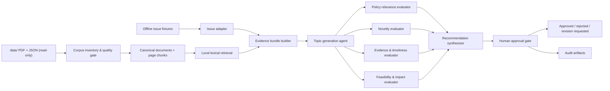
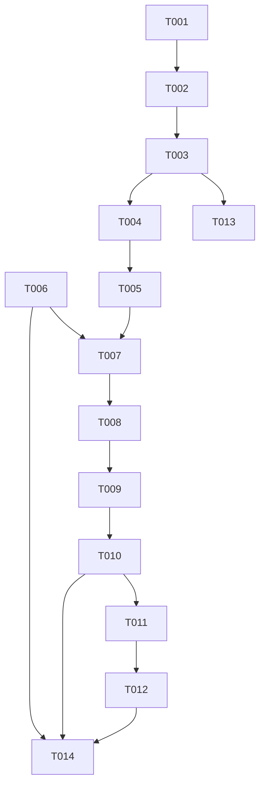
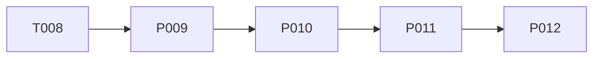

# defense-research-agent 파일럿 구현 계획

## 1. 목표

로컬의 한국국방연구원 공개 연구자료와 향후 연결할 최신 이슈 데이터를 근거로 국방정책 연구주제 후보를 생성·평가·추천하고, 최종 선택은 사람이 승인하는 멀티 에이전트 시스템을 단계적으로 구현한다.

이번 계획은 현재 확인한 실제 데이터 구조를 기준으로 한다. `data/`는 읽기 전용 원본으로 취급하며 모든 정규화·색인·실행 결과는 `artifacts/` 아래 파생 산출물로 만든다.

## 2. 설계 원칙

1. **원본 불변**: `data/` 아래에는 어떤 파일도 생성·수정·삭제·이동하지 않는다.
2. **근거 우선**: 후보 주제와 평가에는 문서 ID, PDF 상대 경로, 페이지 번호를 포함한다.
3. **품질 게이트**: 저추출·손상·중복 문서는 색인 전에 상태를 부여하고 기본 검색에서 제외한다.
4. **명시적 인간 승인**: 추천 결과는 자동 게시·확정하지 않는다. `approved` 전이는 사람만 수행한다.
5. **오프라인 재현성**: 첫 수직 프로토타입은 외부 API 대신 고정된 최신 이슈 fixture와 로컬 검색을 사용한다.
6. **교체 가능한 모델/검색기**: 생성 모델, 임베딩, 웹 검색 제공자를 인터페이스 뒤에 둔다. 테스트는 fake 구현으로 실행한다.
7. **비밀정보 비저장**: 키나 토큰을 코드·fixture·로그에 넣지 않는다.
8. **감사 가능성**: 입력 버전, 프롬프트 버전, 에이전트 결과, 사람의 판단과 시각을 실행 레코드에 남긴다.
9. **보수적 자동화**: 근거가 부족하거나 에이전트 평가가 충돌하면 추천 대신 `needs_review`를 반환한다.

## 3. 제안 아키텍처



첫 프로토타입에서 “에이전트”는 각각 입력/출력 JSON 스키마와 독립 평가 책임을 가진 실행 단위다. 단순히 하나의 긴 프롬프트를 여러 이름으로 나누지 않는다.

## 4. 제안 프로젝트 구조

아래는 구현 티켓에서 생성할 구조이며 현재 존재하는 파일이 아니다.

```text
defense-research-agent/
├── data/                              # 원본, 읽기 전용
├── artifacts/                         # 생성물, data와 분리
│   ├── inventory/
│   ├── corpus/
│   ├── index/
│   └── runs/
├── configs/
│   ├── quality.yaml
│   └── scoring.yaml
├── fixtures/
│   └── issues/
├── src/defense_research_agent/
│   ├── domain/
│   ├── ingestion/
│   ├── quality/
│   ├── parsing/
│   ├── retrieval/
│   ├── issues/
│   ├── agents/
│   ├── workflow/
│   └── interfaces/
├── tests/
│   ├── fixtures/
│   ├── unit/
│   ├── integration/
│   └── e2e/
└── pyproject.toml
```

`artifacts/`는 원본이 아니며 재생성 가능해야 한다. 대형 PDF나 원문 복사본을 이 경로에 중복 저장하지 않는다.

## 5. 개발 티켓

각 티켓은 단독으로 리뷰·테스트 가능한 크기로 정의했다. “변경 파일”은 해당 티켓에서 새로 만들거나 수정할 예정인 파일이다.

### T001. 읽기 전용 코퍼스 매니페스트와 연결 감사

- **목적**: 현재 파일 구조를 코드가 재현 가능하게 스캔하고 PDF-JSON 연결, 고아 파일, 논리 중복을 명시한다.
- **입력**: `data/` 경로
- **출력**:
  - `artifacts/inventory/files.jsonl`
  - `artifacts/inventory/document_links.jsonl`
  - `artifacts/inventory/findings.json`
  - 실행 요약 표준 출력
- **변경 파일**:
  - `pyproject.toml`
  - `src/defense_research_agent/domain/source_file.py`
  - `src/defense_research_agent/ingestion/inventory.py`
  - `src/defense_research_agent/interfaces/cli.py`
  - `tests/unit/ingestion/test_inventory.py`
  - `tests/integration/test_current_data_inventory.py`
- **완료 조건**:
  - PDF 371, JSON 373, `.DS_Store` 3을 재현한다.
  - 문서 JSON 372, 집계 JSON 1을 구분한다.
  - 고유 연결 370, orphan PDF 1, 3:1 중복 그룹 1을 보고한다.
  - 비교용 키는 NFC 정규화하되 원본 이름을 그대로 보존한다.
  - `data/`의 처리 전후 SHA-256 목록이 동일하다.
- **테스트**:
  - 정상 1:1 연결, orphan, 여러 JSON→하나의 PDF, 잘못된 JSON, 분해형/조합형 한글 fixture
  - 현재 데이터 수치에 대한 읽기 전용 통합 테스트
  - 동일 입력의 산출물 정렬과 ID가 결정적인지 확인
- **의존성**: 없음

### T002. 표준 문서 모델과 안정적 문서 ID

- **목적**: 원본 레코드를 변경하지 않고 후속 파이프라인이 사용할 표준 모델로 변환한다.
- **입력**: T001 `document_links.jsonl`, 문서 JSON
- **출력**: `artifacts/corpus/canonical_documents.jsonl`
- **변경 파일**:
  - `src/defense_research_agent/domain/document.py`
  - `src/defense_research_agent/ingestion/normalize.py`
  - `tests/unit/ingestion/test_normalize.py`
- **완료 조건**:
  - `document_id`, `source_type`, 원본/NFC 파일명, 저장소 상대 경로, PDF 해시, 페이지 수, 원본 메타데이터를 보존한다.
  - `metadata.path`를 식별 키로 사용하지 않는다.
  - 논리 중복은 하나의 canonical 문서와 여러 source-record 계보로 표현한다.
  - `filename_year`, `processed_at`, 아직 확인하지 못한 `published_at=null`을 구분한다.
- **테스트**:
  - 경로가 달라도 같은 PDF는 같은 ID
  - PDF 내용이 달라지면 ID 변경
  - 원본 값 손실 없는 round-trip 검사
- **의존성**: T001

### T003. 텍스트 품질 점수와 색인 게이트

- **목적**: 불완전하거나 손상된 추출 텍스트가 검색·생성 결과를 오염시키지 않게 한다.
- **입력**: T002 canonical 문서와 `page_texts`
- **출력**:
  - 품질 필드가 추가된 canonical 문서
  - `artifacts/corpus/reextract_queue.jsonl`
- **변경 파일**:
  - `configs/quality.yaml`
  - `src/defense_research_agent/quality/text_quality.py`
  - `src/defense_research_agent/quality/gates.py`
  - `tests/unit/quality/test_text_quality.py`
  - `tests/integration/test_quality_baseline.py`
- **완료 조건**:
  - `ready`, `warning`, `low_text`, `corrupt_text`, `duplicate`, `orphan_pdf`, `manual_review` 상태를 계산한다.
  - 1,000자 이하 38개와 심각한 제어문자 문서를 기본 색인에서 제외한다.
  - 임계값과 사유를 결과에 기록한다.
  - 원본 텍스트는 보존하고 정제 텍스트는 별도 필드에 둔다.
- **테스트**:
  - 빈 페이지 비율, 제어문자 비율, 쪽당 문자 수 경계값
  - `2023_이상국_인태지역주요군사력과전략동향` 특성을 축소한 fixture
  - 품질 설정 변경 시 상태 변화 테스트
- **의존성**: T002

### T004. 자료 유형별 서지·구조 파서

- **목적**: 네 유형에서 제목, 저자, 발행일, 요약/초록, DOI, 키워드와 본문 구간을 근거 위치와 함께 추출한다.
- **입력**: T003에서 `ready` 또는 `warning`인 문서
- **출력**: 구조화 필드와 필드별 `confidence`, `evidence_page`, `raw_text`
- **변경 파일**:
  - `src/defense_research_agent/parsing/base.py`
  - `src/defense_research_agent/parsing/brief.py`
  - `src/defense_research_agent/parsing/defense_forum.py`
  - `src/defense_research_agent/parsing/policy_studies.py`
  - `src/defense_research_agent/parsing/research_report.py`
  - `tests/fixtures/gold_documents/`
  - `tests/unit/parsing/`
- **완료 조건**:
  - 네 유형 각각 최소 5개 수작업 gold 표본에서 제목과 대표저자 정확도 100%
  - 복수 저자 순서, 원문 표기, 소속/이메일을 가능한 범위에서 분리
  - 날짜 정밀도(`day`, `month`, `season`, `year`)를 보존
  - `국방정책연구`의 DOI, Abstract, Keywords를 분리
  - 실패 시 추측값 대신 `null`과 사유 반환
- **테스트**:
  - 유형별 표지 변형, 계절호, 별표 저자 각주, 공백/제어문자
  - 파일명 연도와 본문 연도 충돌
  - 긴 파일명/잘린 제목에서 표지 제목 우선
- **의존성**: T003

### T005. 페이지 근거를 보존하는 청킹과 로컬 검색

- **목적**: 외부 임베딩 API 없이 재현 가능한 첫 검색 계층을 만든다.
- **입력**: T004 구조화 문서와 페이지 텍스트
- **출력**:
  - `artifacts/corpus/chunks.jsonl`
  - `artifacts/index/lexical/`
  - 페이지 인용이 포함된 검색 결과
- **변경 파일**:
  - `src/defense_research_agent/retrieval/chunking.py`
  - `src/defense_research_agent/retrieval/lexical_index.py`
  - `src/defense_research_agent/retrieval/models.py`
  - `tests/unit/retrieval/`
  - `tests/integration/test_retrieval.py`
- **완료 조건**:
  - 청크마다 `document_id`, 자료 유형, 페이지 시작/끝, 텍스트 해시를 가진다.
  - 품질 게이트 제외 문서는 기본 인덱스에 들어가지 않는다.
  - 같은 입력에서 청크와 검색 순서가 결정적이다.
  - 검색 결과가 실제 페이지 텍스트로 역추적된다.
- **테스트**:
  - 페이지 경계를 넘는 청크, 짧은 문서, 중복 문서 제외
  - 국방 AI/인력/획득 등 골든 질의의 관련 문서 회수
  - 인덱스 재생성 동일성
- **의존성**: T004

### T006. 최신 이슈 표준 모델과 오프라인 어댑터

- **목적**: 향후 웹 검색 제공자와 현재 오프라인 프로토타입이 같은 이슈 스키마를 사용하게 한다.
- **입력**: 사람이 검토해 저장한 JSON fixture
- **출력**: 정규화된 `IssueItem[]`
- **변경 파일**:
  - `src/defense_research_agent/domain/issue.py`
  - `src/defense_research_agent/issues/base.py`
  - `src/defense_research_agent/issues/fixture_provider.py`
  - `fixtures/issues/pilot.json`
  - `tests/unit/issues/test_fixture_provider.py`
- **완료 조건**:
  - `issue_id`, 제목, 요약, 발생일/게시일, 출처명, URL, 수집시각, 원문 해시, 검토 상태를 표현한다.
  - fixture는 공개정보만 포함하고 비밀정보·토큰을 포함하지 않는다.
  - 중복 URL과 동일 내용 이슈를 결정적으로 병합한다.
- **테스트**:
  - 날짜 정밀도, URL 정규화, 중복, 필수 필드 누락
  - 네트워크 호출이 발생하지 않는지 확인
- **의존성**: 없음

### T007. 이슈-코퍼스 근거 묶음 생성

- **목적**: 각 최신 이슈에 관련된 KIDA 근거와 기존 연구의 공백을 생성 에이전트 입력으로 묶는다.
- **입력**: T005 검색기, T006 `IssueItem[]`
- **출력**: `EvidenceBundle` JSON
- **변경 파일**:
  - `src/defense_research_agent/retrieval/evidence.py`
  - `src/defense_research_agent/domain/evidence.py`
  - `tests/unit/retrieval/test_evidence.py`
  - `tests/integration/test_issue_to_evidence.py`
- **완료 조건**:
  - 이슈마다 상위 근거와 반대/인접 근거를 구분한다.
  - 모든 인용은 문서 ID와 페이지를 가진다.
  - 자료 유형 하나가 결과를 독점하지 않도록 유형별 한도를 설정할 수 있다.
  - 근거 부족 시 명시적인 `insufficient_evidence`를 반환한다.
- **테스트**:
  - 인용 역추적, 유형 다양성, 중복 청크 억제
  - 관련 문서가 없는 이슈 처리
- **의존성**: T005, T006

### T008. 연구주제 후보 생성 에이전트

- **목적**: 이슈와 근거 묶음으로 검증 가능한 연구질문 후보를 생성한다.
- **입력**: `EvidenceBundle`, 후보 수, 정책 분야 제약
- **출력**: `TopicCandidate[]`
- **변경 파일**:
  - `src/defense_research_agent/agents/model_gateway.py`
  - `src/defense_research_agent/agents/topic_generator.py`
  - `src/defense_research_agent/domain/topic.py`
  - `src/defense_research_agent/agents/prompts/topic_generator.md`
  - `tests/unit/agents/test_topic_generator.py`
- **완료 조건**:
  - 후보마다 제목, 연구질문, 정책 배경, 예상 기여, 연구 범위, 방법 후보, 근거 인용, 가정을 가진다.
  - 근거에 없는 사실은 주장으로 확정하지 않고 가정/확인 필요로 표시한다.
  - 모델 출력은 스키마 검증 실패 시 제한 횟수 내 재시도 후 실패한다.
  - 테스트는 결정적 fake model을 사용하며 API 키가 필요 없다.
- **테스트**:
  - 유효/무효 모델 출력, 인용 없는 후보 거부, 프롬프트 버전 고정
  - 같은 fake 응답의 결정적 파싱
- **의존성**: T007

### T009. 독립 평가 에이전트와 점수 보정

- **목적**: 후보를 서로 다른 평가 책임으로 검토하고 단일 모델의 자기평가 편향을 줄인다.
- **입력**: `TopicCandidate`, `EvidenceBundle`, 평가 설정
- **출력**: 평가자별 `EvaluationCard`
- **변경 파일**:
  - `configs/scoring.yaml`
  - `src/defense_research_agent/agents/evaluators.py`
  - `src/defense_research_agent/domain/evaluation.py`
  - `src/defense_research_agent/agents/prompts/evaluators/`
  - `tests/unit/agents/test_evaluators.py`
- **완료 조건**:
  - 정책 관련성, 기존 KIDA 연구 대비 신규성, 시의성/근거성, 수행 가능성/정책 파급의 네 평가를 분리한다.
  - 각 점수는 근거, 불확실성, 치명적 결함을 포함한다.
  - 평가자 간 점수 차이가 임계값을 넘으면 `needs_review`가 된다.
  - 평가 입력에는 다른 평가자의 점수를 노출하지 않는다.
- **테스트**:
  - 평가자 격리, 점수 범위, 치명적 결함 규칙, 충돌 감지
  - 근거가 빈 후보의 하향 평가
- **의존성**: T008

### T010. 추천 합성기와 인간 승인 상태기계

- **목적**: 평가 결과를 설명 가능한 순위로 합성하고 사람만 최종 상태를 바꾸게 한다.
- **입력**: 후보와 평가 카드
- **출력**:
  - 순위가 있는 `RecommendationSet`
  - `ApprovalDecision`
  - append-only 실행/판단 로그
- **변경 파일**:
  - `src/defense_research_agent/workflow/recommendation.py`
  - `src/defense_research_agent/workflow/approval.py`
  - `src/defense_research_agent/domain/approval.py`
  - `tests/unit/workflow/`
- **완료 조건**:
  - 허용 상태는 `proposed`, `needs_review`, `approved`, `rejected`, `revision_requested`다.
  - 에이전트는 `approved` 상태를 만들 수 없다.
  - 가중치와 탈락 사유를 결과에 노출한다.
  - 승인자 입력, 시각, 코멘트, 대상 후보 버전을 기록한다.
- **테스트**:
  - 상태 전이 표 전체, 무권한 자동 승인 거부
  - 동점/평가 충돌/근거 부족 처리
  - 로그 append-only 동작
- **의존성**: T009

### T011. 첫 수직 프로토타입 CLI 조립

- **목적**: 한 명의 연구자가 로컬에서 이슈 선택부터 후보 승인까지 한 흐름을 실행하게 한다.
- **입력**: 품질 통과 문서 표본, 오프라인 이슈 fixture, 실행 설정
- **출력**:
  - 콘솔의 후보·평가·근거 보기
  - `artifacts/runs/<run_id>/run.json`
  - 승인 결정 JSON
- **변경 파일**:
  - `src/defense_research_agent/workflow/pilot.py`
  - `src/defense_research_agent/interfaces/cli.py`
  - `configs/pilot.yaml`
  - `tests/e2e/test_pilot_workflow.py`
- **완료 조건**:
  - `inventory → quality → parse → retrieve → generate → evaluate → recommend → human decision`이 한 명령 흐름으로 동작한다.
  - 후보의 모든 KIDA 인용을 PDF 페이지까지 조회할 수 있다.
  - 승인 입력 없이는 실행이 `proposed`로 끝난다.
  - 실행 재현에 필요한 입력 해시·설정·프롬프트 버전을 저장한다.
- **테스트**:
  - fake model 기반 완전 오프라인 E2E
  - 승인/거절/수정요청 세 경로
  - 네트워크 차단 환경에서 성공
  - 실행 전후 `data/` 해시 불변
- **의존성**: T010

### T012. 골든셋과 회귀 평가

- **목적**: “그럴듯한 결과”가 아니라 회수율·근거성·평가 일관성을 측정한다.
- **입력**: 연구자가 검토한 질의, 관련 문서, 후보/점수 기준
- **출력**: `artifacts/runs/<run_id>/evaluation.json`
- **변경 파일**:
  - `tests/fixtures/golden_cases/`
  - `src/defense_research_agent/evaluation/harness.py`
  - `tests/integration/test_golden_cases.py`
- **완료 조건**:
  - 검색 Recall@K, 인용 유효율, 무근거 후보율, 평가자 불일치율을 계산한다.
  - 기준 이하이면 CI가 실패한다.
  - 모델이 없는 테스트와 모델이 있는 선택적 평가를 분리한다.
- **테스트**:
  - 지표 계산식과 실패 임계값
  - 고의로 깨진 인용과 중복 후보 탐지
- **의존성**: T011

### T013. 저추출 문서 재추출/OCR 어댑터

- **목적**: 원본을 바꾸지 않고 `low_text`/`corrupt_text` 문서의 대체 텍스트를 생성한다.
- **입력**: T003 재추출 대기열과 원본 PDF
- **출력**: `artifacts/corpus/reextracted/<document_id>.json`
- **변경 파일**:
  - `src/defense_research_agent/ingestion/extractors/base.py`
  - `src/defense_research_agent/ingestion/extractors/pdf_text.py`
  - `src/defense_research_agent/ingestion/extractors/ocr.py`
  - `tests/integration/test_reextraction.py`
- **완료 조건**:
  - 원본/대체 추출기, 버전, 페이지별 신뢰도를 기록한다.
  - 대체 텍스트가 기존 품질을 실제로 개선한 경우만 채택한다.
  - 원본 JSON과 PDF를 수정하지 않는다.
- **테스트**:
  - 이미지형 PDF fixture, 잘못된 Unicode 매핑 fixture
  - 품질 악화 시 기존 결과 유지
- **의존성**: T003

### T014. 실제 최신 이슈 검색 제공자

- **목적**: 검증된 수직 흐름에 외부 최신 이슈 수집을 추가한다.
- **입력**: 검색 질의, 기간, 허용 출처 정책
- **출력**: T006과 같은 `IssueItem[]` 및 원문 스냅샷/출처 메타데이터
- **변경 파일**:
  - `src/defense_research_agent/issues/web_provider.py`
  - `configs/sources.yaml`
  - `tests/contract/test_web_provider.py`
- **완료 조건**:
  - 출처 URL, 게시일, 수집일, 원문 해시, 검색 질의를 보존한다.
  - 로봇 정책·이용약관·재시도·속도 제한·중복 제거를 적용한다.
  - 자격증명은 런타임 환경에서만 읽고 로그에 남기지 않는다.
  - 사람이 출처를 확인하기 전에는 `reviewed=false`다.
- **테스트**:
  - 네트워크를 모킹한 계약 테스트
  - 시간 초과, 속도 제한, 중복 기사, 게시일 누락
  - 비밀정보 로그 유출 검사
- **의존성**: T006, T010, T012

## 6. 티켓 의존성



병렬로 시작할 수 있는 티켓은 T001과 T006이다. T013은 기본 품질 게이트가 안정된 후 별도 진행할 수 있고, T014는 오프라인 수직 흐름과 회귀 기준이 통과된 뒤에만 연결한다.

## 7. 첫 번째 수직 프로토타입 범위

### 포함

- 각 자료 유형에서 품질 게이트를 통과한 최신 문서 10개씩, 총 40개
- 사람이 검토한 오프라인 최신 이슈 fixture 5개
- 유형별 제목·저자·날짜·초록/요약의 최소 파싱
- 페이지 단위 근거가 보존되는 로컬 lexical 검색
- 이슈당 연구주제 후보 최대 5개
- 4개 독립 평가 역할
- 상위 3개 추천과 평가 충돌 표시
- CLI에서 근거 확인 후 승인·거절·수정요청
- 실행별 JSON 감사 산출물
- 테스트에서는 fake model만 사용하고 네트워크 호출 금지

### 제외

- 실시간 웹 검색
- 전체 371개 PDF 색인
- OCR/재추출
- 외부 임베딩 또는 벡터 DB
- 운영 DB, 사용자 계정, 권한관리, 배포
- 자동 승인·자동 게시
- 비공개/비밀 자료

### 성공 기준

- 표본 40개가 원본 수정 없이 결정적으로 매니페스트·색인된다.
- 모든 추천 후보가 최소 2개의 KIDA 페이지 인용을 갖거나 `insufficient_evidence`로 탈락한다.
- 같은 입력과 fake model 응답으로 같은 순위와 실행 산출물이 생성된다.
- 사람이 승인하기 전에는 어떤 후보도 `approved`가 아니다.
- 골든 질의의 관련 문서 Recall@5 목표를 초기 0.8 이상으로 둔다.
- 인용의 문서/페이지 역추적 성공률은 100%여야 한다.
- 무근거 인용 허용률은 0%여야 한다.

## 8. 다음 작업에서 구현할 첫 티켓

**T001. 읽기 전용 코퍼스 매니페스트와 연결 감사**를 먼저 구현한다.

이 티켓은 이후 모든 처리의 문서 수와 식별자를 고정하고, 현재 확인된 orphan PDF 1개와 논리 중복 1그룹을 자동으로 재현한다. T001이 없으면 후속 색인에서 같은 문서가 세 번 반영되거나 메타데이터 없는 PDF가 조용히 누락될 수 있다.

첫 구현의 종료 시점에는 애플리케이션 에이전트나 외부 API를 아직 연결하지 않는다. 대신 다음 명령 수준의 결과가 재현돼야 한다.

```text
PDF files:                 371
JSON files:                373
Document JSON records:     372
Index JSON files:            1
Unique linked documents:   370
Orphan PDFs:                 1
Duplicate target groups:     1
Source mutations:            0
```

## 9. Prompt 9~12 파일럿 완성 계획

기존 T009~T012를 현재 도메인 모델과 LangGraph 구현에 맞춰 다음 네 개의 독립
변경 단위로 구체화한다. 각 단계는 앞 단계의 Pydantic 산출물만 입력으로 사용한다.

### P009. 독립 평가와 부분 실패 집계

- **입력**: `TopicCandidate[]`, `TopicSignal[]`, 내부 `ResearchPublicationRepository`
- **출력**: 후보별 `EvaluationResult[]`, 평가 실패, 누락 기준, Python 종합점수
- **변경 파일**: `domain/evaluation.py`, `agents/evaluators.py`,
  `services/evaluation.py`, `graph/research_workflow.py`, 관련 단위·그래프 테스트
- **완료 조건**: 네 평가 역할이 다른 평가 결과를 입력으로 받지 않고 병렬 실행되며,
  제한된 재시도 뒤 실패를 후보별 기록으로 보존한다. 무근거 고득점과 직접 중복 신규성
  점수는 Python 규칙으로 제한한다.
- **테스트**: 독립성, 실제 병렬성, 범위, 근거 게이트, 부분 실패, 누락 기준,
  재현성, 직접 중복 감점
- **의존성**: T008

### P010. 결정적 랭킹과 다양성 조정

- **입력**: 후보, P009 집계, 신호 속성, `configs/scoring.json`
- **출력**: 원점수, 감점, 다양성 조정, 최종 순위와 계산 내역
- **변경 파일**: `configs/scoring.json`, `domain/ranking.py`,
  `services/ranking.py`, `graph/research_workflow.py`, `docs/EVALUATION_CRITERIA.md`,
  관련 단위·그래프 테스트
- **완료 조건**: 일곱 기준의 가중합과 감점·동점 처리를 순수 Python 함수로 수행하고,
  다양성 비활성화가 가능하며 같은 입력에서 byte-equivalent 순위가 나온다.
- **테스트**: 가중치, 모든 감점 계열, 동점, 분야·국가 편중 완화, 비활성화,
  부족한 후보 수, 재현성
- **의존성**: P009

### P011. 인간 승인 중단·재개와 주제기획 카드

- **입력**: `artifacts/runs/{run_id}/ranked_candidates.json`, 연구자 결정·수정
- **출력**: append-only `review_history.jsonl`, 승인 후보의
  `topic_planning_cards.json`
- **변경 파일**: `domain/review.py`, `repositories/review_history.py`,
  `services/review.py`, `graph/research_workflow.py`, `cli/review_topics.py`,
  README와 관련 테스트
- **완료 조건**: 승인 입력 전 그래프가 `awaiting_review`로 종료되고 최종 카드를
  만들지 않는다. 같은 `run_id`의 승인·수정승인만 카드로 변환하고 보류·제외는 차단한다.
- **테스트**: 네 결정, 중단·재개, 잘못된 ID, append-only 이력, 미승인 출력 차단
- **의존성**: P010

### P012. 재현 가능한 품질 하네스와 파일럿 판정

- **입력**: 정규화·수집 보고서, 검색 저장소, 생성·평가·랭킹 실행 산출물,
  선택적 전문가 골든셋
- **출력**: `evaluation_summary.json`, `evaluation_report.md`,
  `expert_review_template.csv`, `docs/PILOT_RESULT.md`
- **변경 파일**: `evaluation/harness.py`, `cli/evaluate_pilot.py`,
  평가 fixture·테스트, README와 파일럿 결과 문서
- **완료 조건**: 실제 계산 가능한 지표만 수치화하고 골든셋이 필요한 지표는
  `unavailable`로 표시한다. 시점 분할은 파일명 연도보다 미래인 문서를 입력에서
  제외하고 누출 건수를 명시한다.
- **테스트**: 지표 계산, unavailable, 누출 탐지, 실패 사례 보존, 출력 3종,
  오프라인 재현성
- **의존성**: P011



## 10. P013 7개 역할 연구실 수직 슬라이스

- **목적**: 기존 주제 생성·평가 파이프라인 위에 연구 계획부터 PoC 제안과 독립 검토,
  최종 종합까지 수행하는 연구실 단위 오케스트레이션을 추가한다.
- **입력**: 사람의 `ResearchBrief`, 역할별 `ModelRoute`, provider-neutral
  `ModelGateway`
- **출력**: `ResearchPlan`, 전문 연구 결과 4종, 독립 검토 2종, 부분 실패와
  사람 검토 대기 상태의 `ResearchLabReport`
- **변경 파일**:
  - `domain/research_lab.py`
  - `agents/research_lab.py`
  - `services/research_lab.py`
  - `cli/research_lab_demo.py`
  - `docs/RESEARCH_LAB.md`
  - 관련 domain·agent·service·통합 테스트
- **완료 조건**:
  - 일곱 역할의 책임, 모델 라우트와 허용 도구가 코드 계약으로 분리된다.
  - 메인 연구자가 네 전문 역할에 중복 없는 과업을 배정하고 병렬 실행한다.
  - 근거 감사와 비판 검토는 같은 전문 연구 스냅샷을 독립적으로 받는다.
  - 한 역할의 실패가 다른 성공 결과를 취소하지 않고 최종 종합에 전달된다.
  - 개발 연구자는 코드·테스트 산출물을 제안할 수 있지만 배포 권한이 없다.
  - 최종 상태는 항상 사람 검토 대기이며 자동 승인은 불가능하다.
  - 실제 API 없이 Fake gateway로 전체 경로를 재현할 수 있다.
- **테스트**: 역할 수·권한, 계획 검증, 구조화 출력 scope 검증, 실제 병렬 실행,
  부분 실패, 독립 검토 context, 사람 승인 경계, 오프라인 CLI
- **후속 의존성**:
  - Claude structured-output gateway와 계약 테스트
  - GCP 비동기 실행·상태·감사 저장소

## 11. P014 역할별 검색 도구와 증거 주입

- **목적**: 현재 내부 발간물 검색과 외부 이슈 Provider를 역할 권한 안에서 실행하고,
  검색 근거를 모델 입력과 감사 결과에 연결한다.
- **입력**: `ResearchTask.requested_tools`, 역할 `allowed_tools`, 검색 질의,
  `ResearchPublicationRepository`, `ExternalIssueSearchProvider`
- **출력**: evidence ID, 출처, locator, excerpt, 신뢰 표시와 실패를 포함한
  `ResearchToolContext`
- **변경 파일**:
  - `domain/research_lab.py`
  - `agents/research_lab.py`
  - `services/research_tools.py`
  - `services/research_lab.py`
  - `cli/research_lab_demo.py`
  - 관련 agent·service·통합 테스트와 연구실 문서
- **완료 조건**:
  - 모델 계획의 요청 도구가 역할 허용 목록 밖이면 모델 실행 전에 차단한다.
  - 내부 검색 결과는 발간물 ID와 검색 점수·일치 필드·로컬 경로를 보존한다.
  - 외부 검색 결과는 정규화 URL·게시일·신뢰도와 untrusted 표시를 보존한다.
  - Provider 부분 실패가 성공 근거를 버리지 않고 태스크 context에 남는다.
  - context나 동료 결과에 없는 evidence ID를 에이전트가 인용할 수 없다.
  - Fake model 기반 오프라인 데모에서 내부·외부 근거가 실제 주입된다.
- **테스트**: 내부 검색 변환, 외부 정규화·부분 실패, adapter 미설정, 역할 권한 위반,
  허용·허위 evidence ID, CLI 근거 주입
- **다음 우선순위**:
  - 분석 연구자의 제한된 `data_analysis_sandbox`
  - Claude structured-output gateway

## 12. P015 개발·PoC 코드 샌드박스

- **목적**: 개발 연구자의 구조화된 코드 변경안을 원본과 분리된 임시 작업공간에서
  검증하고, diff와 검사 결과를 PI와 사람 검토자에게 전달한다.
- **입력**: `ProposedArtifact(kind=code_patch)`, `CodeFileChange[]`,
  `CodeSandboxValidation[]`
- **출력**: 변경 경로, unified diff, 검사별 결과, 차단 사유와
  `applied_to_source=false`, `deployed=false`인 `CodeSandboxResult`
- **변경 파일**:
  - `domain/research_lab.py`
  - `services/code_sandbox.py`
  - `services/research_lab.py`
  - `agents/research_lab.py`
  - `cli/research_lab_demo.py`
  - 관련 domain·service·통합 테스트와 연구실 문서
- **완료 조건**:
  - 생성과 교체만 지원하고 삭제를 지원하지 않는다.
  - 교체는 예상 SHA-256이 일치할 때만 허용한다.
  - `data/`, `artifacts/`, 저장소 메타데이터와 허용 범위 밖 경로를 차단한다.
  - 자유 셸 명령 대신 고정 validation enum과 상대 대상 경로만 받는다.
  - 임시 작업공간 정리 전 diff와 검사 로그를 결과에 보존한다.
  - 실행 전후 원본 대상 파일 해시가 동일하다.
  - 로컬 기본 runner는 구문 검사만 수행하고 pytest는 격리 backend 없이는 차단한다.
  - 최종 보고서가 sandbox 결과를 입력으로 받되 자동 반영·승인·배포하지 않는다.
- **테스트**: 안전한 생성, 구문 오류, 허용 경로, 체크섬 불일치, 원본 불변,
  자유 명령 비실행, pytest 격리 요구, service 미설정, CLI sandbox 결과
- **다음 우선순위**:
  - 제한된 `data_analysis_sandbox`
  - Claude structured-output gateway

## 13. P016 GCP Cloud Run Job 격리 pytest runner

- **목적**: 로컬 프로세스에서 실행할 수 없는 개발 연구자의 pytest를 최소 권한
  Cloud Run Job으로 위임하고 결과를 요청 bundle에 암호학적으로 결합한다.
- **입력**: 임시 workspace, `CodeSandboxValidation`, GCP project·region·job·bucket 설정
- **출력**: request ID와 workspace SHA-256에 결합된 `SandboxJobResultEnvelope`
- **변경 파일**:
  - `domain/sandbox_job.py`
  - `services/gcp_code_sandbox.py`
  - `services/sandbox_worker.py`
  - `cli/sandbox_worker.py`
  - `deploy/gcp-sandbox/`
  - 관련 service·worker 계약 테스트와 운영 문서
- **완료 조건**:
  - controller가 `src`, `tests`, `pyproject.toml`만 결정적 ZIP으로 만든다.
  - bundle과 request 객체는 GCS에서 create-only이며 worker 결과도 덮어쓸 수 없다.
  - Cloud Run 실행은 task 1개, 재시도 0, 고정 container와 실행별 request override만 쓴다.
  - worker는 checksum, 상대 경로, symlink, 파일 유형과 압축 해제 크기를 재검증한다.
  - pytest 명령은 Python 코드에 고정되고 model 문자열을 명령으로 받지 않는다.
  - controller는 request ID, bundle checksum, 검사 종류와 대상이 일치한 결과만 수락한다.
  - 전용 서비스 계정은 전용 버킷 객체 get/create만 가지며 list/delete/overwrite와
    소스 반영·배포 권한을 가지지 않는다.
  - Direct VPC `ALL_TRAFFIC`, Private Google Access와 egress firewall을 Terraform으로
    선언하고 worker image는 digest로 고정한다.
  - 실제 GCP 배포는 project ID, image digest와 운영자 승인 없이는 수행하지 않는다.
- **테스트**: 결정적 bundle, symlink·traversal 거부, pytest 성공·실패, 결과 checksum
  불일치, Fake Cloud Run override 계약, 원격 runner Fake GCS 왕복
- **다음 우선순위**:
  - P017 제한된 `data_analysis_sandbox`
  - P018 Claude structured-output gateway

## 14. P017 제한된 공개 데이터 분석 샌드박스

- **목적**: 방법론·데이터 연구자가 모델 생성 코드나 SQL 없이, 검토된 공개 데이터셋에
  대해 재현 가능한 소규모 기술 분석을 수행하게 한다.
- **입력**: 배포자 등록 `DataAnalysisDataset`, planner의 `DataAnalysisRequest[]`
- **출력**: 입력 SHA-256, 행 수, 결정적 통계, caveat와 출처 evidence ID를 포함한
  `ResearchToolEvidence`
- **변경 파일**:
  - `domain/data_analysis.py`
  - `domain/research_lab.py`
  - `services/data_analysis_sandbox.py`
  - `resources/default_data_analysis_datasets.json`
  - `agents/research_lab.py`
  - `cli/research_lab_demo.py`
  - 관련 domain·service·통합 테스트와 문서
- **완료 조건**:
  - planner는 행을 보지 않고 등록된 dataset ID와 열 catalog만 받는다.
  - 행 수, 수치 기술통계, 그룹 건수·평균, Pearson 상관만 enum으로 요청한다.
  - 필터는 열-스칼라 고정 비교만 지원한다.
  - 임의 코드, SQL, 셸, 경로, URL과 데이터 변경 필드는 스키마에 존재하지 않는다.
  - 실패한 분석과 성공한 분석이 함께 있을 때 성공 결과를 보존한다.
  - 결과는 입력 checksum과 원본·필터 행 수를 포함하고 근거 ID로 인용할 수 있다.
  - 오프라인 7역할 데모가 분석 결과를 방법론 연구자의 실제 입력 근거로 사용한다.
- **테스트**: 연산별 결과, 필터, 부분 실패, 미등록 데이터셋·열, 중복 요청 ID,
  임의 SQL 필드 거부, 패키지 resource 포함, 연구실 통합 evidence 경로
- **다음 우선순위**:
  - P018 Claude structured-output gateway와 역할별 route 설정 (완료)
  - 주 애플리케이션 Cloud Run API·비동기 상태 저장·Secret Manager 배포

최종 배포 목표는 사용자가 저장소를 Git에 올리고 GCP 배포를 수행한 뒤 Claude API 키만
Secret Manager에 입력하면 기동되는 상태다. P017은 모델의 데이터 실행 권한을 제한하는
경계를 완성했고 P018은 Claude 모델 경계를 키 하나로 설정할 수 있게 했다. P019는
Secret Manager 키 하나로 7개 역할을 기동하는 사용자 API·비동기 실행 경로를 완성했다.
P020은 검토된 production corpus와 공식 외부 검색 adapter를 같은 키 기반 배포 경로에
연결했다.

## 15. P018 Claude 구조화 출력 게이트웨이와 역할별 라우팅

- **목적**: 7개 연구실 역할을 공식 Anthropic SDK에 연결하면서 기존 Pydantic 산출물,
  근거 검증과 사람 승인 경계를 그대로 유지한다.
- **입력**: `ANTHROPIC_API_KEY`, 선택적 timeout·재시도·역할별 모델 override,
  `ModelCallRequest`
- **출력**: 요청의 `output_schema`로 검증된 도메인 모델과 비밀정보가 없는
  `AnthropicModelCallAudit`
- **변경 파일**:
  - `agents/anthropic_model_gateway.py`
  - `agents/anthropic_research_lab.py`
  - `agents/model_gateway.py`
  - `domain/research_lab.py`
  - `cli/main.py`
  - `.env.example`, `pyproject.toml`, `uv.lock`
  - 관련 unit·SDK 계약·CLI 테스트와 `docs/CLAUDE_GATEWAY.md`
- **완료 조건**:
  - API 키 하나만 있으면 기본 7개 역할 route를 구성한다.
  - 공식 SDK의 `messages.parse()`가 Pydantic 스키마를 structured-output 요청으로
    변환하며 반환값을 애플리케이션도 재검증한다.
  - 시스템 메시지는 top-level system으로, 사용자 메시지는 provider messages로
    결정적으로 변환한다.
  - refusal, max tokens, invalid output과 provider 실패가 정제 오류로 구분된다.
  - API 키, 전체 프롬프트와 provider 원문을 로그나 CLI에 출력하지 않는다.
  - 메인 연구자 한 명과 여섯 worker가 각자의 고정 route gateway를 공유 client 위에서
    사용한다.
  - 역할별 모델은 환경변수로 교체할 수 있고 기본 요청은 현재 모델 호환성을 위해
    sampling parameter를 생략한다.
- **테스트**: 키 마스킹·설정 검증, 역할별 route, 실제 SDK의 HTTP 요청 변환,
  Pydantic 파싱, refusal·token·invalid output, 감사 레코드, CLI 비밀정보 비노출
- **다음 우선순위**:
  - P019 사용자 Cloud Run API와 비동기 상태 저장 (완료)
  - Secret Manager binding과 Git 기반 Terraform 일괄 배포 (완료)

## 16. P019 GCP 사용자 API와 비동기 연구 실행

- **목적**: Git checkout에서 배포 스크립트를 실행하고 Claude API 키를 한 번 입력하면
  7개 역할 연구실을 비동기로 사용할 수 있는 private GCP PoC를 제공한다.
- **입력**: IAM 인증 사용자 연구 요청, GCP project·region, Secret Manager의
  `ANTHROPIC_API_KEY`
- **출력**: Firestore project 상태, checksum 결합 GCS `ResearchLabRun`, append-only
  사람 검토 이력
- **변경 파일**:
  - `domain/research_project.py`
  - `repositories/research_projects.py`
  - `services/research_projects.py`
  - `services/gcp_research_runtime.py`
  - `api/app.py`, `cli/research_worker.py`
  - `deploy/gcp-app/`
  - FastAPI·Firestore·GCS·Cloud Run 계약 테스트와 운영 문서
- **완료 조건**:
  - API가 요청을 Firestore에 먼저 저장하고 202와 server-generated project ID를
    반환한다.
  - API 요청 안에서 모델 호출을 수행하지 않고 전용 Cloud Run Job을 override 실행한다.
  - worker가 `queued → running → awaiting_human_review` 상태만 결정적으로 전이한다.
  - 전체 결과는 create-only GCS 객체이며 Firestore checksum·크기·project ID와
    일치해야 API가 반환한다.
  - 승인, 수정승인, 보류와 거부는 사람 API에서만 생성되고 모델이 승인 상태를 만들 수
    없다. 보류 결과는 나중에 다시 검토할 수 있다.
  - API는 private IAM이고 Claude key는 worker만 접근한다.
  - Secret 값은 Terraform 변수·state·로그에 포함하지 않고 숫자 secret version을
    image digest 고정 worker에 연결한다.
  - 배포 스크립트가 기존 default Firestore 위치를 보존하고 현재 gcloud 사용자를 API
    invoker로 등록한다.
- **테스트**: 상태 전이, 중복 claim, dispatch 실패 정제, 결과 checksum·project binding,
  사람 검토, FastAPI 202·404·409·422, Cloud Run override, create-only GCS, 정적
  Terraform·Docker·secret 경계, 전체 회귀
- **현재 한계**:
  - 내부 코퍼스와 외부 최신 출처 production adapter는 P020에서 연결했다.
  - GCP 코드 샌드박스는 별도 배포 계약이며 주 worker에 자동 연결하지 않는다.
- **다음 우선순위**:
  - P020 검토된 내부 코퍼스 GCS 인덱스와 공식 외부 출처 검색 adapter
  - 실제 GCP staging 배포 smoke test와 비용·token 관측성

## 17. P020 검토된 내부 코퍼스와 Claude 공식 출처 검색

- **목적**: Claude API 키 하나만으로 최신 공식 출처를 검색하고, 운영자가 검토한 공개
  내부 자료를 private GCS에서 무결성 검증 후 연구 역할에 제공한다.
- **입력**: 선택적 read-only `data/`, `ANTHROPIC_API_KEY`, 공식 출처 도메인 allow-list
- **출력**: content-addressed JSONL·승인 manifest, 출처 URL·수집시각·provider
  metadata가 포함된 `ResearchToolEvidence`
- **변경 파일**:
  - `domain/corpus_index.py`, `domain/external_issue.py`
  - `repositories/publication_index.py`, `repositories/gcs_publications.py`
  - `issues/anthropic_web_search.py`
  - `services/corpus_index.py`, `services/gcp_research_runtime.py`
  - `cli/corpus_index.py`, `deploy/gcp-app/`
  - 관련 repository·provider·배포 계약 테스트와 운영 문서
- **완료 조건**:
  - 배포 스크립트가 `data/` 전후 checksum을 비교하고 승인 전 업로드하지 않는다.
  - index와 manifest는 SHA-256 객체명과 generation 0 precondition으로 생성한다.
  - worker는 GCS list 없이 exact get만 사용하고 size·SHA·record count를 검증한다.
  - 공식 검색은 같은 Claude 키, 고정 도메인 allow-list와 요청별 사용 한도를 쓴다.
  - Claude citation URL은 실제 `web_search_result` 및 허용 도메인과 일치해야 근거가 된다.
  - 검색 본문을 신뢰하지 않고 추적 query를 제거하며 URL·수집시각·provider metadata를
    보존한다.
  - 내부·외부 검색 실패는 역할별 근거 공백으로 격리한다.
- **다음 우선순위**:
  - 7역할 `ResearchLabService`를 typed LangGraph로 단계 이관
  - GCP staging smoke test와 token·검색비용·role latency 관측성
