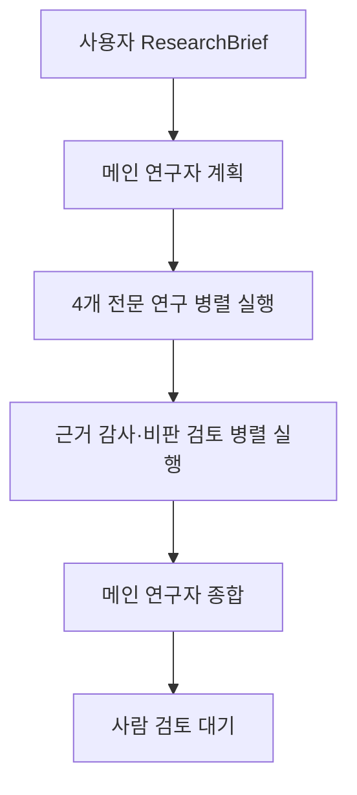

# 7개 역할 연구실 오케스트레이션

## 현재 구현 범위

현재 코드는 하나의 연구 요청을 7개 역할이 협업하는 수직 흐름으로 실행한다. 각 역할은
이름만 다른 프롬프트가 아니라 별도의 책임, 허용 도구, 논리 모델 라우트와 Pydantic
산출물 계약을 가진다. 기본 실행은 `FakeModelGateway`를 사용하므로 API 키와 네트워크가
필요 없다.

| 역할 | 책임 | 기본 허용 도구 |
|---|---|---|
| 메인 연구자 | 계획, 과업 배정, 충돌·실패를 포함한 최종 종합 | 산출물 읽기 |
| 문헌 연구자 | 내부 문헌, 선행연구, 연구 공백과 페이지 근거 | 내부 코퍼스 검색, 산출물 읽기 |
| 최신 이슈 연구자 | 최신 공식 공개 출처, 날짜와 사실·해석 구분 | 외부 출처 검색, 산출물 읽기 |
| 방법론·데이터 연구자 | 연구설계, 지표, 비교 기준과 데이터 한계 | 데이터 분석 샌드박스, 산출물 읽기 |
| 개발·PoC 연구자 | 최소 코드 변경안, 테스트와 검증 명령 | 코드 샌드박스, 내부 검색, 산출물 읽기 |
| 근거 감사자 | 주장-근거 일치, 출처 신뢰도와 누락 근거 감사 | 내·외부 검색, 산출물 읽기 |
| 비판·레드팀 연구자 | 반증, 부작용, 대안 설명과 실행 위험 | 산출물 읽기 |

개발·PoC 연구자는 `ProposedArtifact`만 제안한다. `code_patch`는 생성 또는 체크섬을
지정한 교체 작업, 고정된 검사 종류와 대상 경로를 구조화해 포함할 수 있다. 현재 계약에는
삭제·배포 도구가 없으며 모든 코드 패치·테스트 계획·노트북 제안은
`requires_human_approval=true`다.

## 실행 순서



전문 연구 과업은 서로의 중간 답을 보지 않고 병렬 실행된다. 두 검토 역할은 성공한
전문 연구 결과의 같은 스냅샷을 독립적으로 받는다. 한 작업이 실패해도 다른 결과는
취소하지 않고 `ResearchAgentFailure`로 보존한다. 최종 상태는 항상
`awaiting_human_review`이며 에이전트가 승인 상태를 만들 수 없다.

## 오프라인 데모

```bash
uv run python -m defense_research_agent.cli.research_lab_demo \
  --project-id lab-demo
```

표준 출력의 `ResearchLabRun` JSON에는 다음이 포함된다.

- 사용자의 `ResearchBrief`
- 메인 연구자의 `ResearchPlan`
- 역할별 검색 근거와 Provider 오류를 담은 `ResearchToolContext`
- 4개 전문 연구 결과와 2개 독립 검토 결과
- 부분 실패
- 최종 `ResearchLabReport`
- 임시 코드 검증의 diff, 검사 결과와 적용·배포 여부
- 실제 단계 순서와 `awaiting_human_review` 상태

데모 내용은 사실판단용 연구 결과가 아니라 구조화 계약과 오케스트레이션을 검증하는
fixture다.

## 도구 연결 상태와 증거 경계

`ResearchTask.requested_tools`는 역할의 `allowed_tools`와 Python 코드에서 대조된다.
허용되지 않은 요청은 모델 호출 전에 `ResearchToolPolicyError`로 차단한다. 허용된
도구는 `ResearchToolRuntime`이 등록된 adapter로만 실행한다.

현재 연결된 도구:

- `internal_corpus_search` → `ResearchPublicationRepository.search()`
- `external_source_search` → `ExternalIssueSearchProvider`와
  `ExternalIssueNormalizationService`
- `code_sandbox` → `CodeSandboxExecutor`의 임시 프로젝트 복사본

내부 검색 결과는 발간물 ID, 제목, 요약 또는 본문 일부, 로컬 경로, 검색 점수와 일치
필드를 보존한다. 외부 검색 결과는 source ID, 정규화 URL, 게시일, 신뢰도 tier와
Provider 상태를 보존하고 항상 `untrusted_external_content=true`다.

도구 결과와 오류는 태스크별 `ResearchToolContext`에 저장된다. 에이전트가 이 context나
동료 결과에 없는 evidence ID를 인용하면 `ResearchAgentOutputValidationError`로
거부한다. Provider의 부분 실패는 성공한 근거를 버리지 않고 `ResearchToolFailure`로
함께 전달한다.

### 코드 샌드박스 안전 경계

`CodeSandboxExecutor`는 원본 `src`, `tests`, `pyproject.toml`을 임시 디렉터리에
복사한 뒤 허용 경로의 변경만 적용한다.

- 기본 허용 경로는 `src/defense_research_agent/poc/`와 `tests/unit/poc/`다.
- 생성과 교체만 허용하고 삭제는 지원하지 않는다.
- 교체는 원본 파일의 예상 SHA-256이 일치해야 한다.
- `data/`, `artifacts/`, `.git`, `.venv` 경로는 입력 스키마부터 차단한다.
- 검사 대상은 변경된 파일이어야 하며 문자열 셸 명령을 실행하지 않는다.
- `validation_commands`는 사람에게 보여주는 텍스트일 뿐 실행 입력이 아니다.
- 실행 결과는 unified diff, 검사 로그, `applied_to_source=false`,
  `deployed=false`를 보존한다.

로컬 기본 `StaticSandboxValidationRunner`는 모델 코드를 실행하지 않고 Python 구문만
컴파일한다. pytest는 임의 코드를 실행하므로 격리된 process/container runner가 없으면
`isolation_backend_required`로 차단한다.

GCP용 `GcpCloudRunJobValidationRunner`는 임시 workspace를 결정적 ZIP으로 만들고
SHA-256, 요청 ID, 고정 validation을 `SandboxJobRequest`에 묶는다. controller는
번들과 요청을 create-only GCS 객체로 만들고, Cloud Run Job의 실행별 환경변수
override로 요청을 전달한다. worker는 ZIP 경로·파일 유형·압축 해제 크기와 checksum을
다시 확인한 뒤 `python -m pytest -q <허용된 tests 경로>`만 실행한다. controller는
결과의 요청 ID, checksum, 검사 종류와 대상을 모두 대조한다.

`deploy/gcp-sandbox/`는 단일 task, 재시도 0, CPU·메모리·시간 제한, 전용 서비스 계정,
목록·덮어쓰기·삭제가 없는 객체 권한, Direct VPC `ALL_TRAFFIC`, Google API 443 외
egress 차단을 선언한다. 이 구성은 코드와 테스트로 준비되어 있지만 GCP 프로젝트에
자동 배포되지는 않는다.

### 공개 데이터 분석 샌드박스

`DataAnalysisSandboxAdapter`는 방법론·데이터 연구자의 구조화된
`DataAnalysisRequest`만 실행한다. 배포자가 만든 `DataAnalysisDatasetRegistry`의
정확한 dataset ID를 선택해야 하며 모델은 실제 행 대신 ID·열·출처·행 수만 담긴
catalog를 본다.

- 허용 연산: 행 수, 수치 기술통계, 그룹 건수, 그룹 평균, Pearson 상관계수
- 허용 필터: 열과 스칼라 사이의 고정 비교 연산
- 차단 경계: 임의 Python, SQL, 셸, 파일 경로, URL, 네트워크, 원본 변경
- 추적 정보: 입력 데이터 SHA-256, 원본·필터 행 수, 출처 evidence ID, 결측값 caveat
- 결과 상태: `arbitrary_code_executed=false`, `arbitrary_sql_executed=false`,
  `source_mutated=false`, `deployed=false`

한 분석 요청이 실패해도 같은 태스크의 다른 성공 결과는 보존된다. 결과는
`analysis:{request_id}` evidence로 변환되어 방법론 연구자와 메인 연구자의 입력에
전달된다. 패키지 기본 데이터는 실행 계약을 검증하기 위한 공개 예제 fixture이며 실제
정책 판단의 근거가 아니다.

## Claude 연결

`AnthropicModelGateway`가 provider SDK와 애플리케이션 사이의 유일한 Claude 경계로
구현돼 있다. 공식 SDK의 `messages.parse()`에 매 요청의 Pydantic `output_schema`를
전달하고, SDK 파싱 뒤 애플리케이션에서 같은 스키마로 다시 검증한다.

`AnthropicRuntimeSettings.from_environment()`는 `ANTHROPIC_API_KEY` 하나만 필수로
받고 7개 역할의 기본 route, timeout과 재시도 설정을 제공한다.
`build_anthropic_research_lab_agents()`는 공유 SDK client 위에 메인 연구자 한 명과
전문·검토 연구자 여섯 명을 역할 고정 gateway로 조립한다. 각 route는 환경변수로
교체할 수 있다.

refusal, token 한도, 구조화 출력 불일치와 provider 실패는 서로 다른 정제 오류로
분류한다. 감사 레코드는 모델·스키마·지연·token·허용된 실행 식별자만 기록하고 API 키,
프롬프트와 provider 원문을 저장하지 않는다. 역할별 기본 모델, 환경변수와 계약 테스트는
[`CLAUDE_GATEWAY.md`](./CLAUDE_GATEWAY.md)에 있다.

P020은 이 조립 함수를 비동기 Cloud Run Job에 연결했다. API는 키를 보지 않고 Firestore
상태를 생성한 뒤 project ID만 worker override로 전달한다. worker는 Secret Manager
키로 연구실과 공식 출처 웹 검색을 실행하고 전체 결과를 checksum이 결합된 GCS 객체로
만든다. 운영자가 승인한 내부 코퍼스가 있으면 별도 private GCS에서 exact get으로
manifest와 index를 읽어 무결성을 검증한다.

## GCP 배포 목표

| 컴포넌트 | 권장 GCP 서비스 | 책임 |
|---|---|---|
| 사용자 API | Cloud Run | 연구 요청 접수, 상태·결과 조회, 승인 입력 |
| 비동기 실행 | Cloud Run Jobs 또는 Workflows | 단계 실행, timeout, 재시도, fan-out/fan-in |
| 코드 검증 | 전용 Cloud Run Job | 네트워크 차단 컨테이너의 compile·pytest |
| 작업 큐 | Pub/Sub 또는 Cloud Tasks | 긴 연구 작업 분리와 재전달 |
| 산출물 | Cloud Storage | 보고서, 근거 스냅샷, 코드 제안 |
| 실행 상태·감사 | Cloud SQL PostgreSQL 또는 Firestore | project/task 상태, 실패, 사람 결정 |
| 비밀정보 | Secret Manager | Claude API key와 provider 자격증명 |
| 관측성 | Cloud Logging·Trace·Monitoring | role/task 단위 로그, 비용, 지연, 오류 |

첫 GCP 배포에서도 API 요청 안에서 7개 모델 호출을 동기적으로 끝내지 않는다. API는
작업 ID를 즉시 반환하고 사용자는 상태 페이지나 CLI에서 진행률을 본 뒤, 완료된 결과를
검토하고 명시적으로 승인한다.

운영 절차는 `Git push → deploy.sh 실행 → Claude API 키 최초 입력 → 사용자 API 호출`로
구현됐다. 주 Cloud Run API는 IAM 인증 사용자만 호출할 수 있고 Cloud Run Job,
Firestore, GCS와 Secret Manager binding은 Terraform이 관리한다. 실제 worker는 기본
공개 데이터 분석기, 승인된 내부 코퍼스와 Claude 공식 출처 검색 adapter를 연결한다.
내부 코퍼스가 없거나 adapter가 실패하면 해당 도구의 근거 공백을 보존하며 다른 역할의
성공 결과는 유지한다.
